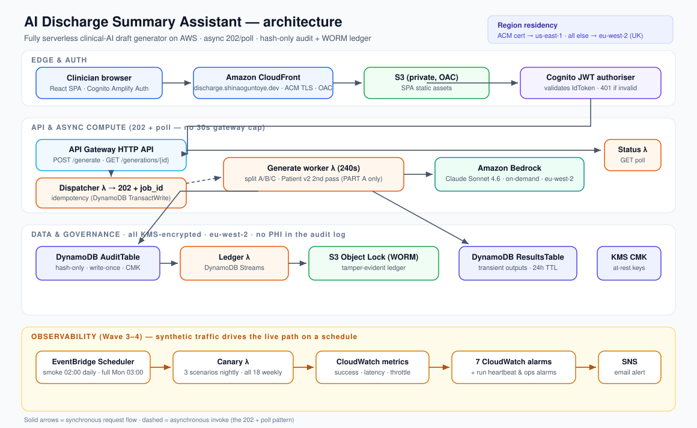

# 🩺 AI Discharge Summary Assistant

Turn a doctor's messy ward-round notes into a structured discharge summary, a GP letter, and a plain-English version for the patient — safely, with every output left as a **draft for a clinician to review and sign**.

**Live:** [discharge.shinaoguntoye.dev](https://discharge.shinaoguntoye.dev) · **Status:** deployed on AWS, fully serverless · **All data synthetic** · **Not a medical device** (see [Disclaimer](#disclaimer)).

> The hard problem in clinical AI is not fluency — it's **restraint**. This tool is engineered to report only what the notes support, to surface gaps and contradictions rather than paper over them, and to refuse to invent the fields that cause harm. The architecture below exists to make that restraint *provable*: a hash-only audit log, a tamper-evident WORM ledger, and a synthetic-traffic canary that watches the live system every night.

> ⚠️ The live link is Cognito-protected with no public self-signup (it's a clinical tool with an audit trail), so it shows a sign-in wall — demo access on request. The full system is in this repo and the [architecture](#architecture) below.

---

## Architecture

Mermaid source (editable) — <code>docs/architecture.mmd</code>

See [`docs/architecture.mmd`](docs/architecture.mmd) for the editable Mermaid version of the diagram above.

Everything is **serverless** and — except the one component AWS forces into us-east-1 — runs in **eu-west-2 (London)** for UK data residency. The build was done as plain CloudFormation ([`infra/`](infra/)) in thin, independently-deployed slices.

## Why this exists

Junior doctors spend a large share of their day on discharge paperwork, and poor summaries delay GP follow-up and contribute to readmissions. This tool drafts a structured summary, a GP letter, and a patient explanation from clinical notes in seconds — but its real point is to do so **without making things up**. It is built with NHS-flavoured, DSPT-aligned controls: Cognito auth, KMS customer-managed-key encryption, and an immutable, **hash-only** audit log that never stores patient-identifiable data.

## What it produces

From one block of free-text notes, three outputs:

1. **Structured discharge summary** — diagnosis, investigations, treatment, resuscitation status, reconciled medications, follow-up, GP actions.
2. **GP letter** — a brief clinician-to-clinician handover mirroring the medication changes and GP actions (the highest-harm interface).
3. **Patient-friendly version** — plain English at Flesch–Kincaid grade ≤ 8, with safety-net advice; audience-shifted for parents/carers in paediatrics, and flagged for translation when the patient does not speak English.

Wherever the notes are silent, the tool writes **"Not documented"** rather than guessing — so the gaps are *visible* to the reviewing clinician, not invented. Every output is marked `draft = true` in the audit log until a clinician records a sign-off; the clinician remains the author of record throughout.

## How it works

**Edge & auth.** The React SPA is served from a private S3 bucket via **CloudFront** (Origin Access Control; the bucket is never public) on the custom domain, with TLS from an **ACM** certificate. The browser signs in against a **Cognito** user pool and calls the API on the *same origin* (CloudFront routes `/generate` and `/generations/*` to the API), so there's no CORS preflight. API Gateway's native **JWT authoriser** verifies the Cognito IdToken (signature, issuer, audience, expiry) *before* any Lambda runs — invalid tokens get a 401 with no cold start spent. The handler reads the user's identity from the *verified* JWT claim, never from the request body, closing the obvious spoofing hole in the audit log.

**Async generation (202 + poll).** Bedrock generation can take ~50–80s, well past API Gateway's hard 30s integration cap. So `POST /generate` hits a **dispatcher Lambda** that writes a pending audit row + a client-supplied **idempotency** receipt atomically (`TransactWriteItems`), asynchronously invokes the **generate worker**, and returns `202 + {job_id}` in under a second. The client polls a **status Lambda** (`GET /generations/{id}`) until the job is terminal. A retried POST with the same `Idempotency-Key` returns the same `job_id` without re-firing the worker — no double-billed Bedrock calls.

**Generation + Patient v2.** The worker calls **Bedrock** (Claude Sonnet 4.6, on-demand in eu-west-2), splits the output into the three parts, and — under a flag — regenerates the patient leaflet in a **second pass whose only input is the curated clinician summary** (see [Patient v2](#patient-v2--defence-in-depth-against-helpful-hallucination)). Outputs land in a transient `ResultsTable` (24h TTL); the audit table stays hash-only.

**Tamper-evident audit.** The **AuditTable** is write-once, KMS-CMK-encrypted, and stores only **SHA-256 hashes** of inputs/outputs plus metadata — never PHI. Its DynamoDB stream feeds a **ledger Lambda** that copies every change event into an **S3 Object Lock (WORM)** bucket, where it cannot be altered or deleted within its retention window — making the "immutable audit log" claim provable, not aspirational.

## Patient v2 — defence in depth against "helpful hallucination"

An independent clinician review flagged a subtle failure: the patient leaflet had added *standard-of-care* stoma safety-netting (high-output / no-output / blockage red flags) that was clinically sound but **not in the ward-round notes**. Sound advice the responsible clinician didn't document is still a hallucinated instruction to the patient.

This was fixed two ways:
- **Prompt level (v0.6):** an explicit "no model-added clinical advice" rule in the patient section, with a generic fall-back safety-net line when none is documented. A cold-eval regression holds **5/5** across textbook traps (COPD, upper-GI-bleed) that tempt the model to invent red flags.
- **Architecture level (Patient v2a):** the patient leaflet is regenerated in a separate Bedrock pass anchored to the *curated clinician summary alone* — so it is **structurally unable** to reintroduce undocumented advice, independent of prompt wording. It stays on the same UK-region on-demand model (residency unchanged). Design: [`docs/PATIENT_V2_DESIGN.md`](docs/PATIENT_V2_DESIGN.md).

## Observability — a canary that caught a real bug

A scheduled **canary Lambda** ([`src/canary/`](src/canary/)) replays all 18 evaluation scenarios through the *live, deployed path* every night (EventBridge Scheduler, 02:00), authenticating as a dedicated synthetic user and driving the same Cognito → API → worker → Bedrock flow a clinician would. It emits **CloudWatch custom metrics** (success rate, latency, throttles, plus a "did the canary even run" heartbeat) that **7 CloudWatch alarms** watch, notifying an **SNS** email topic. Thresholds track the *observed* baseline (~15–16/18 nightly), so alarms catch deviation rather than an idealised 100%.

It earned its keep on night one. Two findings the synthetic traffic surfaced that ordinary unit tests could not:

1. **A latent worker-timeout bug.** Firing all 18 scenarios exposed that the generate worker's Lambda timeout was **60s — too short** for a Patient-v2 two-call generation (which the cold-eval clocked at 52–83s). Longer scenarios were killed mid-generation, leaving the job row stuck `pending`. The async 202/poll design means the worker has no API-gateway cap, so the fix was simply raising its timeout to **240s** — but the canary is what made the latent problem visible before it bit a real user.
2. **A self-inflicted Bedrock throttling pattern.** Eighteen simultaneous generations saturated the account's on-demand quota. The canary was reshaped to a **bounded-concurrency sliding window** (representative of real traffic, with a one-time retry on throttles) — which also informs a sensible quota-increase request. Design: [`docs/WAVE3_SYNTHETIC_TRAFFIC_DESIGN.md`](docs/WAVE3_SYNTHETIC_TRAFFIC_DESIGN.md).

That's the point of observability: it doesn't just make traffic, it catches problems your tests don't.

## How it's evaluated

Outputs are scored on five dimensions, three with **auto-fail gates**: omission, hallucination (auto-fail: invented resus / drug / diagnosis), resuscitation-status accuracy (auto-fail), drug reconciliation (auto-fail), and patient-version reading age (Flesch–Kincaid ≤ 8). The set is ~18 fully synthetic scenarios spanning neonatal to elderly, medical and surgical, plus adversarial cases (prompt injection, internally contradictory notes, missing data + a non-English-speaking patient).

This repo deliberately documents what **didn't** work — a portfolio that only shows green ticks isn't credible:

- **A real failure, fixed and verified.** On an adversarial case, an *independent* model with no access to the answer key produced an English-only leaflet for a Polish-speaking patient. Root cause: no prompt rule for non-English speakers. Fix: a translation/interpreter rule; the leaflet now leads with "FOR TRANSLATION — do not hand to the patient untranslated." A complete **failure → fix → verify** loop.
- **The evaluation caught errors in its own answer key.** Run cold (no gold in context), the disciplined model disagreed with five hand-written reference answers — and the *model* was right (the gold had invented a resuscitation status and asserted unfounded "None known" allergies). The eval auditing its own answer key is itself evidence the safety rules work.
- **Independent clinician review (Run 4).** Eleven specialty-matched review packs went to practising doctors; one returned substantive feedback (the "added-advice" finding above), which drove the Patient v2 work. The portfolio narrative is kept honest: *asked 11, 1 responded, here's what they said and how it was addressed* — not a claim of full clinician coverage.

Full rubric, per-scenario checkpoints, and the run log: [`evals/EVAL_RESULTS.md`](evals/EVAL_RESULTS.md). The reusable cold-eval harness (mirrors the deployed Lambda's Bedrock call exactly) is [`evals/run_cold_eval.py`](evals/run_cold_eval.py).

## Governance & residency

Governance is treated as a first-class deliverable, not an afterthought:

- [`docs/MODEL_CARD.md`](docs/MODEL_CARD.md) — intended use, out-of-scope, model details, safety behaviours, evaluation, known limitations.
- [`docs/THREAT_MODEL.md`](docs/THREAT_MODEL.md) — STRIDE plus AI-specific threats (prompt injection, hallucination, automation bias, gold-error, model drift).
- [`docs/ADR-phase1.md`](docs/ADR-phase1.md) — the architecture decision records (model choice, audit-log schema, region/residency, async pattern, SPA delivery).

**Residency:** all inference and all data at rest stay in **eu-west-2 (UK)**. The one deliberate exception is the **ACM certificate in us-east-1**, because CloudFront reads viewer certs only from there — a documented, defensible boundary rather than an accident.

## Tech stack

`Amazon Bedrock` (Claude Sonnet 4.6) · `Lambda` · `API Gateway (HTTP API)` · `Cognito` · `DynamoDB` (+ Streams) · `S3` (Object Lock / WORM, OAC) · `KMS` (CMK) · `CloudFront` · `Route 53` · `ACM` · `EventBridge Scheduler` · `CloudWatch` · `SNS` · `CloudFormation` (plain) · `Python 3.13` · `React + Vite + Amplify Auth`

## Repository layout

| Path | What it is |
|------|------------|
| [`infra/`](infra/) | All IaC — `template.yaml` (the `discharge-audit` stack), `web-template.yaml` (the `discharge-web` CloudFront stack), plus deploy/bootstrap runbooks |
| [`src/generate/`](src/generate/) | Bedrock worker (+ Patient v2 second pass) and the canonical/packaged system prompt |
| [`src/dispatcher/`](src/dispatcher/), [`src/status/`](src/status/) | The async 202/poll front + poll Lambdas |
| [`src/ledger/`](src/ledger/) | DynamoDB-stream → S3 WORM ledger consumer |
| [`src/canary/`](src/canary/) | The synthetic-traffic canary + bundled scenarios |
| [`docs/`](docs/) | ADRs, model card, threat model, design notes, and this diagram (`architecture.svg` / `.mmd`) |
| [`evals/`](evals/) | Synthetic scenarios, run log (`EVAL_RESULTS.md`), and the cold-eval harness |
| [`tests/`](tests/) | 38 unit tests across the Lambdas (idempotency, anti-spoof, retry-safety, cross-user 404, the canary scorer) — run in ~0.1s |
| [`ui-spa/`](ui-spa/) | The React + Vite SPA (Amplify Auth) |

## Honest status — what's not done

- **Bedrock on-demand quota is tight** on this account; the canary runs at bounded concurrency to stay under it. A quota increase is the next step to lift the nightly success baseline.
- **Deferred hardening:** a CloudFront WAF and access logging are scoped but not yet deployed.
- **Patient v2b** — regenerating the leaflet from the clinician-*edited* summary via a review-gated endpoint — is the documented follow-on to v2a.

## Disclaimer

This is a portfolio demonstration. It is **not a medical device**, carries no CE/UKCA marking, has no regulatory clearance, and must not be used in clinical care or with real patient data. Every output is a draft requiring review and sign-off by a qualified clinician who remains responsible for the discharge summary.
