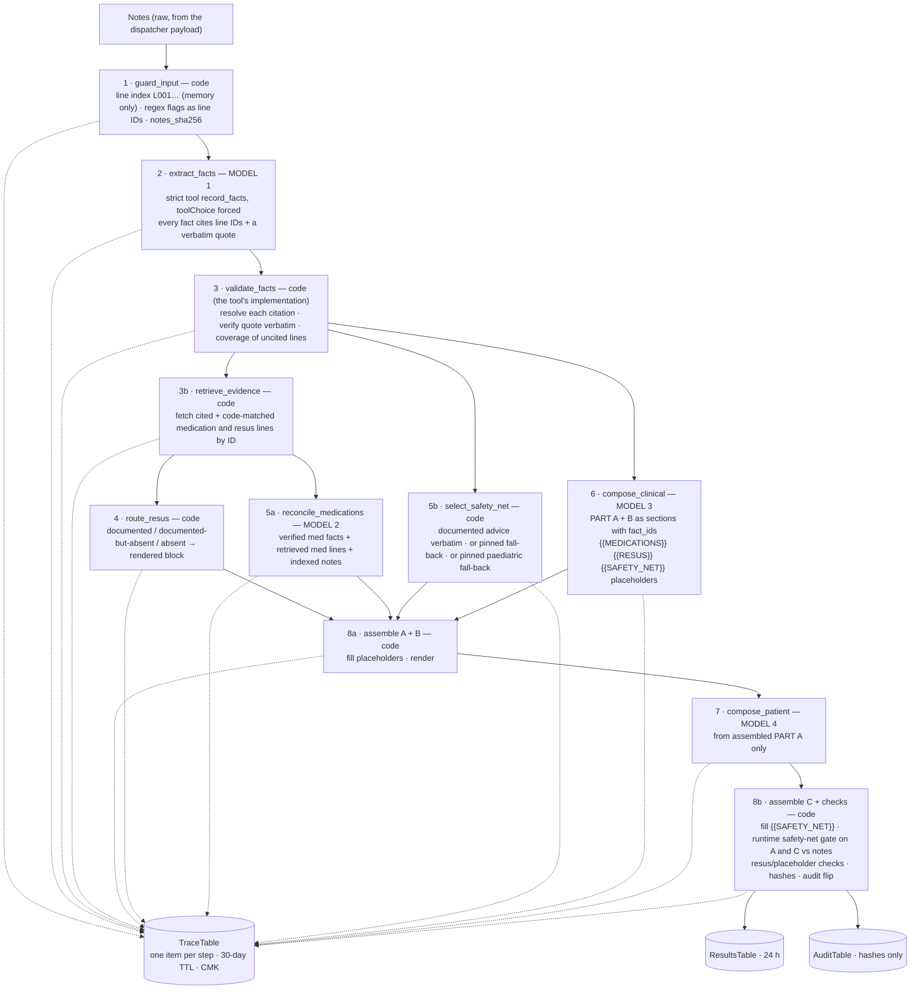

# Architecture Decision Record — Discharge Summary Assistant (Phase 1)

Status: **Proposed** (Phase 1 discovery — to be ratified before Phase 3 build)
Date: 2026-05-21
Author: Shina (drafted with Cowork)
Scope: three decisions that shape the serverless build — (1) Bedrock model choice,
(2) DynamoDB audit-log schema, (3) single-region eu-west-2 vs Bedrock regional availability.

> Format note: each ADR records Context → Decision → Consequences, so the reasoning
> survives even if the decision is later reversed. Verify model/region facts against
> the AWS console at build time — Bedrock availability changes month to month.

---

## ADR-001 — Foundation model: Claude on Amazon Bedrock

### Context
The app drafts three text outputs (discharge summary, GP letter, patient version)
from messy clinical notes. The model must follow a long, rule-heavy system prompt
faithfully (resus-change flagging, drug reconciliation, the "Not documented" rule,
a Flesch–Kincaid ≤ 8 patient version) and resist prompt injection embedded in the
notes field. The Notion tracker already commits to Bedrock for the AWS-portfolio
value (Cognito/KMS/serverless around it), so the decision is *which* Bedrock model,
not Bedrock vs. a direct API.

### Decision
Use **Anthropic Claude on Amazon Bedrock** as the primary model, accessed through a
**system-defined inference profile** (not a raw on-demand model ID). Standardise on a
**Claude Sonnet-class** model for the quality/cost balance the rule-following demands,
and pin the exact model + version string in config (not hard-coded) so it can be
upgraded deliberately and recorded in the audit log.

Rationale:
- Instruction-following and structured-output fidelity matter more here than raw
  speed; a Sonnet-class model is the sweet spot. Haiku-class is a fallback for the
  patient-version simplification pass if cost becomes a concern; Opus-class is
  reserved for eval/grading, not the hot path.
- Bedrock keeps the call inside the AWS account boundary (IAM, CloudTrail, VPC
  endpoints, KMS) — exactly the controls the governance section requires.
- Llama (also available in-region) is kept as a documented alternative for the
  model card's "models considered" note, but Claude is chosen for output quality.

**Model pinned — 2026-05-23 (eu-west-2 CLI check).**
`aws bedrock list-foundation-models --region eu-west-2 --by-provider anthropic`
returned these Sonnet-class options: `claude-sonnet-4-6` (**ON_DEMAND** + inference
profile), `claude-sonnet-4-5-20250929-v1:0` (inference-profile only), and the older
`claude-3-7-sonnet-20250219-v1:0` / legacy `claude-3-sonnet-20240229-v1:0` (on-demand).
**Pinned: `anthropic.claude-sonnet-4-6`** — the current-generation Sonnet that is
*also* available on-demand in London, so it satisfies ADR-003 rule 1 (UK-only
inference). This **supersedes this ADR's original assumption** that access would be
via an inference profile: the build-time check revealed on-demand is available
in-region, which is the stronger residency posture. `claude-opus-4-6-v1` is likewise
ON_DEMAND in eu-west-2 and is the candidate eval/grading model (kept off the hot path
per the cost stance above). Haiku-class (`claude-haiku-4-5-…`) is inference-profile-only
in-region, so a future Haiku patient-version pass would need the EU profile (ties to
open question #3). **On-demand invocation confirmed 2026-05-25** — invoking first required
clearing the Bedrock **Anthropic use-case gate** (a one-time, account-level use-case form,
submitted via the Model catalog since the standalone "Model access" page is retired). After
that, a `Converse` call to `anthropic.claude-sonnet-4-6` in eu-west-2 (on-demand) returned
successfully and the Phase-2 generate Lambda produced all three outputs with a hash-only
audit write. (An earlier draft of this ADR claimed the gate was cleared on 2026-05-23; that
was incorrect — it was actually cleared on 2026-05-25.) ADR-001 is now fully locked.

### Consequences
- Model version becomes an audited field — every generation logs the model+version
  used (already in the audit schema, ADR-002).
- Bedrock **fine-tuning is not available in eu-west-2**, so the design must rely on
  prompt engineering + few-shot, not fine-tuning. This is acceptable and arguably
  preferable for a portfolio (cheaper, no training-data governance burden).
- Newer Claude versions may only be reachable via cross-region/global inference
  profiles rather than single-region on-demand — see ADR-003.
- Prompt-injection mitigation lives in the application layer (input sanitisation +
  the "treat notes as data" system-prompt rule), not the model.

---

## ADR-002 — DynamoDB audit-log schema (hash-only, immutable)

### Context
NHS DSPT alignment and the model card require an **immutable, KMS-CMK-encrypted**
audit trail of every generation request that captures *who/when/what-model* — but
explicitly **not raw clinical content** (PHI must not land in the log or in
CloudWatch). We need to answer "who generated what, when, with which model, and was
it reviewed before download" without ever storing the patient notes.

### Decision
A single DynamoDB table, on-demand capacity, encrypted with a **customer-managed KMS
key**, with the following item shape:

| Attribute            | Type | Notes |
|----------------------|------|-------|
| `PK`                 | S    | `USER#<cognito_sub>` — partition by clinician |
| `SK`                 | S    | `GEN#<ISO8601_timestamp>#<ulid>` — sortable, unique per generation |
| `generation_id`      | S    | ULID, also returned to the UI |
| `user_sub`           | S    | Cognito subject (pseudonymous id, not name/email) |
| `timestamp`          | S    | ISO-8601 UTC |
| `input_sha256`       | S    | SHA-256 of the input notes — **hash only, never raw text** |
| `output_sha256`      | M    | one hash per output: `{summary, gp_letter, patient}` |
| `model_version`      | S    | e.g. `anthropic.claude-sonnet-4-6 (eu-west-2, on-demand)` |
| `output_type`        | S    | which tabs were generated |
| `draft`              | BOOL | `true` until the clinician ticks "I have reviewed this" |
| `reviewed_at`        | S    | ISO-8601, set when draft→false (nullable) |
| `request_region`     | S    | source region of the API call (eu-west-2) |
| `inference_profile`  | S    | the Bedrock profile ARN used (residency evidence) |
| `schema_version`     | N    | for forward migration |

Immutability & integrity:
- Application IAM role is granted `dynamodb:PutItem` and `UpdateItem` **only for the
  `draft`/`reviewed_at` transition** — no `DeleteItem`, no general overwrite. Deny
  delete in the resource policy.
- **Tamper-evidence mechanism — DECIDED 2026-05-23.** The table emits a
  **DynamoDB Stream**; a consumer (Lambda, or Kinesis Firehose for batching) writes
  each change event to an **S3 bucket with Object Lock (WORM)**. That immutable,
  append-only S3 ledger — keyed to the `input_sha256`/`output_sha256` hashes — is the
  tamper-evidence control, because in Object Lock the record cannot be altered or
  deleted by a compromised IAM principal.
    - **Demo:** Object Lock **Governance mode**, ~1-day retention — immutable to
      normal principals, but a specially-permissioned admin can override, so the demo
      can be torn down without long-term storage lock-in.
    - **Production:** Object Lock **Compliance mode** with the NHS-required retention
      — undeletable even by the root account until retention expires.
- **Point-in-Time Recovery stays enabled, but is the operational recovery net, NOT
  the tamper-evidence control.** PITR is recovery (restore the table after accidental
  corruption/deletion within 35 days), not immutability — it does not detect or prevent
  alteration of live items, and a privileged principal can disable it. Relying on
  PITR alone would make the "immutable audit log" claim in `THREAT_MODEL.md` /
  `README.md` an overclaim; the S3 WORM ledger is what makes that claim true.
- KMS CMK with a tight key policy; CloudTrail data events on the table.
- The only mutable field after creation is the review transition (`draft`,
  `reviewed_at`); everything else is write-once.

> **Correction, 24 Sep 2026 (W1) — what is enforced where.** Three statements above describe the
> intended design, not the build, and are corrected here rather than rewritten, so the record of
> what was believed survives:
> 1. **"Granted `PutItem` and `UpdateItem` only for the `draft`/`reviewed_at` transition."** IAM
>    cannot express a *value* transition. From the W1 change set, the worker's and dispatcher's
>    `UpdateItem` grants carry a `dynamodb:Attributes` whitelist — an update can only touch the
>    lifecycle attributes it needs, never `input_sha256` or `user_sub` (keys cannot be updated in
>    DynamoDB at all; `PK`/`SK` are listed only because AWS requires it). **Which
>    transitions are legal (pending → complete / failed) is enforced by `ConditionExpression`s
>    in code.** And both roles hold `PutItem`, which replaces a whole item, so **overwriting a
>    row cannot be prevented by IAM** — it is *detected*: the stream carries old and new images
>    to the WORM ledger. The worker loses `PutItem` at the W11 cut-over (ADR-009).
> 2. **"Deny delete in the resource policy."** No resource policy exists. Deletion is prevented
>    by the *absence* of `DeleteItem` / `BatchWriteItem` in every application role (the CI deploy
>    role holds `dynamodb:*` for CloudFormation's sake), plus
>    `DeletionProtectionEnabled` on the table (verified live 24 Sep 2026).
> 3. **"CloudTrail data events on the table."** Not configured anywhere (HAZ-11, DPIA R-09). It
>    is scheduled for W11 with WS6.

### Consequences
- The log proves usage and review compliance **without holding PHI** — a clean
  story for the THREAT_MODEL.md (Repudiation + Information-disclosure rows).
- Hash-only means you cannot reconstruct the note from the log (by design); if a
  future feature needs content retention, it requires a separate, explicitly
  consented, encrypted store and a new ADR. *(24 Sep 2026: ADR-009 (b) is that ADR
  and `TraceTable` that store. "Explicitly consented" is not adopted — consent is not
  the lawful basis for patient data in direct care, `WS3-DPIA.md` §5.1.)*
- The `draft` flag wires directly to the UI gate (ADR-adjacent: the human-in-the-loop
  control), giving an auditable link between "reviewed" tick and the record.
- ULID in `SK` gives time-ordering for cheap per-clinician history queries.

---

## ADR-003 — Region strategy: single-region eu-west-2 vs Bedrock regional availability

### Context
NHS / UK-GDPR data-residency expectations push toward keeping processing in the UK
(eu-west-2, London). But Bedrock's newest Claude models are increasingly offered
**only through cross-region inference profiles** (e.g. an EU geographic profile), not
as single-region on-demand endpoints. So there is a real tension: *strict single-region
(UK-only) limits model choice; the EU geographic profile widens model choice but
processes transiently across EU regions.*

Verified during Phase 1 discovery:
- eu-west-2 hosts Bedrock with Anthropic Claude models (on-demand available for some
  versions).
- An **EU geographic cross-region inference profile** is available from eu-west-2. It
  keeps processing **within the EU geography** and routes across EU regions
  (e.g. Ireland, Frankfurt, Spain, and others per the profile version) for throughput.
- **Data at rest** (logs, S3 outputs, DynamoDB) stays in the **source region you
  deploy to** — the cross-region behaviour is about transient inference compute only.
- Fine-tuning is not available in eu-west-2 (reinforces ADR-001's no-fine-tune stance).

### Decision
**Deploy all stateful resources single-region in eu-west-2 (London)** — S3, DynamoDB,
Cognito, KMS, CloudFront origin, logs. For the Bedrock call, **default to single-region
on-demand in eu-west-2 where the chosen model is available; otherwise use the EU
geographic inference profile** (processing stays within the EU, an adequate
jurisdiction under UK GDPR). Record the actual `inference_profile` / region used on
every audit item (ADR-002) as residency evidence.

Decision rule, in priority order:
1. If the target model is available **on-demand in eu-west-2** → use it (UK-only
   processing, the cleanest residency story).
2. Else if available via the **EU geographic profile** → use it, and document in the
   model card that inference may transiently process in other EU regions while all
   data at rest remains in eu-west-2.
3. **Never** fall back to a US/global profile for this app — that would break the
   residency posture. If a model is only available US/global, it is out of scope.

**Resolved 2026-05-23 — rule 1 applies.** The pinned model
`anthropic.claude-sonnet-4-6` is available **on-demand in eu-west-2**, so the app uses
single-region on-demand invocation: both data at rest *and* inference stay in London.
The EU geographic profile is retained only as a documented fallback (rule 2) for the
case where on-demand capacity is unavailable at runtime. Every audit item records
`request_region = eu-west-2` and the on-demand path as residency evidence.

### Consequences
- Single-region stateful design keeps cost, latency, and the IAM/threat-model story
  simple — appropriate for an MVP and the SAA-C03 syllabus. No multi-region DR is in
  scope for v1 (document as a known limitation).
- Model choice is constrained to what eu-west-2 / the EU profile offers; if the
  preferred Sonnet version is EU-profile-only, that's accepted under rule 2.
- The audit log's `request_region` + `inference_profile` fields turn residency from a
  claim into evidence — useful for the DSPT/governance narrative.
- A documented residency boundary ("data at rest UK; inference within EU") is a
  defensible, honest position for a portfolio project and a real NHS conversation.

---

## ADR-004 — Front door: HTTP API (v2) + Cognito JWT authoriser

**Status:** Accepted (2026-05-26, slice 4a).

### Context

The generate Lambda (slice 2) is currently invoked directly (CLI/console). To
put it behind the React UI (slices 4b/4c) it needs a public, authenticated HTTP
endpoint. Two AWS choices exist for "Lambda behind Cognito-authenticated HTTP":

1. **API Gateway REST API (v1)** + **Cognito user-pool authoriser** (or a
   Lambda authoriser that calls Cognito).
2. **API Gateway HTTP API (v2)** + the **native JWT authoriser**.

### Decision

Use **API Gateway HTTP API (v2)** with the native **JWT authoriser**, configured
against the Cognito User Pool's OIDC issuer URL and the SPA App Client id as
the JWT `aud`. The route is a single `POST /generate` on the `$default` stage
with `AutoDeploy: true`.

### Rationale

- **Cost.** HTTP API is ~70% cheaper per million requests than REST API. For a
  portfolio demo this is small in absolute terms, but the right-size choice is
  itself the SAA-credible answer — not picking the more expensive product
  "because more features".
- **Latency.** HTTP API has lower per-request overhead and skips the v1
  request/response transformation pipeline we are not using anyway.
- **Native JWT support.** API Gateway v2 validates the IdToken's signature,
  issuer, audience, and `exp` *before* invoking the integration. A v1 REST API
  achieves the equivalent only via either (a) the Cognito user-pool authoriser,
  which is less flexible and ties us to v1, or (b) a custom Lambda authoriser,
  which adds a second Lambda invocation (and a second cold start) on every
  request. The v2 JWT authoriser removes that latency without removing the
  control.
- **Surface area we don't need.** REST API's bigger feature set — usage plans,
  API keys, request validators, x-amz-mock integrations, EDGE endpoints — is
  exam material but unrelated to this app's hot path. Keeping the front door
  narrow keeps the threat model narrow.

### Identity is asserted by the authoriser, never by the client

The handler must take the clinician's Cognito `sub` from
`event.requestContext.authorizer.jwt.claims.sub` — populated by API Gateway
**after** the JWT is cryptographically verified — and must **never** trust a
`user_sub` field in the request body. The body is client-controlled, so any
authenticated user could otherwise attribute their generation to another user
in the audit log. This is enforced in `src/generate/app.py`: the HTTP-API code
path ignores body identity and reads only the verified claim; the direct-invoke
path (slice 2/3 smoke tests) keeps the body-supplied `user_sub` because there
is no JWT to verify against.

### Cognito posture for the demo

- **MFA OPTIONAL + TOTP (SOFTWARE_TOKEN_MFA).** Users *may* enrol TOTP MFA; the
  pool does not force it for every sign-in. This is the honest middle ground:
  the README can truthfully say "Cognito MFA supported" without making the
  recorded demo painful. Flipping `MfaConfiguration` to `ON` in prod is a
  one-property change.
- **No self-signup.** `AllowAdminCreateUserOnly: true`. For synthetic-data
  demos this prevents the public API from doubling as an account-creation
  endpoint.
- **Public SPA app client.** `GenerateSecret: false` — a browser cannot keep
  secrets. Auth flows are SRP, USER_PASSWORD (smoke test), and refresh.
- **`PreventUserExistenceErrors: ENABLED`** so the API does not differentiate
  "user not found" from "wrong password" — a defensive default that costs
  nothing.

### Consequences

- The hot path is now `Browser → CloudFront (slice 4c) → HTTP API → JWT
  authoriser → generate Lambda → Bedrock + DynamoDB + S3 WORM ledger.` Every
  step except the browser is in eu-west-2 (CloudFront is global by design).
- The frontend (slice 4b) uses Amplify Auth (SRP), gets an IdToken, and
  passes it as `Authorization: Bearer <IdToken>`. The IdToken (not the access
  token) is required, because Cognito puts the App Client id in `aud` only on
  the IdToken.
- CORS is permissive (`http://localhost:5173`) for the dev loop in 4a/4b. In
  4c the app and the API share a single CloudFront hostname, so the browser
  sees them as same-origin and CORS becomes a no-op.

### Alternatives considered

- **REST API + Cognito user-pool authoriser.** Functionally fine, but slower
  and more expensive with no benefit for this app. Kept as a documented
  alternative in case a future requirement (e.g. usage plans for partner
  organisations) forces it.
- **REST API + Lambda authoriser.** Adds a Lambda invocation per request just
  to do what the v2 native authoriser does for free. Rejected on latency.
- **AppSync (GraphQL) + Cognito.** Overkill for a single mutation endpoint;
  GraphQL caching/subscriptions are not in scope.

### Slice 4a findings (2026-05-26 smoke test)

Slice 4a was verified end-to-end against the live stack on 2026-05-26 using
the recipe in `infra/SLICE_4A_SMOKE_TEST.md`: unauth call → 401, malformed
token → 401, authed call → 200 + three outputs, audit row's `user_sub`
matched the JWT's `sub` claim (not anything supplied in the request body),
new WORM ledger object landed within seconds. The JWT-as-trusted-identity
contract holds in real AWS, not just in unit tests.

Two findings worth recording honestly before slice 4b begins:

1. **HTTP API has a hard 30-second integration timeout.** Bedrock Sonnet
   emitting three outputs at `MAX_TOKENS = 4096` runs ~20–25 s on warm
   containers and longer on a cold start. The first smoke-test call (a
   multi-line NSTEMI ward-round note on a cold container) hit the cap; the
   client got `503 Service Unavailable` with no Lambda logs visible in the
   first 30 s, because Lambda was still mid-Bedrock call when API Gateway
   cut the integration. Warm + shorter input (a one-line UTI note) returned
   200 in 20.7 s. Mitigations, in order of preference:

   - **Async pattern (preferred for production).** `POST /generate` returns
     `202 Accepted` with a job id; Lambda kicks off the Bedrock call via
     `EventBridge` or a second `Invoke` (`InvocationType: Event`); the
     client polls a second `GET /generations/{id}` endpoint that reads from
     the audit table. Removes the timeout entirely and gives the UI an
     honest progress indicator. This is what slice 4b will move to.
   - **Reduce `MAX_TOKENS`** from 4096 to ~1500. Faster, but truncates
     longer admissions — clinically suboptimal.
   - **Lambda Function URL + response streaming**, fronted by CloudFront.
     Bypasses API Gateway's 30 s cap. Trade-off: no built-in JWT
     authoriser, so Cognito auth would have to move to CloudFront
     functions / Lambda@Edge — heavier and a step away from the AWS
     "default" stack for this shape of app.

2. **Lambda completes server-side even when the client gets a 5xx**, so the
   first failed call left behind a "ghost" audit row and a ghost WORM
   ledger object. This is correct behaviour at the data layer — the
   audit log should reflect *attempts*, not just *successes* — but it has
   two consequences for the UI in slice 4b:

   - A naïve "retry" button would re-invoke Bedrock and duplicate the
     audit row. The UI must therefore either disable retry until status
     is confirmed via a `GET` (the async pattern again), or compute a
     client-side idempotency key sent with the request and refuse to
     write a second row with the same key.
   - When clinicians review the audit log they will see rows whose
     `parse_ok` and `output_sha256` reflect a generation the *client*
     never saw. The Model Card and UI copy should make this honest:
     **"every attempt is logged, including ones the system failed to
     deliver."**

These are recorded here rather than as a separate ADR-005 because they are
direct consequences of the ADR-004 architecture choice (HTTP API + sync
Lambda) — anyone reviewing the architecture should encounter them at the
same place they encounter the decision. The **fix** to both of them — moving
the hot path to an async `202 + poll` pattern with client-supplied
idempotency — is recorded in ADR-005 below.

---

## ADR-005 — Async `202 + poll` pattern with client-supplied idempotency

**Status:** Accepted (2026-05-26, slice 4b).

### Context

ADR-004 / slice 4a put the generate Lambda behind API Gateway HTTP API
synchronously. The slice-4a smoke test surfaced two consequences that the
production hot path cannot ship with:

1. **API Gateway HTTP API has a hard 30 s integration timeout.** It cannot
   be raised. Bedrock Sonnet emitting three outputs at `MAX_TOKENS = 4096`
   runs ~20–25 s warm and longer on a cold start. Even shaving `MAX_TOKENS`
   would truncate longer admissions — clinically the wrong trade. The cap is
   load-bearing.
2. **Lambda completes server-side even when API Gateway has 503'd the
   client.** The first failed call left a "ghost" audit row + WORM ledger
   object behind, and a naïve client "retry" would double-invoke Bedrock —
   double-billing, double-logging, and (since the audit table is write-once)
   visibly distinct rows that look like the user submitted twice.

The same constraints apply to anything else in this app whose latency is
naturally variable and uncapped (later: optional second-pass patient-version
regeneration; future: longer Opus eval-grading runs).

### Decision

Move `POST /generate` to the **async `202 + poll` pattern**, with
client-supplied **idempotency keys**:

```
client ──POST /generate──▶ Dispatcher Lambda  ──Invoke(Event)──▶ Generate (worker)
                                │  writes pending audit row              │
                                │  returns {job_id, status:"pending"}    │
                                │  HTTP 202 in <1s                       │
client ──GET /generations/{id}──▶ Status Lambda                          │
                                │  reads audit row + (if complete) outputs
                                │  returns {status, outputs?, error?}    │
                                                                         │
                  worker UpdateItem-s row to status=complete (with hashes,
                  parse_ok, tokens) and PutItem-s outputs into ResultsTable
```

Three Lambdas — `DispatcherFunction`, `StatusFunction`, and the worker
(`GenerateFunction`, slice-2 code refactored). Two routes on the same HTTP
API, gated by the same JWT authoriser. One additional DynamoDB table for the
transient outputs.

### Rationale

- **The 30 s ceiling stops being load-bearing.** The dispatcher does one DDB
  transaction + one async invoke — sub-second. The worker runs for as long
  as Bedrock needs (Lambda's own timeout is the only ceiling, set at 60 s
  here). The status endpoint is two `GetItem`s — also sub-second.
- **Ghost records are converted into honest pending rows.** The dispatcher
  writes the row in `status=pending` BEFORE invoking the worker. If the
  worker fails or the network drops mid-poll, the row tells you the truth:
  there's a job in flight that you should expect to terminate. There is no
  scenario where the client sees an error but the audit/ledger show a
  completed generation, because completion is no longer how the client
  finds out.
- **Idempotency is enforced server-side.** Each `POST` carries an
  `Idempotency-Key` (a client UUID). The dispatcher runs a
  `TransactWriteItems` that puts the `IDEM#<key>` row AND the
  `GEN#<job_id>` pending row atomically, with `attribute_not_exists` guards.
  A retried POST with the same key fails the IDEM `ConditionCheck`, rolls
  the transaction back, and the dispatcher returns the EXISTING `job_id`
  with a `200` (not `202`). The worker is fired exactly once.
- **JWT-as-identity contract from ADR-004 holds.** Both new Lambdas read
  `user_sub` from `event.requestContext.authorizer.jwt.claims.sub`. The
  status Lambda's `GetItem` uses `PK = USER#<jwt.sub>`, so a cross-user
  read returns nothing — surfaced as 404 (uniform with "no such job"), not
  403 (which would confirm existence).
- **Hash-only audit invariant from ADR-002 holds.** The actual outputs are
  not in the audit table — they live in a separate `ResultsTable` with
  `PK = USER#<sub>, SK = RES#<job_id>` and a **24-hour TTL**. The audit
  table continues to carry only hashes, who/when, and operational metadata.
  ResultsTable is a delivery buffer; it can be wiped at any time and the
  audit log is intact.

### Data model changes

The audit table (ADR-002) gains two SK prefixes (one new, one repurposed):

| PK | SK | What |
|----|----|------|
| `USER#<sub>` | `GEN#<ulid>` | One row per generation. **slice 4b: SK uses the bare ULID** (was `GEN#<timestamp>#<ulid>` in slice 2). ULIDs are already time-sortable, so dropping the timestamp prefix lets the status Lambda do a direct `GetItem` by `job_id`. The legacy slice-2 direct-invoke path keeps writing the old SK shape for backwards compatibility. |
| `USER#<sub>` | `IDEM#<key>` | Idempotency receipt. TTL ~24 h. Maps `(user_sub, idempotency_key) -> job_id`. The GEN# row it points to has NO TTL — only the receipt expires. |

DynamoDB TTL is enabled at the table level on attribute `ttl`. GEN# rows
omit the attribute → never expire. IDEM# rows carry it → expire after 24 h
(best-effort — *corrected 24 Sep 2026*: AWS now documents deletion *"within a few days of their
expiration time"*, not 48 hours).

The new `ResultsTable`:

| PK | SK | Attrs |
|----|----|-------|
| `USER#<sub>` | `RES#<job_id>` | `summary`, `gp_letter`, `patient`, `completed_at`, `ttl` |

SSE-KMS with the same CMK as the audit table; NO Streams (it's not part of
the audit trail); NO PITR (transient by design); 24 h TTL.

### Idempotency contract

- The header is `Idempotency-Key: <UUID>`. UUIDv4 is the expected shape; the
  dispatcher validates the canonical 8-4-4-4-12 hex form and rejects
  anything else with 400.
- The header is **optional**. If absent, each POST is a fresh job (no
  idempotency receipt is written).
- If present and seen before for the same `user_sub`, the dispatcher returns
  the **current** status of the existing job (not the status at first
  submission). Status `pending` on replay is fine — the client polls anyway.
- Idempotency keys are **scoped per user_sub**. Two different users using
  the same UUID get different jobs.
- The body sent on replay is **not** compared against the original — the
  dispatcher records the input hash on the IDEM# row for forensics but does
  not enforce equality, in line with the Stripe idempotency-key contract.

### Status state machine

```
        ┌─ complete ──── (outputs available; draft=true, awaiting review)
        │
pending ┼─ failed ────── (error_code + error_message; no outputs)
        │
        └─ expired ──── (status=complete in audit, but ResultsTable TTL’d)
```

- `pending` is the only state the dispatcher writes. Only the worker flips
  it (with `ConditionExpression: status = pending`, so a Lambda async retry
  cannot clobber a finalized row).
- `expired` is synthesised by the **status** Lambda when the audit row says
  `complete` but the ResultsTable row is missing. The audit trail survives;
  the outputs do not.

### Anti-spoof

- POST: `user_sub` comes from JWT claims. Body-supplied `user_sub` is
  silently ignored (and not echoed in any response or log).
- GET: the PK of the lookup embeds the JWT sub. A client cannot read
  another user's job even if they know the `job_id`.
- Cross-user reads return 404 (uniform with "no such job"), not 403 —
  matching the User Pool's `PreventUserExistenceErrors` posture from
  ADR-004.

### Consequences

- The hot path now spans **three Lambdas** instead of one. The dispatcher
  and status functions are tiny (256 MB, ≤10 s timeouts, no third-party
  deps), so the cost and cold-start surface area increase is modest.
- The HTTP API surface grows by **one route** (`GET /generations/{id}`)
  using the same JWT authoriser.
- The slice-4a `aws lambda invoke` smoke test path is **preserved**. The
  worker detects the dispatcher-event shape vs the legacy direct-invoke
  shape and behaves correctly for both. An HTTP-API-shaped event arriving
  at the worker by accident returns `410 Gone` rather than silently
  regressing to the 30 s problem.
- The model card / README copy from slice 4a ("every attempt is logged,
  including ones the system failed to deliver") remains true and is now
  **observable** through the status endpoint: a client that polls a
  pending job and never sees `complete` knows precisely that the attempt
  was logged.

### Alternatives considered

- **Lambda Function URL + response streaming.** Bypasses the 30 s cap, but
  the JWT authoriser is API Gateway-only — Cognito auth would have to move
  to CloudFront Functions / Lambda@Edge. A heavier, less standard stack
  for a portfolio shape.
- **Reduce `MAX_TOKENS` to 1500 to fit in 30 s.** Truncates longer
  admissions (the late-stages NSTEMI / GI bleed / multi-co-morbidity cases)
  — clinically the wrong direction.
- **`input_sha256`-keyed dedupe instead of a client header.** Surprising
  behaviour: two genuinely separate identical requests would collapse into
  one job. Breaks the "every attempt is logged" invariant. Rejected.
- **Separate "jobs" table.** Considered, but the audit table is already
  the system of record for "did this generation happen and for whom".
  Reusing it (with two SK prefixes) keeps the WORM ledger seeing state
  transitions for free — the immutable evidence covers `pending →
  complete/failed` without an extra stream.

---

## Open questions to close before Phase 3
- ~~Confirm the exact Claude model + version available on-demand in eu-west-2~~ —
  **RESOLVED 2026-05-23:** pinned `anthropic.claude-sonnet-4-6`, **ON_DEMAND** in
  eu-west-2 (satisfies ADR-003 rule 1 — UK-only inference). `claude-opus-4-6-v1` also
  on-demand in-region as the eval/grading candidate. See ADR-001 / ADR-003.
- ~~Decide the tamper-evidence mechanism for the audit log~~ — **RESOLVED 2026-05-23:**
  DynamoDB Streams → consumer → S3 Object Lock (WORM) is the tamper-evidence control
  (demo = Governance mode + ~1-day retention; prod = Compliance mode + NHS retention);
  PITR retained as operational recovery, not the immutability control. See ADR-002.
- ~~Confirm whether the patient-version simplification runs as a second model pass
  or a single combined prompt~~ — **RESOLVED 2026-05-23: Option A, single combined
  prompt.** One inference emits all three outputs (clinician summary, GP letter,
  patient version). Evidence-led: the Run 3 cold evals (S8–S18) produced patient
  versions at **Flesch–Kincaid 3.6–6.2**, comfortably under the ≤ 8 target, using the
  single combined v0.5 prompt — so a separate simplification pass is not needed to hit
  the reading-age bar. Combined-prompt also keeps the whole hot path UK-only on-demand
  (a Haiku second pass would be inference-profile-only in eu-west-2, leaving the
  strict residency posture). **Future enhancement (v2):** a second pass that
  regenerates the patient version from the *clinician-reviewed* summary — justified by
  clinical safety (anchoring the leaflet to approved content), NOT by reading age. This
  ties to the human-in-the-loop control and the Model Card's "confidence in outputs"
  theme. **Built 2026-05-30 (v2a, flag-gated `PATIENT_V2_SECOND_PASS`, off by default):**
  the worker now regenerates PART C in a separate Bedrock pass whose only input is the
  curated PART A — architectural belt-and-braces over the v0.6 prompt rule, on the same
  Sonnet on-demand model (residency unchanged). *Scope corrected 15 Sep 2026: that
  guarantee covers only invention beyond PART A, not advice invented into PART A, which
  is where WS2a found it happening. Deployed state is `on` — CI pins it — despite the
  template default of `off`.* Anchoring to the *clinician-edited*
  summary via a review-gated endpoint (v2b) remains the follow-on. See
  `docs/PATIENT_V2_DESIGN.md`.

---

## ADR-006 — Static SPA delivery: single CloudFront distribution, two origins

**Status:** Accepted (2026-05-27, slice 4c).

### Context

Slice 4b ended with a Vite + Amplify Auth SPA running locally against the
deployed HTTP API, with API Gateway CORS allow-listing `localhost:5173`.
For a portfolio demo the SPA must be reachable from a hosted URL, served
over HTTPS, behind the same JWT-authenticated path the API uses. The
constraints inherited from earlier ADRs:

- ADR-002: no PHI may sit in static assets or in cache.
- ADR-003: inference + data-at-rest remain in `eu-west-2`.
- ADR-004 / ADR-005: the HTTP API + Cognito JWT authoriser stay as-is;
  this slice must not weaken or re-architect them.

### Decision

A **single CloudFront distribution** with **two origins**:

- **S3 (private, OAC-only)** — serves the Vite-built SPA. Default cache
  behaviour, `CachingOptimized` policy, SPA-routing handled via
  `CustomErrorResponses` (403/404 → `/index.html` 200).
- **API Gateway HTTP API (eu-west-2, imported)** — serves `/generate` and
  `/generations/*`. Path-pattern cache behaviours, `CachingDisabled`,
  `AllViewerExceptHostHeader` origin-request policy.

Lives in a **separate `discharge-web` CloudFormation stack** in the same
region (eu-west-2), importing `HttpApiId` + `HttpApiDomain` via
`Fn::ImportValue` from the existing `discharge-audit` stack.

Default `*.cloudfront.net` hostname for now — no custom domain, no ACM cert
in this slice. The us-east-1 ACM hooks are present as commented-out
scaffolding in `infra/web-template.yaml` for a later cutover.

### Why a single distribution, two origins (vs S3 and API on separate hostnames)

The alternative is the classic SPA-on-S3-website + API-on-`*.execute-api.*`
shape with CORS allow-listing the SPA's domain on the API.

The single-distribution shape wins on three independent axes:

1. **Eliminates CORS preflight for every API call.** Browsers only enforce
   CORS for *cross-origin* requests. When the SPA at
   `https://x.cloudfront.net/` calls `fetch('/generate')`, both the page
   origin and the request destination are `https://x.cloudfront.net` —
   same origin — so the browser skips preflight entirely. The
   `idempotency-key` and `authorization` headers go in the actual POST,
   not in a separate `OPTIONS` round-trip. One less request, one less
   API Gateway invoice line item.
2. **One TLS cert, one access-log story, one URL.** Cuts ops surface area
   and removes "which domain is the API on?" from the demo narration.
3. **No CORS configuration drift.** The CORS allow-list on the API still
   contains only `http://localhost:5173` (for `npm run dev`); we
   deliberately do NOT add the CloudFront hostname there because, by the
   same-origin argument above, it would be dead config. Adding it would
   invite a future engineer to assume the API was *meant* to be reachable
   cross-origin and drop the allow-list when convenient. Same-origin =
   no CORS = no allow-list entry needed.

### Why OAC over OAI

**Origin Access Identity (2009)** was the legacy mechanism: CloudFront
authenticated to S3 as a special user-like principal listed in the bucket
policy. It did not support SSE-KMS-encrypted buckets, struggled with newer
S3 regions, and was permitted only on GET/HEAD.

**Origin Access Control (2022)** uses **SigV4**: CloudFront signs each
origin request with its own service credentials. Supports SSE-KMS, all
regions, all HTTP methods, and removes the "special principal" footgun.
AWS-recommended for all new work since 2023. There is no scenario in 2026
where new OAI is the right answer.

The bucket policy uses an `aws:SourceArn` condition pinning access to this
specific distribution's ARN. Without that condition, *any* CloudFront
distribution in *any* account that knew the bucket name could read the
bucket — the classic confused-deputy hole. With it, only `discharge-web`'s
distribution can. Same pattern as SNS→Lambda, EventBridge→target, SES→S3;
once internalised it pays dividends across the SAA-C03 syllabus.

### Why path-pattern behaviours with `AllViewerExceptHostHeader`

CloudFront evaluates cache behaviours top-down by path pattern; the default
behaviour runs only when nothing else matches. `/generate` (POST) and
`/generations/*` (GET) sit above the default, routing to the API origin
with `CachingDisabled` because per-user JWT-authenticated responses must
never be shared across viewers.

The AWS-managed origin-request policy `AllViewerExceptHostHeader`
(ID `b689b0a8-53d0-40ab-baf2-68738e2966ac`) forwards every viewer header —
Authorization, Idempotency-Key, Content-Type, cookies, query string — to
the API origin **except** the `Host` header. CloudFront rewrites `Host` to
the origin's hostname (`*.execute-api.eu-west-2.amazonaws.com`). Without
this rewrite, API Gateway HTTP API responds 403 because the Host doesn't
match its own DNS — a frustrating silent failure that's the first thing to
suspect if a slice-4c smoke test returns 403 on `/generate` while the same
call works against the API directly.

### Why custom error responses 403/404 → /index.html 200

The SPA does client-side routing. Reloading `/some/deep-link` hits S3,
which returns 404 because no such object exists. Without intervention the
viewer sees a CloudFront error page. With `CustomErrorResponses` rewriting
both 403 (OAC-readable bucket, key missing) and 404 (any other missing key)
to `/index.html` with status 200, the SPA's router takes over and renders
the right view.

This rewrite is *distribution-wide*, but the more specific cache
behaviours for `/generate` and `/generations/*` intercept the path before
the rewrite has a chance to fire — verified in §6.4 of
`infra/SLICE_4C_DEPLOY_AND_SMOKE.md`.

### The us-east-1 ACM rule (deferred, documented)

CloudFront viewer certificates **must live in us-east-1**, regardless of
where the distribution, origins, or any other resources are. CloudFront is
a global service whose control plane reads ACM from one region only — a
cert in eu-west-2 is invisible to it.

This slice does not exercise the rule (no custom domain), but the future
cutover is fully documented as a commented block at the bottom of
`web-template.yaml`: a second stack in us-east-1 owns the cert, its ARN is
passed into the eu-west-2 web stack as a parameter (cross-region
`Fn::ImportValue` does not exist), and the existing `ViewerCertificate`
block is swapped for `AcmCertificateArn` + `Aliases`. Same applies to WAFv2
web ACLs for CloudFront (`SCOPE=CLOUDFRONT`, region us-east-1) and to any
Lambda@Edge functions.

### Why a separate `discharge-web` stack

CloudFront distribution updates take 5–15 minutes to propagate to all edge
PoPs; the stack does not return `UPDATE_COMPLETE` until propagation
finishes. Bundling CloudFront into the existing `discharge-audit` stack
would mean every backend iteration (a Lambda env-var bump, a CORS tweak)
paid the full propagation cost. Splitting keeps the backend iteration
loop sub-minute and confines the slow update path to genuine CloudFront
changes, which are rare.

Both stacks live in eu-west-2, so cross-stack values use the normal
`Fn::ImportValue` against same-region exports. If we'd put CloudFront in
its own region (which we briefly considered, since the resource itself is
global), we'd need either an SSM Parameter Store cross-region read or a
stack parameter — another reason to keep things in eu-west-2 for now.

### Defence-in-depth response headers

A `ResponseHeadersPolicy` is attached to both API path behaviours:
HSTS (1 year, includeSubdomains), `X-Content-Type-Options: nosniff`,
`X-Frame-Options: DENY`, `Referrer-Policy: strict-origin-when-cross-origin`,
and a minimal CSP that allows same-origin scripts/styles, same-origin XHR
(covering both SPA and API since they share the hostname), and Cognito IdP
endpoints for the Amplify SRP exchange. Cheap to add, expected by any
security reviewer, and a useful talking point for the demo.

### Consequences

- The SPA gets HTTPS, HTTP/2+HTTP/3, edge caching, and SPA routing for
  free. First-byte latency from a UK viewer should be ~30-60 ms (UK edge
  PoP) for static assets and dominated by Bedrock for `/generate`.
- The HTTP API CORS allow-list keeps `http://localhost:5173` (for `npm
  run dev`) and gains nothing else, because the production path is
  same-origin.
- The `discharge-audit` stack now has exports it can't change while
  `discharge-web` is importing them. This is the export safety lock and
  is intentional — it's the guard against accidentally bricking the web
  stack via a backend edit.
- CloudFront PriceClass_100 limits PoPs to NA + EU. Sufficient for a UK
  NHS demo audience; bump to `_200` if the audience ever shifts.
- The S3 bucket is `DeletionPolicy: Retain` with versioning on, so
  accidental object deletes leave delete-markers (recoverable) and a
  stack-delete leaves the bucket alive.

### Alternatives considered

- **CloudFront with the S3 *website* endpoint as origin.** Rejected: the
  website endpoint is HTTP-only and bypasses bucket policy ACLs, so the
  bucket would have to be public. Defeats the whole point of OAC and
  fails any reasonable threat-model review.
- **AWS Amplify Hosting.** Faster initial setup but bundles deploy +
  CloudFront + auth into one product, opaquely. The portfolio learning
  value is in seeing the explicit OAC + bucket policy + custom error
  responses + cache behaviours wired by hand.
- **S3 + CloudFront for the SPA, API kept on its `*.execute-api.*`
  hostname with CORS.** Working, common, but adds a preflight to every
  state-changing API call and means two TLS certs/two hostnames to
  document. No upside over the chosen shape.
- **Adding the CloudFront hostname to API Gateway CORS allow-list.**
  Considered for completeness, rejected: it would be dead config (the
  prod call is same-origin) and would invite future devs to assume the
  API was meant to be cross-origin from the SPA — leading to the
  drop-the-allow-list change that would silently break only the dev
  workflow. Same-origin in prod means CORS is genuinely not in the
  picture; the config should reflect that.

### Verification (post-deployment, 2026-05-27 12:17 UTC)

The stack deployed clean and a representative generation job completed
through the full new path. Live identifiers captured for reproducibility:

| Resource | Value |
|---|---|
| CloudFront distribution domain | `d97dn8vzuz1u0.cloudfront.net` |
| CloudFront distribution ID | `E1GQ7L05AVH8YI` |
| Private SPA bucket | `discharge-web-spabucket-d5rb2e4ujkrd` |
| Stack | `discharge-web` (eu-west-2) |

Each of the three architectural payoffs of this design was verified
directly in the browser via Chrome DevTools' Network panel, rather than
taken on trust:

1. **Same-origin routing.** The POST issued by the SPA showed its request
   URL as `https://d97dn8vzuz1u0.cloudfront.net/generate` — the
   CloudFront hostname, not `*.execute-api.eu-west-2.amazonaws.com`.
   Confirms the SPA is calling the same origin it was served from, and
   that the path-pattern cache behaviour routed `/generate` to the API
   origin without exposing the API hostname to the browser.
2. **Zero preflight.** No `OPTIONS` row immediately preceded the POST,
   despite the request carrying the custom `Idempotency-Key` header.
   Confirms the browser treated this as a same-origin request and
   skipped CORS preflight entirely — the practical benefit on which the
   single-distribution design rests.
3. **Defence-in-depth headers attached to the API behaviour.** The POST
   response headers included `content-security-policy: ...`,
   `x-content-type-options: nosniff`, and
   `strict-transport-security: max-age=31536000; includeSubDomains`.
   Confirms the `ResponseHeadersPolicy` is attached to the `/generate`
   cache behaviour, not only to the default S3 one — an easy thing to
   miss when wiring multiple behaviours and worth specifically checking
   in any future review.

Data-layer evidence corroborated the network view. A `GEN#` row appeared
in `AuditTable` for the test user (sub `1682f284-…-6528`) with
`SK=GEN#01KSMNVNG9CMNKV8FZVAV34CSM` (ULID format = slice-4b async path,
not legacy direct-invoke), `draft=true`, all three `output_sha256`
populated, `completed_at=2026-05-27T12:17:54.941018+00:00`. The
hash-only audit invariant held (no PHI in the row) and the corresponding
ledger objects landed in the WORM bucket within seconds. The full chain
SPA → CloudFront → API Gateway → JWT auth → Dispatcher → Worker →
Bedrock → DynamoDB → Streams → S3 Object Lock therefore executed
end-to-end through the new CloudFront perimeter without weakening any of
the earlier slices.

### Implementation notes (gotchas worth recording)

These do not change the decision, but cost real time during the build
and are easy to repeat. Recorded here so the next person — or a
recruiter reading the source — sees what was learned:

- **`PublicAccessBlock` is named `PublicAccessBlockConfiguration` in
  CloudFormation.** The S3 web console labels the feature "Public access
  block", which is the obvious property name to guess. CFN templates
  fail validation if you guess.
- **cfn-lint `E1029` on `${...}` inside Parameter `Description` fields.**
  `Description` is not an `Fn::Sub` context, so `${ThingName}` in there
  triggers the lint rule. Escape with placeholder notation like
  `<ThingName>` in descriptions; reserve `${...}` for `Fn::Sub`
  contexts.
- **Zsh treats `<` and `>` as redirection.** Smoke-test recipes that
  contain `<YOUR_THING>` placeholders break in zsh as soon as the user
  copy-pastes the example. Use plain `YOUR_THING` (or quote the line)
  in any pasted-in shell snippet.
- **DynamoDB attribute names are case-sensitive.** A query against
  `PK=...` fails with `ValidationException: Query condition missed key
  schema element: PK` if the table actually declares `pk`. Mixing the
  two cost a smoke-test round-trip. Stick to one convention and check it
  against the table's actual schema, not the recipe.
- **Stack `Description` has a hard 1024-character limit** (slice 4b
  finding, still applies). A descriptive multi-line block can quickly
  exceed it and is rejected at change-set creation with
  `ValidationError: 'Description' length is greater than 1024`. Trim
  before committing.

---

## ADR-007 — Retention and expiry of generation records

> **Accepted 11 Sep 2026.** Regulatory positions below were verified against primary sources on 11 Sep 2026 and are dated accordingly — re-verify before quoting them. *(The "DRAFT — awaiting author approval" banner that stood here contradicted the "Accepted" status line immediately below it; it survived the fold into this file and was removed 17 Sep 2026 during WS4.)*

### Status

**Accepted 11 Sep 2026.** Supersedes nothing. It **surfaces** a decision already taken in `infra/template.yaml`, and **extends** it, because the original decision answered "does this row expire?" without answering "for how long, and on whose authority?"

### Context

#### The decision already existed, in a CloudFormation comment

`infra/template.yaml` L301–306:

> TTL added in slice 4b for the IDEM# rows (the dispatcher's idempotency receipts). DynamoDB only deletes items that ACTUALLY carry the `ttl` attribute — the GEN# audit rows are written without it, so they never expire and the hash-only audit log retains its immutability.

Real reasoning, correctly implemented. But it lives where no DPIA reader, Clinical Safety Officer or procurement reviewer will find it, and "never expires" is indefinite retention — a position that must be argued, not inherited from the absence of an attribute.

#### The table holds two different kinds of data

By ADR-002 the audit rows are hash-only: no clinical content. What they do hold is `user_sub` (the clinician's Cognito subject), a timestamp, `input_sha256`, `output_sha256`, model version, output type, request region and inference profile.

So there is no patient personal data here at all. There is **clinician** personal data — a record of who generated what, and when. That distinction drives everything below, because the two halves are governed by different regimes and have no business sharing a retention period.

### What the law and the standards actually require

*Verified 11 Sep 2026. Where no requirement exists, that is stated as a finding rather than filled with an assumption.*

**The NHS Records Management Code of Practice 2023 (v5) sets no retention period for audit trails, system logs or access logs.** Every Appendix II sub-schedule was checked. The nearest entries are "Clinical audit — 5 years" (audit *projects*, not system trails) and "Telephony systems record — 1 year". The Code's only signal is indirect: on EPR decommissioning it says *"The system, along with the audit trails, should be retained"* — implying an audit trail follows the record it documents. The Code also binds **NHS and adult social care organisations as controllers**; Appendix III characterises a system supplier as a **processor**, reached through contract rather than by the Code directly. *Any claim that "the NHS Code requires N years for audit logs" is extrapolation.* — [Code](https://digital.nhs.uk/data-and-information/information-governance/guidance/records-management-code-of-practice), [Appendix II](https://digital.nhs.uk/data-and-information/information-governance/guidance/records-management-code-of-practice/appendix-ii), [Scope](https://digital.nhs.uk/data-and-information/information-governance/guidance/records-management-code-of-practice/scope-of-the-code)

**The DSPT gives a floor of six months, for a different purpose.** CAF-aligned DSPT Principle C1 relays NCSC advice that logs answering incident-investigation questions be retained *"for a minimum of 6 months"*, with the normative requirement being to *"define and implement an appropriate retention period"* per log type. This is **security monitoring**, not clinical non-repudiation, and IT suppliers complete assertions-based Category 2/3 rather than the CAF view — so it reaches a supplier contractually. Treat six months as a floor to justify departing from, not a target. — [DSPT C1](https://digital.nhs.uk/cyber-and-data-security/guidance-and-resources/caf-aligned-dspt-guidance/objective-c/security-monitoring), [NCSC logging](https://www.ncsc.gov.uk/guidance/introduction-logging-security-purposes)

**DCB0129 v4.2 sets no period, but imposes an open-ended duty.** §3.1.2: *"The Clinical Risk Management File MUST be maintained for the life of the Health IT System."* No destruction date anywhere in the standard; DCB0160 v3.2 is materially identical. Note also that DUAA 2025 s121 extended the s250 information-standards compliance duty to **IT providers** from 5 Feb 2026, and s251ZA carries a power to require production of records — you cannot produce what you destroyed. — [DCB0129 spec v4.2](https://digital.nhs.uk/data-and-information/information-standards/governance/latest-activity/standards-and-collections/dcb0129-clinical-risk-management-its-application-in-the-manufacture-of-health-it-systems/), [DUAA s121](https://www.legislation.gov.uk/ukpga/2025/18/section/121)

**The ICO prescribes no period, and mandates a schedule.** *"The UK GDPR does not dictate how long you should keep personal data. It is up to you to justify this, based on your purposes."* Pseudonymisation does not help: *"Pseudonymised data is personal data in the hands of someone who holds the additional information"* — and `user_sub` resolves to a named clinician by design, which is the whole point of a non-repudiation log. — [Storage limitation](https://ico.org.uk/for-organisations/uk-gdpr-guidance-and-resources/data-protection-principles/a-guide-to-the-data-protection-principles/storage-limitation/), [Pseudonymisation](https://ico.org.uk/for-organisations/uk-gdpr-guidance-and-resources/data-sharing/anonymisation/pseudonymisation/)

**This log is worker monitoring.** The ICO's monitoring-workers guidance has a *"Time and access control"* category expressly covering *"controlling access to IT and other systems"*, and applies *"regardless of the nature of the contract"* — so locums and bank staff are in scope. Its retention requirement is mandatory in form: *"You **must** ensure you have a retention schedule and delete any information you collect from monitoring workers in line with your schedule."* It also requires transparency — *"you **must** make sure workers are aware of how and what personal information you are collecting during any monitoring"* — and constrains repurposing: a purpose may only change where the new purpose is compatible, consented to, or legally required. Note this guidance is itself marked as under review following the DUAA. — [Monitoring workers](https://ico.org.uk/for-organisations/uk-gdpr-guidance-and-resources/employment/monitoring-workers/), [Methods](https://ico.org.uk/for-organisations/uk-gdpr-guidance-and-resources/employment/monitoring-workers/specific-data-protection-considerations-for-different-ways-or-methods-of-monitoring-workers/)

**Net position.** Nothing names a number. The binding constraints are a six-month contractual floor for security logs, an open-ended clinical-safety duty pulling long, storage limitation pulling short, and — decisively — a *mandatory* obligation to have a documented schedule at all. **Indefinite retention with no schedule fails that obligation before the period is even argued.**

### Current state

*Verified against `infra/template.yaml` and `src/`, 11 Sep 2026.*

| Class | Where | Expiry today | Mechanism |
|---|---|---|---|
| Generated outputs | DynamoDB `ResultsTable` | **24 hours** | `ttl` per item, `RESULTS_TTL_HOURS` default 24 (`src/generate/app.py:451`). KMS-CMK; no stream, no PITR |
| Idempotency receipts (`IDEM#`) | DynamoDB `AuditTable` | TTL'd | `ttl` written by dispatcher (`src/dispatcher/app.py:397`) |
| Audit rows (`GEN#`) | DynamoDB `AuditTable` | **Never** | No `ttl` attribute — deliberate. KMS-CMK, PITR 35 days, stream on, no `DeleteItem` in the IAM policy |
| WORM ledger copy | S3 `LedgerBucket` | `LedgerRetentionDays` — **1 day in demo**, unset for prod | Object Lock (Governance in demo / Compliance in prod), versioning, KMS-CMK with Bucket Key, `DeletionPolicy: Retain` |
| Lambda logs | CloudWatch | 30 days | `RetentionInDays: 30` |

Note the asymmetry: the audit row is permanent, while the WORM copy that makes its immutability *provable* expires after a day in the demo configuration.

### Decision

**Split the audit row's lifetime in two, because it holds two kinds of data.**

1. **Generated outputs stay at 24 hours.** A delivery buffer between worker and poll. The clinician's copy of record is whatever they put in the EPR; nothing downstream may treat `ResultsTable` as storage.

2. **`GEN#` rows are never deleted or mutated by the write path.** Retention is not implemented by adding a `ttl` attribute — that would hand the expiry mechanism to the same code that creates the record, defeating the non-repudiation property ADR-002 exists to provide.

3. **Attribution phase — the full row, including `user_sub`, is retained for a period set by the deploying organisation.** We are the processor; the controller sets retention. Where a deployment specifies nothing, the default is **8 years**, matching the adult health-record period in the Records Management Code — on the argument that a record of what was generated for an episode should not outlive the episode's own record. *This is reasoning by analogy, not a citation; the Code has no audit-trail entry. State it that way in the DPIA.*

4. **Integrity phase — at the end of the attribution period, `user_sub` is removed or replaced with a salted forward-hash, and the de-identified row is retained for the life of the Health IT System** per DCB0129 §3.1.2. What survives is the fact that a generation occurred, its input and output hashes, model version, region and timestamp — enough to prove the integrity chain and to investigate a safety incident, without continuing to hold a record of which clinician did it.

5. **The transition is a separate, authorised lifecycle operation**, not a write-path capability. It requires its own IAM principal, and each transition is itself logged.

6. **`LedgerRetentionDays` must be set for any non-demo deployment**, in Compliance mode, to at least the attribution period. Left at the 1-day demo default, the immutability claim in `THREAT_MODEL.md` is true for twenty-four hours and false thereafter.

#### Why not the alternatives

- **Indefinite, unqualified.** Not available: it fails the ICO's mandatory retention-schedule requirement for worker-monitoring data regardless of how good the purpose is.
- **A single bounded period for the whole row.** Either too short for the DCB0129 "life of the system" duty, or too long for `user_sub`. The split exists precisely because one number cannot satisfy both.
- **Six months (the DSPT/NCSC floor).** Wrong purpose. That floor is calibrated to attacker dwell time, not to clinical incident investigation, which runs for years.

### Consequences

**Declared now (what WS3 needs):** the DPIA can state a period and a basis per data class. `MODEL_CARD.md` §9 gains a retention line it currently lacks. The clinician-not-patient distinction goes into the DPIA explicitly — it is the reasoning that separates a real assessment from a template.

**Built later (v2.1+, logged not silently deferred):** the de-identification lifecycle job and its authorisation path. Declaring the period is what September requires; implementing it is not.

**New scope for WS3 — a control that does not exist.** Nothing in the product or its documentation tells clinicians that their generations are attributed and retained. Under the monitoring guidance that transparency is mandatory, and it cannot be satisfied by a line in a threat model they will never read. A worker-facing privacy notice belongs in the IG pack.

**A constraint to record:** this log is collected for clinical safety and non-repudiation. It may not be repurposed for performance management or appraisal without a compatibility assessment. Writing that limitation down now is cheap; discovering it after someone asks for "a report on who is using the tool" is not.

### Unverified / to re-check before the DPIA quotes this

- The 8-year default is an analogy to a health-record period, **not** an audit-trail citation. Do not present it as one.
- ICO monitoring-workers guidance is expressly under review following the DUAA; the pages carry 2026 dates but may move.
- Whether the DSPT supplier view (Category 2/3) states a log-retention figure of its own — not found, not excluded.
- The DCB0129/0160 national review closed 11 Sep 2026. A revised standard may change the "life of the system" duty.

---

## ADR-008 — The serverless substitution: what the v2 spec said, what was built, and where containers live now

> **Version 1.1 · 24 Sep 2026 · retrospective.** *(v1.1, same day: the canary arithmetic below was
> built on a Bedrock quota of 5 requests/min read from `docs/BEDROCK_QUOTA.md`; the live quota,
> queried 24 Sep 2026, is **25**. The weekly-run argument is corrected in place; the decision
> does not change.)* This records a decision that has been in force
> since the first build slices (ADR-001 to ADR-006, 21–27 May 2026) and was never logged as one. It
> is written now, not back-dated.
>
> **Sources.** *Why* the path is serverless: ADR-004, ADR-005 and `docs/COST.md` only. *What the
> spec said, and when*: the Notion Flagship spec and the 18 Sep Stocktake page. *Current
> configuration values* (timeouts, budgets): `infra/template.yaml`, read 24 Sep 2026. Anything
> else is marked as reasoning.

### Status

**Accepted (retrospective), 24 Sep 2026.** Records a decision already implemented in
`infra/template.yaml` and ADR-004/ADR-005. Supersedes nothing. Closes the July 2026 finding on the
Notion Flagship spec (*"containerisation drifted out of v2 item 1 during the serverless build
without an ADR"*) and WS1a definition-of-done item 6 for this substitution.

### Context

#### What the spec said

Notion, *Flagship Project (v1 + v2 Spec)*, "Flagship v2 — rebuild the discharge project to hit all
three", item 1, verbatim:

> **Deploy it for real** — containerised, on AWS, behind an API. *(FDE production rigour + fixes
> the muddy GitHub signal.)*

Three requirements are packed into that line. "On AWS" and "behind an API" are about production
rigour. "Containerised" is about the evidence a hiring reader looks for — a Dockerfile, an image
registry, an orchestrated service.

#### The dating problem, stated rather than smoothed

The spec was written in **June 2026** ("reverse-engineered from live UK job specs (Jun 2026)").
The serverless architecture already existed by then — ADR-001 to ADR-006 are dated **21–27 May
2026**. So this is not a build that drifted away from a spec; it is **a spec written over a build
that already contradicted it**, and not reconciled with it. The contradiction was noticed on
**2 Jul 2026** (the Flagship spec's "FDE gap amendments" note) and recorded as a lesson — *log the
deviation as a decision* — without the decision itself being logged. This ADR is that log, 84 days
after the lesson.

#### What was built instead

A fully serverless path, every piece of which has its own ADR:

- **Front door:** API Gateway HTTP API (v2) with the native Cognito JWT authoriser — ADR-004.
- **Compute:** three Lambda functions — dispatcher, status, and the Bedrock worker — in the async
  `202 + poll` pattern — ADR-005.
- **State:** DynamoDB (hash-only audit table, 24-hour results buffer), S3 Object Lock ledger —
  ADR-002, ADR-005.
- **Delivery:** one CloudFront distribution, two origins — ADR-006.

### Decision

**The hot path stays serverless. Containerisation is not pursued for the request path. It lives in
WS7 — the Fargate eval/canary container, scheduled W6 (9 Nov 2026) — where it has a job the
request path does not give it.**

#### Why — the facts, from ADR-004, ADR-005 and `docs/COST.md` only

1. **Bedrock latency is the dominant term, and it is what shaped the path.** ADR-004 recorded
   Sonnet producing three outputs at `MAX_TOKENS = 4096` in *"~20–25 s on warm containers and
   longer on a cold start"*, against API Gateway HTTP API's *"hard 30-second integration
   timeout"*. A container behind API Gateway would face the same wall. Behind an ALB the idle
   timeout is configurable, so the wall moves — but a 20–25 s-plus synchronous request is still the
   model's latency, not the runtime's, and the async pattern is the right shape either way. ADR-005's answer, the async **`202 + poll`** pattern (dispatcher
   returns in under a second; the worker runs for as long as Bedrock needs; the status endpoint is
   two `GetItem`s), is runtime-agnostic. Once it existed, nothing in the request path needed a
   long-lived process.
2. **Cost at demo volume.** `docs/COST.md` (Cost Explorer actuals, ~30 days): Bedrock is
   **~£43/month, "~99% of the project's cost"**; *"the application itself, at rest, is essentially
   free-tier — Lambda, DynamoDB, S3, CloudFront, API Gateway, Cognito all land at pennies or
   zero"*; the idle floor is *"roughly the price of the KMS key (~£1/month)"*. ADR-004 adds that
   HTTP API is *"~70% cheaper per million requests than REST API"*. An always-on container has a
   floor above zero, which this idle floor does not. *(Its size is not quoted — `COST.md` does not
   model it, and this ADR does not invent a figure.)*
3. **Operational burden.** `COST.md`: *"this project is 100% serverless (no compute instances,
   load balancers, NAT, or file systems)"*. For a one-person project that is also the Clinical
   Safety Officer, every component not operated is a component that cannot drift, go unpatched or
   need an on-call answer. *(This point is reasoning from that fact, not a measured figure.)*
4. **The dispatcher and status functions are tiny.** ADR-005: *"256 MB, ≤10 s timeouts, no
   third-party deps"*. There is nothing for a container to add to them.

#### What was given up — stated, not buried

- **The hiring signal the spec wanted.** No Dockerfile, no image registry, no ECS service exists in
  the repository. The Notion tracker listed Docker in the tech stack until 18 Sep 2026, when the
  stocktake removed it because no container build existed. The FDE evidence "containerised"
  was meant to supply is simply absent until W6.
- **Lambda's ceilings.** A Lambda invocation has a hard 900 s maximum. The worker is set to 240 s
  (`infra/template.yaml`) and one combined Bedrock call never came near it; **ADR-009's four-call
  pipeline does**, and raises it to 300 s. *(v1.1: v1.0 said the canary could not fit a weekly
  18-scenario run inside its 840 s budget. At the live quota of 25 requests/min it can — about
  7–8 minutes at concurrency 4. See ADR-009, question 3.)* Where the ceiling does bind is a long
  **evaluation** run: the stratified evaluation HAZ-05 needs (40–60 cold generations × 4 calls,
  run to be scored rather than raced) takes an hour or more, and no single Lambda invocation can
  hold it. A container task has no such ceiling.
- **Runtime parity.** The code runs only as Lambda handlers; tests mock AWS. There is no local
  image that is byte-for-byte what production runs.

#### Where containerisation actually lives now

**WS7 — the Fargate eval/canary container, W6 (9 Nov 2026).** Its Notion deliverable is exactly
this: *"Eval suite runs as a scheduled containerised job on Fargate."* **The forcing function is the
evaluation harness, not the canary** *(corrected v1.1)*. The nightly and weekly canary runs fit
their Lambda at the live quota. A full cold-eval run with the safety-net gate and step-level
scoring, and above all the stratified evaluation (HAZ-05), is long-running batch work with no
reason to be squeezed under a 900 s invocation ceiling — the shape containers exist for. That is a
better reason to own a container than "the spec said so". *(v1.0 argued instead that the weekly
canary run could not fit its Lambda; that rested on a stale 5 requests/min quota and is withdrawn.)*

### Consequences

- The v2 spec's item 1 is **met on "on AWS, behind an API"** and **deliberately not met on
  "containerised" for the request path**. The Notion spec should say so beside item 1, pointing
  here, so it stops describing a build that does not exist.
- **Revisit this decision if:** a generation's p99 approaches the worker's Lambda ceiling (900 s
  maximum; 240 s configured today, 300 s under ADR-009); the pipeline needs a long-lived connection or state between steps
  that Lambda cannot hold within one invocation; or sustained real traffic makes per-request
  pricing exceed an always-on task's floor — a question Cost Explorer answers, not this ADR.
- The lesson is recorded in its correct form: **a substitution is a decision, and a decision
  without a record is indistinguishable from drift.** ADR-009 applies it forward.

### Alternatives considered

- **Containerise the worker only (ECS/Fargate task per job, dispatched by the same `202 + poll`
  front).** Keeps the async shape, adds cluster, task definition, image pipeline and a cold task
  start (tens of seconds) to every generation — to solve a latency problem that is Bedrock's.
  Rejected for the request path; the same shape is exactly right for the weekly regression, which
  is where WS7 puts it.
- **App Runner / a container behind API Gateway.** Behind API Gateway: the same 30 s ceiling
  (ADR-004). App Runner caps a request at 120 s ([App Runner docs](https://docs.aws.amazon.com/apprunner/latest/dg/develop.html),
  read 24 Sep 2026), which the tail of a four-call generation exceeds. Either way it still needs
  `202 + poll`, plus an always-on floor. Rejected.
- **Leave the spec wording and add a container later "for the CV".** That is the silent rot the
  July lesson named. Rejected by writing this.

---

## ADR-009 — The agentic pipeline: named steps, step traces, a review-gate seam, and a branch-isolated build

> **Version 1.1 · 24 Sep 2026.** *(v1.1, same day: accepted with the author's rulings; reconciled
> against the live account — see "Live-state reconciliation" below.)* Records the author's design of 23 Sep 2026, pressure-tested
> against the repository on 24 Sep 2026, then checked by an independent verification pass the same
> day (findings applied; see *Verification* at the end). Where the test found that part of the
> design cannot work as written, the evidence is shown and the amendment is marked **[A1]–[A7]**
> so each can be accepted or reverted on its own.

### Status

**Accepted, 24 Sep 2026** — the author accepted amendments A1–A7 as written and decided the
paediatric fall-back wording (e). Built in W2–W3 on `feat/agentic-pipeline`; **live only at the W11 cut-over (14 Dec 2026)**, through the W7 CSO release gate, with
WS4 re-issued as v2.0.

- **Supersedes** the "pipeline parameter" isolation recorded on the Notion Stocktake page
  (18 Sep 2026) and in `WS4-HAZARD-LOG.md` / `WS4-SAFETY-CASE.md` v1.3 change control.
- **Amends** ADR-002's consequence that content retention needs *"a separate, explicitly
  consented, encrypted store and a new ADR"* — this is the new ADR and the separate encrypted
  store; the word *consented* is not adopted, for the reason at (b).
- **Retires at cut-over:** `_split_outputs`, `_maybe_second_pass` and the `PatientV2SecondPass`
  parameter (see (d)).

**How the current system was checked.** By reading `infra/template.yaml`,
`infra/cicd-oidc-role.yaml`, `.github/workflows/ci-cd.yml`, `src/generate/app.py`,
`src/dispatcher/app.py`, `src/status/app.py`, `src/canary/app.py`, `ui-spa/src/` and the eval
runs, on the working tree of 24 Sep 2026. **The deployed stack was not queried** — this session
had no AWS credentials. Deployed values below are read from CI's parameter overrides, which is the
inference `WS2a` v1.4 corrected itself for. **Before the first W2 commit, query the live stack's
`PatientV2SecondPass` and `CanaryMaxConcurrency`, and re-read the two Bedrock quotas in Service
Quotas.**

### Context

#### What "done" is

WS1a's seven-point definition of done (Notion, *Flagship Project (v1 + v2 Spec)*, added
2 Sep 2026), abbreviated here and quoted where the wording matters:

1. **Decomposed** — *"named, individually invocable steps — at minimum retrieval, clinical
   extraction, medication reconciliation, safety-netting, composition."*
2. **Traced** — *"per step: input, output, model, token counts, latency, cost — persisted and
   retrievable by summary ID."*
3. **Separately inspectable** — medication reconciliation and safety-netting *"can each be
   viewed on their own, without reading the final summary."*
4. **Real tool use** — *"at least one step calls a tool or retrieval rather than relying on
   everything sitting in prompt context."*
5. **Step-level scoring** — at least one step-level metric against the v1 baseline.
6. **Decisions logged** — as ADRs.
7. **Demonstrable** — one worked example followed end to end.

And the exclusion: *"NOT done if it is the same prompt split into a chain with no tools, retrieval
or independent step evaluation."*

#### Constraints, verified 24 Sep 2026

| Constraint | Value | Source |
|---|---|---|
| Bedrock on-demand quota, Sonnet 4.6, eu-west-2 | **25 requests/min** (`L-9B878FAE`), 3M tokens/min (`L-5F5A169C`), both **not adjustable** | **Service Quotas, queried live 24 Sep 2026.** *v1.0 used 5 requests/min from `docs/BEDROCK_QUOTA.md` (read 6 Jun 2026); the live value is five times that. The repository does not record why it changed — AWS raising the default, or a granted request* |
| TPM burndown | Input + `maxTokens` reserved at start; output settles at **5×** for Anthropic models ≤ 4.7. ~16k in + ~5k out ≈ **41k TPM per generation** — TPM does not bind; **RPM does** | [AWS: How tokens are counted](https://docs.aws.amazon.com/bedrock/latest/userguide/quotas-token-burndown.html), read 24 Sep 2026 |
| Structured outputs on Sonnet 4.6 | **Supported** — JSON-schema output and `strict: true` tool use; *"For new schemas, Amazon Bedrock compiles the grammar, which may take up to a few minutes"*; compiled grammars *"cached for 24 hours from first access"*; no `minLength`/`maximum`, `additionalProperties` must be `false`, no recursion | [Model card](https://docs.aws.amazon.com/bedrock/latest/userguide/model-card-anthropic-claude-sonnet-4-6.html), [structured output](https://docs.aws.amazon.com/bedrock/latest/userguide/structured-output.html), read 24 Sep 2026 |
| Model lifecycle | `anthropic.claude-sonnet-4-6` launched 17 Feb 2026; **"EOL no sooner than Feb 17, 2027"** | Model card, read 24 Sep 2026 |
| Worker Lambda | `Timeout: 240`; `BEDROCK_READ_TIMEOUT` 150 s; `BEDROCK_MAX_ATTEMPTS` 1; async `MaximumRetryAttempts: 0` | `infra/template.yaml`, `src/generate/app.py` |
| Canary Lambda | `Timeout: 900`; `CanaryPollTimeoutS` 840; **CI pins `CanaryMaxConcurrency=4`** (template default 2) — **live value 4**, confirmed 24 Sep 2026 | `infra/template.yaml`, `.github/workflows/ci-cd.yml`, live stack |
| Live stack parameters not in CI | **`PromptCaching=on`** — template default `off`, not in CI's overrides. `aws cloudformation deploy` keeps a parameter's previous value unless it is overridden, so a value once set by hand persists invisibly | Live stack, 24 Sep 2026 |
| Today's deployed path | Two Bedrock calls (combined + Patient v2 second pass; **CI pins `PatientV2SecondPass=on`**). Mean **52.6 s** per generation (210.3 s / 4, 15 Sep deployed-path run); ~5.5k in / ~2.3k out on the combined call | `evals/runs/run-2026-09-15-…-patient-v2/SUMMARY.md` |

### Pressure test of the 23 Sep step list

The step list, as the author wrote it, scored against the definition of done:

| DoD item | 23 Sep list | Verdict and evidence |
|---|---|---|
| 1 Decomposed | 8 steps; med rec, resus and safety-netting share step 5 | **Fails as written.** The item names medication reconciliation and safety-netting as distinct minimum steps; one call producing both is not *"individually invocable"*. No step is retrieval |
| 2 Traced | Own table, keyed by `generation_id` | **Meets** by design — (b) |
| 3 Separately inspectable | Step 5 output holds both | **Partly.** Viewable as fields; not separately generated, re-run or rejected |
| 4 Real tool use | Schema validation as a code tool | **Partly.** Validating a response after the call is not the model using a tool, and the exclusion names *"a chain with no tools"*. Needs the call to be a tool call — [A4] |
| 5 Step-level scoring | Safety-netting at step 5 | **Meets**, with the metric re-defined at (e) |
| 6 Decisions logged | This ADR + ADR-008 | **Meets** |
| 7 Demonstrable | Traces | **Partly.** Traces show steps, not the path from an output line back to a source note. Needs citations carried through — [A4] |

Against the hazard log and the code, eleven findings. **F1–F5 are evidence that part of the design
cannot work as written**; F6–F11 are consequences the design must carry.

- **F1 — Step 5 fails its own argument.** The reason recorded for keeping step 5 out of step 2 is
  that *"a step sharing a call with extraction cannot be re-run or re-scored alone."* Step 5 then
  shares one call between medication reconciliation, the resuscitation recommendation and
  safety-netting. By the same argument none of the three can be re-run or re-scored alone — and
  (c) puts a **per-step** review gate on reconciliation and on safety-netting separately, so a
  clinician rejecting the reconciliation would regenerate safety-netting they had already
  accepted. → **[A1]**
- **F2 — Step 5's "resus recommendation (only on the §2a route)" contradicts (e).** Narrowing §2a
  to *"a form exists; its content is not transcribed; confirm against it"* (`WS4-HAZARD-LOG.md`
  HAZ-02, recommendation) means there is **no recommendation to produce** on that route. Keeping
  the output keeps the hazard. With §2a narrowed, the whole resuscitation block is rendered by code
  from step 4's route — no model writes it. → **[A2]**
- **F3 — The gate at step 5 cannot guard PART C.** The list states that the v0.6 laundering path
  for C *"remains open, and what guards it now is step 5's gate anchored to the source notes."* But
  the laundering happens in **steps 6 and 7**: step 6 composes PART A's advice field, step 7 copies
  it into C. A gate that runs at step 5 inspects step 5's output and never sees either. Evidence is
  the list's own data flow: step 6 takes *"validated facts"*, step 7 takes *"PART A only"*; neither
  passes back through step 5. → **[A3]**
- **F4 — The repair attempt is a fifth call.** Step 3's *"one repair attempt"* is a model call, so
  the ceiling is four only when nothing fails. And on the failure that matters here — a citation
  that does not check out — asking the model to repair it invites it to find support for what it
  already wrote: verification against its own output, HAZ-13's shape. → **[A4]**
- **F5 — "Room for the canary": holds, at the live quota** *(corrected v1.1)*. v1.0 found the
  weekly run could not fit (72 calls ≥ 14.4 min at 5 requests/min). The live quota is **25**:
  four concurrent four-call generations use ~12–16 requests/min, and 18 scenarios run in ~5 waves
  of ~90 s ≈ **7–8 minutes** against the 840 s budget. The author's premise stands, with a
  condition: keep `CanaryMaxConcurrency` ≤ 4, and do not run ephemeral-stack end-to-end tests
  inside the canary windows (the quota is account-wide). → Consequences.
- **F6 — HAZ-08 is Closed on a watch condition this design trips.** HAZ-08: *"Any future EPR
  write-back, tool use or retrieval re-opens this at a materially higher inherent score and this
  row must be re-analysed **before such a feature is estimated**."* Its control 2 is
  *"Architectural: no tool use, no retrieval."* DPIA R-13 cites the same. Re-analysis is at (a).
- **F7 — ADR-002 conditioned content retention on consent.** The DPIA (§5.1) deliberately does not
  use consent as the lawful basis for patient data. Resolved at (b).
- **F8 — Steps 6 and 7 never see the notes.** Breaking the A→B chain creates a new one:
  notes → facts → A and B. A fact step 2 omits is invisible to every later step except 5a — the
  HAZ-07 shape, now with a single point of failure. → coverage check at step 3.
- **F9 — A and B can now disagree.** B no longer derives from A. Medications, resuscitation and
  safety-netting are rendered into both by code [A1–A3], so the high-harm fields cannot diverge;
  narrative fields can. A candidate new hazard — TASK 3 identifies it; it is not added.
- **F10 — Branch isolation is a convention, not a boundary.** Verified at (d): the deploy job's
  `if:` holds, but the OIDC trust accepts any ref in the repository.
- **F11 — `PatientV2SecondPass` becomes dead configuration at cut-over.** Left in the template it
  is the next template-default-versus-deployed-value error. → (d)

**What held under test, and is recorded as the author decided it:** step 5 (now 5a) as its own
call rather than folded into extraction; PART B from the facts object rather than from PART A; PART
C from PART A, deliberately; step 4 as code, which becomes a stronger guarantee once §2a is
narrowed; safety-netting as the first step-level metric; traces in their own table, not the audit
table; branch isolation rather than a runtime parameter.

### Decision

#### The pipeline



**Exactly four model calls, no conditional fifth.** 5a and 6 run in parallel — neither depends on
the other — which is possible because PART A and B no longer contain model-written medications
[A1]. Steps 1, 3, 3b, 4, 5b and 8 are code.

**Individually invocable.** Every step is a function with JSON in and JSON out —
`run_step(name, input) -> output` — that the W4–W5 harness can call on a fixture input without
running the rest of the pipeline. Model steps call Bedrock; code steps call nothing. Only the
orchestrator knows the order. The line-indexed notes exist in the worker's memory for the life of
the invocation and are passed to steps as an argument; they are never traced (b).

| # | Step | Kind | In | Out | Hazards | Scored how |
|---|---|---|---|---|---|---|
| 1 | `guard_input` | code | raw notes | line-indexed notes (`L001`…, **in memory only**); traced output is `notes_sha256`, `line_count` and the regex flags **as line IDs**, never the matched text | 08 | Adversarial scenarios (A5 + new strings): does the flag fire |
| 2 | `extract_facts` | **MODEL 1** — strict tool `record_facts`, forced | indexed notes | **facts object**: per-field `{value, status: documented / not_documented / inferred_flagged, cites[{line, quote}]}`; `medications{pre_admission[], discharge[], discharge_status}`; `resus{form_or_discussion_documented, status_documented, changed, cites}`; `documented_advice[]` verbatim; `age_group`; `contradictions[]`; model-reported `suspicious_text[]` | 06, 07, 09, 18 | Field-by-field vs a gold record per scenario; uncited-line coverage |
| 3 | `validate_facts` | code — the tool's implementation | facts + indexed notes | verified facts: each citation resolved and its quote checked verbatim (normalised whitespace/quotes); quotes **capped at 200 characters by code**; failures marked `citation_unverified`, **not repaired**; list of note lines no fact cites | 24, 13, 07 | Unit tests: malformed, missing, paraphrased, over-long and out-of-range citations |
| 3b | `retrieve_evidence` | code — **the retrieval step** | verified facts + indexed notes | evidence blocks keyed by line ID: the medication and resuscitation lines the facts cite, **plus** lines code matches independently (drug-history / TTO / discharge-medication headers; DNACPR / ReSPECT / resus / CPR terms) — so a line extraction missed is still retrieved | 02, 06, 07 | Unit tests on fixtures: every expected line retrieved; recall scored per scenario in W5 |
| 4 | `route_resus` | code | verified resus fields + 3b's resuscitation evidence | route ∈ {`documented`, `documented_but_absent`, `absent`} and the **rendered** resuscitation block | 02, 06 | Assert route and rendered text on every scenario |
| 5a | `reconcile_medications` | **MODEL 2** | verified medication facts + 3b's medication evidence + indexed notes | reconciliation list: per drug `{drug, dose, route, frequency, tag, dh_cites, discharge_cites}`; gaps flagged, never filled | 06, 18 | D4 at step level vs gold; citations re-verified by the step-3 validator |
| 5b | `select_safety_net` | code | verified `documented_advice[]`, `age_group`, notes | safety-net block: documented advice verbatim with citations, **or** the pinned fall-back, **or** the pinned paediatric fall-back | 01, 03 | **First step-level metric** — (e) |
| 6 | `compose_clinical` | **MODEL 3** | verified facts, *excluding* medications, resus and advice | PART A and PART B as sections `{heading, text, fact_ids[]}` with three placeholders | 07, 09, 17 | Completeness and faithfulness vs the facts object; every contradiction's `fact_id` must appear in A |
| 7 | `compose_patient` | **MODEL 4** | assembled PART A only | PART C sections with a `{{SAFETY_NET}}` placeholder | 12, 16, 17, 21 | Reading age, withholding, audience label |
| 8 | `assemble` (8a, 8b) | code | all of the above | three documents; runtime gate result; audit hashes; final trace | 01, 24 | Unit tests; the runtime gate |

#### The author's decisions, as recorded

- **Step 5 (now 5a) stays a separate call rather than folding into step 2.** It is where the review
  gate attaches, it carries a feature the device determination puts on the line (`WS2a` §5.1), and
  a step sharing a call with extraction cannot be re-run or re-scored alone. Cost: one call and its
  latency.
- **PART B derives from the facts object, not from PART A's text** — breaking the chain that let a
  PART A invention propagate unchallenged into B.
- **PART C still derives from PART A, deliberately.** One variable at a time, and A→C is the
  constraint the current prompt relies on. *The known weakness, stated:* the v0.6 laundering path
  for C remains open in principle. **Why the patient-facing output is on the weaker path** — the
  reviewer's question, answered: (1) changing B's and C's sources in the same release would make
  any eval movement unattributable, and C is the output with the most patient-facing harm, so it is
  the one that must not move blind; (2) after [A3] the specific content that was laundered — the
  seek-help trigger — **no longer passes through model composition on the route where the notes
  document none**: it is inserted by code into both A and C, and the runtime gate checks both
  against the notes; (3) what remains open is advice phrased without urgency tokens, which the gate
  cannot see (HAZ-01's stated blind spot) and which C-from-facts would not close either. **Revisit
  trigger:** move C to the facts object once W5's step-level scores show whether A→C adds errors
  that facts→C would not — as its own ADR, not a silent edit.
- **Step 4 is code** — *"is a resus decision documented at all"* is text detection, not judgement.
  Refined by [A2]: no resuscitation status reaches any document unless a verbatim quote supporting
  it was found in the notes by code. A prompt rule becomes a design guarantee.
- **First step-level metric: safety-netting** — defined at (e).

#### Amendments on review

- **[A1] Split step 5.** 5a `reconcile_medications` is the model call; 5b `select_safety_net` is
  code. Safety-netting needs no model: under v0.7 the advice is either documented (carry it
  verbatim) or not (the pinned line). Medications, resuscitation and safety-netting are rendered
  into A and B **by code from the structured step outputs**, via placeholders. Four calls, not
  five; the two gated units become separately invocable, re-runnable and rejectable; a
  clinician's hand edit to either propagates into all three documents deterministically.
- **[A2] Drop "resus recommendation" from step 5.** With §2a narrowed the resuscitation block is
  rendered by step 4 alone. On `documented_but_absent` code writes: *"A resuscitation form or
  discussion is documented ([L0nn]: "…"). Its recommendation is not transcribed in these notes.
  Confirm against the completed form before relying on any resuscitation decision."* If the
  resus regex matches lines that extraction did not cite, or a resus citation fails verification,
  the route is forced to `documented_but_absent` with those lines cited — failure sends the
  clinician to the notes, never to a guessed status.
- **[A3] Move the gate to where laundering can happen.** `evals/safety_net_gate.py`'s
  `check(notes, part_a, part_c)` runs at **8b**, on the assembled A and C, anchored to the notes.
  Failure **fails the job** (`error_code = safety_net_gate_failed`) — fail-closed, and the first
  time a hazard control runs at the point of use (`WS4-SAFETY-CASE.md` §7.3: *"`safety_net_gate.py`
  is imported by no Lambda"*). The module ships inside the worker package, one copy, tested from
  both places.
- **[A4] Tool use by the model; no repair call.** Step 2 is a Bedrock tool call with a
  `strict: true` tool `record_facts` and `toolChoice` forced; step 3 is that tool's
  implementation. Constrained decoding makes a syntactically invalid response impossible short of
  truncation (`stopReason = max_tokens`), which **fails the step**. A citation that does not verify
  is **flagged, not repaired** — rendered as *"(source not verified — check the notes)"* beside the
  fact. Compose steps return sections with `fact_ids`, which carries the provenance trail to the
  output line (DoD 7).
- **[A5] Parallelise 5a and 6.** Enabled by [A1]; takes ~11 s off the critical path.
- **[A6] Traces store step inputs by reference to the notes, not as a copy of them** — (b).
- **[A7] Retrieval is a named step.** DoD item 1 names *retrieval* among the minimum steps; the
  23 Sep list had none, and spreading it across steps 1, 3 and 5a (this ADR's first draft) did not
  meet the item either. Step 3b, `retrieve_evidence`, is code and costs no call.

#### The final design against the definition of done

| DoD item | Verdict | How |
|---|---|---|
| 1 Decomposed | **Meets** | Ten named steps, each `run_step`-invocable: retrieval (3b), extraction (2), reconciliation (5a), safety-netting (5b), composition (6, 7) |
| 2 Traced | **Meets** | One item per step and attempt, keyed by `generation_id` — (b) |
| 3 Separately inspectable | **Meets** | 5a and 5b have their own trace items and are the two per-step review units — (c) |
| 4 Real tool use | **Meets as amended — a recorded substitution** | See below |
| 5 Step-level scoring | **Meets** | Safety-netting correctness on 5b, scored identically on v1's outputs — (e) |
| 6 Decisions logged | **Meets** | ADR-008, ADR-009 |
| 7 Demonstrable | **Meets, if the export is done** | One synthetic worked example exported from its trace and committed (hours table), because traces expire in 30 days and only the operator can read them |

**DoD item 4 — the substitution, recorded as one.** Read strictly, *"a step calls a tool or
retrieval rather than relying on everything sitting in prompt context"* asks for a model that
fetches what it needs. This design does not do that: step 2's tool is forced and returns nothing to
the model, so in effect it is structured output with validation in code; retrieval (3b) is done
**for** the model, by code; and steps 2 and 5a keep the full notes in context on purpose. A genuine
tool round trip — for example 5a calling `get_lines(ids)` — is one more Bedrock request per turn,
and at one page of notes it would fetch nothing the model could not already see, while creating a
way to *not* fetch a line (an omission hazard). *(v1.1: v1.0 also argued that the extra request
would not fit a 5 requests/min ceiling. The live quota is 25, so that argument is withdrawn; the
other two stand, and so does the substitution.)* **So the item is met as "tool-mediated extraction, a code retrieval step and
independent step evaluation", and the DoD text on the Notion Flagship spec should be amended to
say so**, under item 6's own rule that a substitution is logged, not left to rot. The exclusion
clause — *"no tools, retrieval or independent step evaluation"* — is not triggered: all three
exist. **Upgrade path — now open:** v1.0 made a real tool loop in 5a conditional on the quota
rising, and at 25 requests/min it has. It costs ~2–3 hours and one request per generation. **It is
not added to W2–W3**, which sit at 29 of 30 hours; it is a candidate for the W12 buffer or January,
and worth having for the portfolio story, not for safety.

#### Open questions — answered

**1. Where retrieval attaches: step 2 only, or 2 and 5?** **Both — as citation-addressed retrieval
over the line index, not semantic retrieval.** Step 1 numbers the notes; step 2 must cite a line ID
and a verbatim quote for every fact; step 3 resolves each citation; **step 3b retrieves** the
medication and resuscitation lines — those the facts cite, plus those code finds on its own, so a
line extraction missed is still fetched; step 5a receives them as a separate evidence block
alongside the full indexed notes, and must cite the pre-admission and discharge line for every
drug, which the step-3 validator re-checks; step 4 routes on the resuscitation evidence. **Semantic
retrieval is over-engineering at this scale and is not built**: a page of notes is ~1–2k tokens
against a 1M-token context, so retrieval buys no context budget; an embedding index is a component
that can *miss* a passage, which is a new omission hazard (HAZ-06/07) bought for nothing; and an
embedding model is a second model family to pin, drift-test and residency-check (HAZ-10, ADR-003).
Steps 2 and 5a keep the full notes in context **deliberately** — withholding them would trade an
invention control for an omission hazard. Steps 6 and 7 never see the notes; they work only from
tool-verified facts. What this means for DoD item 4 is recorded, as a substitution, under
*The final design against the definition of done*.

**2. Can guard_input be code alone, or does it need a cheap model check?** **Code alone, plus a
`suspicious_text[]` field in step 2's schema — zero extra calls.** A cheap-model check is a fifth
call per generation; the cheap model in-region (Haiku 4.5) is *"inference-profile-only in-region"*
(ADR-001), which breaks ADR-003 rule 1; and it adds a second model family to HAZ-10.
HAZ-08's residual rests on the **absence of an action surface**, not on detection, so the guard's
job is to flag for the clinician, not to block — and a regex flag with false negatives degrades
only the flag. Step 2 is already reading every line; asking it to report instruction-like text is
free. The union of both flags is shown.

**3. Latency and cost of four calls vs today's two, against `COST.md` and the quota.**

| | Today (deployed, 2 calls) | Agentic (4 calls, [A5]) | Basis |
|---|---|---|---|
| Critical path | 52.6 s mean | **~75–90 s median** | 15 Sep cold-eval run through the harness, configured as the deployed path (second pass on) — not a measurement of the deployed API: ~63 output tok/s effective; second pass +16.5 s. Step 2 ~2.0k out (~32 s); 6 ~1.8k (~29 s, parallel with 5a ~0.7k, ~11 s); 7 ~0.9k (~16 s); code + DynamoDB <1 s |
| Tail | up to ~83 s single-call (worker comment, 6 Jun) | **~2–3 min on long notes**; more on first use of a new schema (grammar compilation, *"up to a few minutes"*) | Scaled from the observed tail; compile figure from AWS docs |
| Tokens / generation | ~5.5k in, ~2.3k out on the combined call (measured); the second pass is **not recorded** in the eval summaries — estimated ~3.3k in, ~0.8k out, so ~8.8k in, ~3.1k out in total | ~16k in, ~5.4k out (estimate) | Step prompts split from v0.7's ~4.5k-token prompt, not rewritten |
| $ / generation | ~$0.07 on the estimate above (`COST.md`'s ~$0.06 uses a different basis, 5k in + 3k out) | **~$0.13** at $3/$15 per MTok; **~$0.14** with the 10% regional premium | [Anthropic pricing](https://platform.claude.com/docs/en/about-claude/pricing), 24 Sep 2026: $3/$15, and a 10% premium for regional endpoints on Bedrock *"starting with Claude Sonnet 4.5, Haiku 4.5, and Opus 4.5"* — which covers 4.6. **Open:** whether single-region on-demand in eu-west-2 is billed as a "regional endpoint"; Cost Explorer will say. `COST.md` still uses $3/$15 |
| RPM while one generation runs | ~2 | **~3–4** in any 60 s window | 4 calls in ~80 s, two of them concurrent |

**Does a generation exceed ~2 minutes? The median does not; the tail will.** Fixes, all in scope:
(1) [A5] parallelism; (2) worker `Timeout` 240 → **300 s**, with an **internal deadline of 270 s**:
the runner starts a model step only if the time left exceeds that step's read timeout plus 10 s
(per-step read timeouts: 90 s for steps 2 and 6, 60 s for 5a and 7), and otherwise marks the job
`failed` itself — because a Lambda killed at its timeout never flips the row, and the SPA's clock
starts at the 202, before the async worker does. The ceiling is set by the SPA, which **stops
polling after five minutes** (`JobStatus.tsx`,
`HARD_CEILING_MS = 5 * 60 * 1000`, *"still pending after 5 minutes — give up and try again"*); a
worker allowed to run longer would finish jobs nobody is watching and invite a duplicate retry, so
every job must reach `complete` or `failed` inside the client's window; (3) retry **only**
`ThrottlingException`, per step, at most twice, 20–30 s jittered, inside that deadline — the 6 Jun
2026 lesson was silent retries of *timeouts*, which this does not reintroduce; (4) grammar compilation: compiled grammars are *"cached for 24 hours from first access"* — use
does not extend the cache — so each of the four schemas recompiles about once a day, and whichever
generation comes first absorbs *"up to a few minutes"*. Measure it on the ephemeral stack in W2; if
it is minutes, give the nightly canary a separate warm-up request per schema before its scenarios,
with its own time budget, so a clinician's generation is never the one that pays.

**Quota** *(corrected v1.1 — live value 25 requests/min)*: a four-call generation uses ~3–4
requests in any 60 s window, so **about six generations can run at once** before throttling.
Nightly canary: 12 calls — fits. **Weekly full run: 72 calls at concurrency 4 ≈ 7–8 minutes —
fits** the canary Lambda's 840 s budget. *(v1.0, on a stale 5 requests/min: "one generation at a
time; weekly run does not fit".)* Prompt caching is **on** in the live stack, and each step's
system prompt clears the 1,024-token cache minimum, so canary bursts will read cached prefixes;
the cost estimate below ignores that and is an upper bound. Monthly Bedrock spend at today's cadence
(3 nightly + 18 weekly ≈ 170 generations) rises from ~£10 to ~£18 — an estimate; `COST.md`'s £43
was measured under the old nightly-18 cadence plus throttle-storm tokens and is not comparable.

**4. Does the v0.7 rule "B and C must never contain a fact not in Part A" survive as written?**
**No.** As written it now checks B against A — two model outputs — which is HAZ-13's defect shape
(*"a boundary that is itself model output"*). Replacement text for the step prompts and the model
card:

> Every clinical statement in PARTS A and B must come from the verified facts object or from a
> code-rendered block (medications, resuscitation, safety-netting). Every fact in the facts object
> must carry a citation that code has verified against the source notes. PART C may contain nothing
> that is not in PART A. A fact recorded as "Not documented" stays "Not documented" in A and stays
> out of B and C.

Honest limit: step 3 verifies that a quote exists, not that the value was read correctly from it —
*"no penicillin allergy"* cited correctly with the value *"penicillin allergy"* passes. HAZ-18 is
not closed by citations.

**5. Partial failure — does a failure after step 5 fail the whole job?** **Yes. Any step failure
fails the whole job, including step 7.** The audit row goes to `failed` with
`failed_step = <name>`; no outputs are written to `ResultsTable`; the trace keeps every completed
step for diagnosis; the status endpoint returns `failed` as today. Reasons: HAZ-24's hazard is
*"a partial or malformed generation is presented as complete"*, and until W10 there is no surface
that can present a partial generation as partial; step 6 failing leaves nothing usable anyway; and
a clinician can always regenerate or write the document (R-14). **Revisit at W10**, when the review
gate gives per-unit state and per-step regeneration — at that point "A and B ready, C failed —
regenerate C" becomes a safe state because the surface that shows it is the one that gates use.

#### (a) Tool and retrieval

**Schema validation as a tool.** Step 2 calls `record_facts` (`strict: true`, forced). Its input
schema is the facts object; `additionalProperties: false` throughout, no recursion, no string or
number constraints (unsupported — [AWS docs](https://docs.aws.amazon.com/bedrock/latest/userguide/structured-output.html)).
Step 3 executes it. **This replaces `_split_outputs` and its regex fail-safe path.** Compose steps
also return JSON sections, so no document is ever split out of free text.

- **HAZ-24:** its stated cause — *"`_split_outputs` fails safe by returning the whole A+B+C blob
  under `summary`"* — is removed by construction. The remaining cause is a step failing mid-run,
  handled fail-closed (question 5). Residual stays **2**; the row's cause and controls change at
  cut-over.
- **`parse_ok`:** retained on the `GEN#` row for schema continuity, with new meaning — `true` when
  every document was assembled from schema-valid step outputs with all placeholders filled.
  On the agentic path it is never `false` on a delivered generation: any condition that would make
  it false fails the job instead.

**HAZ-08 re-analysed, as its watch condition requires — but late.** The condition says *"before
such a feature is estimated"*; the 18 Sep re-plan had already estimated WS1a (~36–38 h), so the
ordering was not met. It is recorded as a process deviation in the hazard log draft. The analysis:
the new tool surface is: one tool, forced,
executed by code, read-only, with no side effect, operating only on the request's own notes, and
returning nothing to the model (no second turn). Retrieval is by line address into those same
notes; **no content from outside the request enters any context.** An injection can still corrupt
the facts object — which is the pre-existing HAZ-08 effect — but it cannot select a tool, reach
another record or cause an action. **The inherent score does not rise.** The row's control 2 is
re-worded from *"no tool use, no retrieval"* to *"no model-selectable tool, no side-effecting tool,
no retrieval beyond the request's own notes"*, and the watch condition is kept for EPR write-back,
model-selectable tools and external retrieval. Drafted into the hazard log (TASK 3).

#### (b) Traces

**Their own DynamoDB table, `${AWS::StackName}-traces`. ADR-002's write-once, hash-only audit table
is not touched.**

| Key / attribute | Value |
|---|---|
| `PK` | `GEN#<generation_id>` — the `job_id` the client already holds. **One `Query` on `PK` returns the whole run in order** (DoD 2) |
| `SK` | `META` for the run header; `STEP#<seq>#<step_name>#A<attempt>` per step and attempt (`seq` zero-padded — `01` … `03b` … `08b` — so items sort by step number; `started_at` gives execution order, which differs because 8a runs before 7). **Every write is `PutItem` with `ConditionExpression: attribute_not_exists(SK)`**, so a retry or a regeneration is a new item and can never overwrite an earlier attempt |
| Header (`META`) | `pipeline_version` (hash of the four step prompts + facts schema + code version), `started_at`, `completed_at`, `status`, `failed_step`, `notes_sha256`, `line_count`, `model_id`, `trace_schema_version`. **`notes_sha256` equals the audit row's `input_sha256`**, so it is a second join key to the clinician record, and it also links the traces of identical notes across generations — stated in the notice |
| Per step | `step_name`, `seq`, `kind` (code / model), `status` (ok / failed / skipped), `attempt`, `started_at`, `latency_ms`, **`input`**, **`output`**, `model_id` and `prompt_sha256` (model steps), `input_tokens`, `output_tokens`, `cache_read_tokens`, `cache_write_tokens`, `stop_reason`, `cost_usd_est`, `error_code` |
| `input` [A6] | Every non-note input **verbatim** (facts object, route, assembled PART A …) and the notes **by reference** — `notes_sha256` + the line IDs the step was given. Each step's input is exactly reconstructible given the notes; the raw and the line-indexed notes are never written, **including as step 1's output** |
| `output` | Verbatim for steps 2–8 — facts object (quotes ≤ 200 characters), evidence line IDs, reconciliation list, rendered blocks, sections, gate result. Step 1's output is hash, count and flag line IDs only |
| `cost_usd_est` | Tokens × price constants held in config, labelled an estimate. Cost Explorer remains the source of truth (`COST.md`) |
| `ttl` | `started_at + 30 days` on **every** item |
| Not present | **`user_sub`.** Linkage to the clinician is only through `generation_id` → the audit row, which is already the clinician record. The trace table is not a second monitoring record |

- **Encryption:** SSE-KMS with the **existing CMK** — in the main stack `!GetAtt AuditKey.Arn`; in an
  ephemeral stack, by ARN (d). No new key: the same key already governs the same data class in
  `ResultsTable`.
- **No stream, no PITR, no WORM ledger.** Traces are a working record, not the audit trail.
  `DeletionProtectionEnabled: true`.
- **IAM:** the worker gets `dynamodb:PutItem` on this table **only** — no Get, Query, Update or
  Delete. **The dispatcher and status functions get nothing.** Traces are never served to the SPA:
  if they were, a 30-day-old draft would be retrievable and HAZ-19's control — the 24-hour
  `ResultsTable` bound — would be defeated. Reading traces is an operator action.
- **CloudWatch never receives trace content.** Logs keep today's rule: ids, codes and counts only.
  (DoD's exclusion — *"traces exist only as unstructured CloudWatch logs"* — is met by design, and
  R-01's *"log statements sanitised"* stays true.)
- **Item size:** the largest output (facts object or PART A) is tens of KB against DynamoDB's 400 KB
  item limit; the writer fails the step rather than truncate if an item would exceed it.

**Purpose on real patient data is narrower than on synthetic data.** On a real deployment a trace
may be used for **one thing: investigating that generation** — a reported problem, or a fault in
the service that produced it — which is the clinical-safety purpose the product already has
(DCB0129) and is part of providing the service. **Step-level scoring, regression and evaluation use
synthetic data only** (the canary and the eval scenarios). Evaluating on real patient content would
be a secondary use, outside the direct-care basis the DPIA relies on (§5.1–§5.3, §8.5), and is not
done. The DPIA and the notice say this.

**Why raw notes are not stored [A6].** The DPIA's strongest data-minimisation claim is that *"the
notes are never stored"* (R-01, §11.2; §7.1 makes the same claim in other words). Holding them would duplicate the patient record into a
supplier store for a marginal gain: every synthetic scenario's notes are already in the repository,
joinable by `notes_sha256`, and in any real deployment the notes are in the EPR the investigating
clinician can already read. The step outputs are stored — and they contain the model's structured
restatement of the notes, including short verbatim quotes. **That is patient data, and the TASK 3
edits say so plainly**; storing it by reference is a real but modest minimisation, not a claim
that traces hold no clinical content.

**Why 30 days.**
- **Longer than 24 hours** because the purposes are diagnosis and evaluation, and a problem with a
  draft may be reported well after `ResultsTable` has expired it: step-level scoring compares a week
  of canary runs with the next (W5); a clinician's report must reach the CSO, be triaged and have
  its trace exported into the Safety Incident Management Log (W1) before expiry.
- **Shorter than anything longer** because traces hold patient-derived content with no clinical-
  record purpose; the clinician's copy of record is in the EPR. ADR-007's reasoning applies: a
  period has to be argued, and storage limitation pulls short.
- **Incident hold is an export, not a TTL change.** When an incident is logged, the relevant items
  are exported into the incident record — a manual, logged operator action. No code path removes a
  `ttl`. **The export is itself a retention class:** it is kept with the Clinical Risk Management
  File for the life of the system (DCB0129 §3.1.2), so it is **de-identified on export** — patient
  identifiers removed, clinical content kept — unless the investigation needs them, in which case
  the incident record says why. The DPIA (§7.2) and the notice state the period.
- **Deletion is best-effort:** AWS states expired items are deleted *"within a few days of their
  expiration time"* ([DynamoDB TTL](https://docs.aws.amazon.com/amazondynamodb/latest/developerguide/TTL.html),
  read 24 Sep 2026). The notice and DPIA say 30 days *plus* a few.

**ADR-002's "explicitly consented" condition is not adopted.** Consent is not the lawful basis for
patient data in direct care (DPIA §5.1: *"Consent is deliberately not used"*). The trace store is
covered by the same Article 6(1)(e) / 9(2)(h) basis as the rest of the processing, argued for
necessity and proportionality in the DPIA — which is where ADR-002's intent actually lands.

**These edits ship before the first W2 commit** (TASK 3): `PRIVACY-NOTICE.md` v1.4, `WS3-DPIA.md`
v2.5, and the WS4 drafts.

#### (c) The review-gate seam — designed now, built W10

**Five gated units per generation: two steps and three documents.**

| Unit | Gated as | Why |
|---|---|---|
| `reconcile_medications` (5a) | **Per step** | `WS2a` §5.1 — outside the definition *"with a named condition"*: inferring why a drug stopped, or flagging an interaction, moves it inside |
| `select_safety_net` (5b) | **Per step** | `WS2a` §5.2 — *"outside by intent, and the build was not holding it"*; §6 item 3 names condition-specific safety-netting as a device trigger |
| PART A, PART B, PART C | Per document | Restatement; the determination places them outside |

These are the two §5 puts on the line alongside the resuscitation carve-out (§5.3), and **the
carve-out drops out of the per-step set only because (e) removes the inference.** If the §2a
narrowing slipped from the W11 release, resuscitation would have to join the per-step set. The
split is a **conformance** control in §5.4's sense — it keeps the build doing what the intended
purpose says — not a qualification argument.

**The seam, as data** — the schema is fixed now; W10 builds the UI and a regeneration endpoint:
- Every gated unit has a stable `unit_id` (`<generation_id>#<unit>`) and a content hash, recorded
  in the trace and, for the three documents, in `output_sha256` on the audit row as today.
- A review writes an audit-table item `REV#<generation_id>#<unit>`: `action` (accepted_unchanged /
  edited / rejected), `generated_sha256`, `final_sha256`, `changed` (a structured summary of what
  changed), reviewer `sub`, time. Write-once, no TTL, so it inherits the ledger — the W1 attribute
  whitelist and ADR-007's lifecycle must cover `REV#` items when W10 builds them.

**When a step is rejected:**
- **What regeneration and hand edits need, and where it lives.** Re-running 5a needs the notes and
  the outputs of steps 3, 3b, 4, 5b and 6; hand-edit propagation needs the structured units and the
  placeholder templates. **None of that may come from `TraceTable`** — the worker cannot read it,
  and the SPA must not (HAZ-19). So `ResultsTable` stores, alongside the three rendered documents
  and under the same 24-hour TTL, the **structured units** (reconciliation list, safety-net block,
  resuscitation block, verified facts) and the **placeholder templates**; and the client
  **re-sends the notes** with a regeneration request — the clinician still has them. Review and
  regeneration are therefore possible only within the 24-hour window, which is also HAZ-19's bound.
- **Default: edit by hand.** Because medications and safety-netting are rendered into A, B and C
  **by code** from the structured unit [A1], an edited reconciliation or safety-net block
  propagates into all three documents without a model call — and the documents' review state
  resets, as HAZ-04 control 5 requires (*"Regenerating an output resets its review state"*).
- **Regenerate** is offered for 5a only: re-run 5a and its dependents (8a → 7 → 8b), as a new
  `attempt` in the trace — a new item under its own sort key, never overwriting the first. Rejecting 5b has **no regenerate option** —
  it is deterministic code over the clinician's own notes, so the only meaningful correction is the
  clinician writing the advice. That is the intended purpose stated as a UI rule: *the responsible
  clinician decides what advice a patient is given.*

**§7.4's four gate hazards, against this seam.** (1) *Click-through* and (3) *fatigue across tabs*
— five units is worse than three if each is its own screen; so the two step units are reviewed
**inline in PART A**, as highlighted blocks attested where they sit, and the clinician sees three
documents, not five screens. (2) *False assurance from the record* — `accepted_unchanged` and
`edited` are distinct, hash-evidenced actions, so the record distinguishes review from
acknowledgement, as §7.4 requires. (4) *Downstream trust* — no document carries a "reviewed" mark.
The hazards themselves are logged when the gate is built (W10), per §7.4.

#### (d) Isolation during W2–W3 — the branch, not a parameter

**Build on `feat/agentic-pipeline`. For end-to-end runs, deploy an ephemeral stack by hand, and
delete it after. Cut over by merging to `main` at W11 — the merge commit and its CI run are the
release record (DCB0129 §7.3.4; `RELEASES.md` arrives W7). No runtime pipeline parameter.**

**Verified in `.github/workflows/ci-cd.yml`:** `on.push.branches: [main]` — a push to a feature
branch does not start the workflow *while the branch's copy of the workflow says so*; `pull_request` to `main` runs `test` only; the `deploy` job
carries `if: github.ref == 'refs/heads/main' && github.event_name == 'push'`, so neither a PR nor
`workflow_dispatch` deploys, and the stack name is hard-coded `discharge-audit`. **The gate holds
as written.**

**But it is a convention, not a boundary (F10).** `infra/cicd-oidc-role.yaml` trusts
`token.actions.githubusercontent.com:sub` = `repo:shinatxo/ai-discharge-summary:*` — any branch or
pull request in the repository can assume `GitHubActionsDischargeDeploy`, and for a same-repo pull
request GitHub runs the workflow file **from the branch**. A branch can edit its own
copy of the workflow — the trigger or the `if:` — and deploy to `discharge-audit`, the live stack,
**by a plain push with no pull request at all**, or through a pull request. **Recommended, W1 (~0.5 h, one `discharge-cicd`
deploy):** narrow the trust to `repo:shinatxo/ai-discharge-summary:ref:refs/heads/main`. That turns
the convention into an IAM boundary. Not done here — it is an infrastructure change.

**Why no runtime parameter.** A parameter means two code paths in the live stack and a
configuration value deciding which runs — and this project has already been wrong about exactly
that kind of value. `PatientV2SecondPass` *"defaults to `off` in `infra/template.yaml`, but the CI
pipeline pins it `PatientV2SecondPass=on` on every deploy"*; the determination memo said *off* from
v1.0 to v1.3, *"reasoning from the template default … instead of querying the live parameter"*
(`WS2a` v1.4 change control). A pipeline parameter would recreate that ambiguity for the most
safety-significant change in the project's history, and would put unreleased agentic code on the
live stack for eight weeks, dormant but deployed and outside the Safety Case's configuration.
**With branch isolation, `main` is the released configuration, always.** For the same reason,
**`PatientV2SecondPass` is removed from the template and from CI at the cut-over (F11)** — after
it, A→C *is* the pipeline and the parameter would describe nothing.

**The consequence to plan for.** The branch lives from W2 to W11, and W4–W5 (step-level eval), W8–W9
(FHIR from the facts object) and W10 (review gate on the steps) all build on it. Rule for
W2–W10: **pull requests to `main` may change `evals/`, `docs/`, `tests/` and the workflow; they
may not change `src/`, `infra/template.yaml` or the deploy job's `--parameter-overrides`** (which
change live configuration directly). *Unverified:* whether a merge that touches neither deploys an
empty change set — `aws cloudformation package` hashes a fresh zip whose file timestamps change on
every checkout, so expect Lambda code updates on every push to `main`. The code is identical either
way; test it on the first such merge and record the result here. Rebase the branch
weekly. The W7 CI release gate lands on `main` and must key on `pipeline_version`, so it is ready
to judge the W11 merge.

**Checked — the OIDC role's scope for a second stack.** `cloudformation:*` in eu-west-2/us-east-1
on any stack, but IAM only on `role/discharge-audit-*`, and every execution role is named
`${AWS::StackName}-…-role`. So the CI role **could** create a second stack named
`discharge-audit-<x>` and **cannot** create one under any other prefix. **Name ephemeral stacks
`discharge-eph-<yyyymmdd>`** — the CI role then cannot stand one up by accident, and they are
deployed by hand under the author's own credentials, as intended. Keep the name ≤ 33 characters:
the ledger bucket is `${StackName}-ledger-<12-digit account>-eu-west-2` and bucket names cap at 63.

**Checked — what survives a stack delete.**
- `AuditTable` and `ResultsTable` (and the new `TraceTable`): **no `DeletionPolicy`** (so Delete),
  but **`DeletionProtectionEnabled: true`** — `delete-stack` **fails** on them until protection is
  switched off per table (`aws dynamodb update-table --no-deletion-protection-enabled`). After that
  they go with the stack; no orphans.
- `LedgerBucket`: **`DeletionPolicy: Retain`** — **survives** the delete, holding Object Lock
  objects under the 1-day Governance default. It must be emptied and removed by hand after a day.
  **And a second deploy under the same stack name fails** on the bucket name — hence the date in
  the stack name.
- `AuditKey`: **`Retain` from the W1 change set** — so a stack that creates its own key now
  **leaves it behind** on delete, costing ~$1/month until someone runs
  `aws kms schedule-key-deletion --key-id <id> --pending-window-in-days 7`. The teardown sequence
  includes it, and so does the stack log below. It does not apply when the stack is given the live
  key by `ExistingCmkArn`: that key must never be scheduled for deletion.

**The existing CMK by ARN** needs a template change on the branch: an `ExistingCmkArn` parameter
(default empty), a `CreateCmk` condition on `AuditKey`, and `!If` on every key reference and KMS
grant. **Precondition, on `main`, before that condition exists:** add `DeletionPolicy: Retain` and
`UpdateReplacePolicy: Retain` to `AuditKey`. Without it, a condition that ever evaluated false on
the live stack would remove the live key from the stack and schedule it for deletion — and with it
the ability to read the audit and results tables. One line; it can ride the W1 infra deploy. If the
W2–W3 hours run short, drop the parameter and let the ephemeral stack create its own key (~£1
prorated and a pending deletion) — see the cut order below.

**Ephemeral runbook:** stack `discharge-eph-<yyyymmdd>`; `CanaryEnabled=off`; `ExistingCmkArn=<the
live AuditKey ARN>`; `Environment=demo`; a Cognito test user created by hand. **Do not run it during
the canary windows** (02:00 nightly, 03:00 Monday) — the quota is account-wide, and an ephemeral run
and the canary will throttle each other. Delete sequence: switch off table deletion protection (three tables) → `delete-stack` → next
day, empty and delete the retained ledger bucket → if the stack created its own key, schedule
that key for deletion. "Deleted" in this ADR means every step, not the first two. Log each stack in the table
at the end of this ADR.

**How WS4 names two stacks.** The Safety Case and hazard log currently say *"stack
`discharge-audit` as deployed"*. From v1.4 (drafted in TASK 3): the **released configuration** is
`discharge-audit` alone, built from `main`; stacks named `discharge-eph-*` are **development
environments** — synthetic data only, built from `feat/agentic-pipeline`, never released, not
covered by the Report, each logged here with creating commit and dates. The cut-over re-states the
configuration line with `pipeline_version`.

#### (e) §2a narrowed and the paediatric fall-back — properties of the steps

Both ship in the W11 release, not as separate prompt bumps.

- **§2a (HAZ-02 → 2).** Implemented by step 4 [A2]: no inferred recommendation exists on any route;
  the documented-but-absent route renders the fixed text above. The hazard log's recommendation —
  *"a form exists; its content is not transcribed; confirm against it"* — becomes code, which
  eliminates the hazard by design (DCB0129 IG §6.1 mechanism 1) rather than flagging it. The
  inference template leaves every step prompt.
- **Paediatric fall-back (HAZ-03).** Step 5b selects between two **pinned** strings on the
  extracted `age_group` (neonate / infant / child → paediatric). A misclassified age falls back to
  the adult line, which is still a correct generic signpost. **Decided by the author as CSO,
  24 Sep 2026** — the S8-derived wording, which the hazard log judged *"clinically sensible"*:

  > If you are worried about your child, contact your GP or call NHS 111. Call 999 if it is an
  > emergency.

  It names no symptom, threshold or diagnosis, so it passes the §6 item 3 test below. It is pinned
  verbatim in step 5b and in the gate from W3, and goes live at the W11 cut-over. `safety_net_gate.py` gains it as a second canonical line, with
  unit tests, so the advisory-path blind spot HAZ-03 records closes for the fall-back route.
  **This reverses a v0.7 decision, and says so.** v0.7 pinned one line and stated that *"the
  generic fall-back line applies to paediatric cases in the same way"* (HAZ-03 control 4); the model
  did not comply, and HAZ-03's own Outstanding asks for a pinned paediatric variant instead.
  **Tested against `WS2a` §6 item 3** (*"condition-specific safety-netting … including a 'helpful'
  conditional fallback"*): selection is on **audience** — the reader is a parent — not on
  condition; within each audience the line is patient-independent; and the candidate wording names
  no symptom, threshold or diagnosis. It stays outside §6 item 3 **only while that holds**: the
  CSO's sign-off on the wording must confirm it contains no clinical trigger.
- **The first step-level metric (DoD 5): safety-netting correctness**, scored per scenario against
  the same gold on both pipelines. On the agentic pipeline it is scored on **5b's output**; on v1,
  which has no steps, on **the equivalent content of v1's output** — PART A's advice field and
  PART C's signposting — from the W4 18-scenario baseline. Three parts, each scorable on both:
  (i) **route** — did the output treat the notes as documenting advice or not, against gold;
  (ii) **documented route** — is every advice sentence supported by a note line (verified by
  citation on the agentic side, located by the scorer on v1); (iii) **fall-back route** — is the
  pinned line present verbatim and nothing else. The 8b runtime gate is reported beside it, not as
  part of it: it is an output check, and it passes unconditionally whenever the notes document a
  trigger (`safety_net_gate.check`). A second step metric that is also cheap and comparable:
  **D4 medication reconciliation** on 5a's list against v1's PART A medication section, same gold.

#### (f) What ADR-009 does not decide

- The step prompts' wording (split from v0.7, W2–W3) and the facts schema's field list.
- The eval rubric's new dimensions, thresholds and scenarios (W5; January for HAZ-16/17/22 sets).
- The review-gate UI, its interaction design and the hazards it introduces (W10).
- A `partial` job state and per-step regeneration outside the review gate (revisit W10).
- Moving PART C onto the facts object (after W5 scores; its own ADR).
- The W7 CI release gate's mechanics — only that it keys on `pipeline_version`.
- FHIR/SNOMED mapping of the facts object (W8–W9 standards ADR).
- The weekly-regression Fargate task's design (WS7, W6) — only that the weekly run moves there.
- The OIDC trust narrowing, the `AuditKey` Retain line and the W1 attribute whitelist — separate
  infrastructure changes this ADR depends on or recommends.
- Model choice (ADR-001 unchanged), residency (ADR-003 unchanged), retention of audit rows
  (ADR-007 unchanged).
- Price constants for `cost_usd_est`.

### Alternatives considered

- **One step 5 for reconciliation, resuscitation and safety-netting (the 23 Sep draft).** One call
  fewer than a naive split — but the split in [A1] costs no call, because safety-netting is code.
  Rejected on F1 and F2.
- **Model-written safety-netting checked by a gate at step 5 (23 Sep).** Rejected on F3: the gate
  is upstream of where laundering happens.
- **Fold reconciliation into extraction.** The author's rejection stands: a step sharing a call
  cannot be re-run, re-scored or gated alone.
- **A repair call on validation failure.** Rejected on F4 — a fifth call, and a citation laundering
  path.
- **Semantic retrieval (embeddings / vector index) or BM25 over the notes.** Rejected — question 1.
- **A cheap-model input guard.** Rejected — question 2.
- **A runtime pipeline parameter** (the Stocktake's 18 Sep plan). Rejected — (d).
- **AWS Step Functions to orchestrate the steps.** Real advantages: native per-step retry, state and
  a visual execution history, and no Lambda ceiling. Rejected for W2–W3: a new service, role and
  state-machine definition inside a 30-hour build. A Standard workflow also keeps execution history,
  step inputs and outputs included — **encryptable with the same customer-managed key**, retained
  90 days by default and reducible to 30 by quota request
  ([workflow types](https://docs.aws.amazon.com/step-functions/latest/dg/choosing-workflow-type.html),
  [encryption at rest](https://docs.aws.amazon.com/step-functions/latest/dg/encryption-at-rest.html),
  read 24 Sep 2026) — so it would be a second copy of the trace to govern, not an ungovernable one.
  The rejection rests on the hours. Revisit under ADR-008's trigger (a generation nearing the
  Lambda ceiling).
- **Bedrock Agents / a managed agent runtime.** The orchestration and its traces would be the
  service's, not the project's, which defeats DoD items 2, 3 and 7. Rejected.
- **PART C from the facts object now.** Two variables at once. The author's rejection stands.
- **Traces in the audit table, CloudWatch, or S3.** Audit table: breaks ADR-002. CloudWatch: the
  DoD's own exclusion, and clinical content in logs. S3 with lifecycle expiry: workable, but the
  per-generation query and per-item TTL are what DynamoDB already does here. Rejected.
- **A new KMS key for traces.** Key sprawl for the same data class. The author's rejection stands.

### Consequences

**On the platform (all on the branch, live at W11):**
- Worker `Timeout` 240 → 300 s with a 270 s internal deadline (the SPA stops polling at 300 s after the 202); throttle-only step retry; four step prompts replace
  `system_prompt.md` and `patient_system_prompt.md`; `safety_net_gate.py` packaged into the worker.
- **New `GEN#` attributes: `pipeline_version`, `failed_step`, `model_calls`, `safety_net_gate`
  (`pass` / `fail` only).** The W1 `dynamodb:Attributes` whitelist on the worker role **must
  include these names**, or the W11 worker is denied at the audit flip. **The safety-net route
  (documented / fall-back) is kept in the trace, not on the audit row**: on a row keyed by
  `user_sub` it would say whether a named clinician documented safety-netting — a documentation-
  quality measure of an individual, which §7.5 of the DPIA exists to prevent. The four new
  attributes are declared in DPIA §3.3. `patient_version`,
  `patient_model_version`, `patient_parse_ok` and `patient_output_tokens` stop being written at
  cut-over; the whitelist can keep them for old rows.
- **Canary, at cut-over** *(corrected v1.1)*: `CanaryMaxConcurrency` stays at **4 or below**; the
  weekly run stays on the canary Lambda; the `CanaryLatencyThresholdMs` alarm (200,000 ms, sized for
  the two-call path) is re-baselined on the ephemeral stack's measured p90. WS7's Fargate task
  (W6) runs the evaluation harness, not the canary — ADR-008.
- **Every live parameter that matters is pinned in CI** — `PromptCaching`, `ModelId`,
  `LedgerRetentionDays` from W1 — because `aws cloudformation deploy` keeps previous values, so a
  parameter that exists only in the live stack is configuration no reviewer can see.
- **The worker loses `PutItem` on the audit table at cut-over.** It needs it only for the legacy
  direct-invoke path, which the agentic worker does not keep, and `PutItem` replaces a whole item —
  IAM cannot stop it overwriting any audit row (W1 change set, below).
- `PatientV2SecondPass` removed from the template and CI (F11).
- `ResultsTable` gains the structured units and placeholder templates (24 h), for W10 — (c).

**On the safety and IG record (TASK 3):** the privacy notice's *"never stored"* sentence, the
DPIA's §3.3, §4.1, §7, Annex A and register (R-01, R-13, new R-23), HAZ-08, HAZ-10, HAZ-24 and the
configuration lines all change. New hazard candidates, identified not added: A/B narrative
divergence (F9); extraction omission as a single point of failure (F8).

**W2–W3 hours — the honest fit.** The Stocktake gives WS1a ~36–38 h across W1–W3 against The
Window's ~45 h; with the ADRs done in W1, W2–W3 hold **30 h**.

| Work (hand-written, with tests) | Hours |
|---|---:|
| Facts schema + extraction prompt split from v0.7 | 4 |
| `guard_input`, line index, `validate_facts` citation verifier + coverage + tests | 4 |
| `route_resus`, `select_safety_net` (pinned strings), gate extension + tests | 3 |
| Reconcile, compose-clinical and compose-patient prompts split from v0.7 | 4 |
| Orchestrator: step runner, 5a ∥ 6, throttle retry, fail-closed, audit flip | 4 |
| `assemble` + placeholder/resus checks + gate packaging + tests | 2 |
| `TraceTable` + IAM + trace writer + tests | 2.5 |
| Ephemeral stack: `ExistingCmkArn` + deploy + four-scenario end-to-end + teardown | 3.5 |
| Export one synthetic worked example from its trace, commit it under `evals/runs/` (DoD 7) | 1 |
| First-contact defects | 1 |
| **Total** | **29** |

**It fits with no slack; it does not push W2–W3 past 15 h/week if nothing else enters them.** Cut
order if it runs over, in this order: (1) the `ExistingCmkArn` parameter — let the ephemeral stack
make its own key (−1.5 h); (2) [A5] parallelism — run 5a and 6 sequentially (−1 h, +~11 s);
(3) citation re-verification on 5a — keep it on step 2 (−1 h). **Never cut:** code-rendered
resuscitation and safety-netting, the runtime gate, fail-closed, the trace table. The step-level
metric stays in W5, the canary rework in W6/W11.

### Compliance edits — made with this ADR, and owed

**Drafted 24 Sep 2026 for the author's review** (none committed): `PRIVACY-NOTICE.md` v1.4;
`docs/WS3-DPIA.md` v2.5 (header, §1.2, §1.3, §2.1, §3.2, §3.3, §3.6, §4.1, §6.1, §6.6, §7.1–7.3,
§8.2–§8.5, §11.2 note, §11.3, Annex A.2, Annex B note, R-01, R-13, R-16, **R-23**, action plan,
Annex D); `docs/WS4-HAZARD-LOG.md` v1.4 draft
(configuration line, HAZ-08, HAZ-10, HAZ-24, change control); `docs/WS4-SAFETY-CASE.md` v1.4 draft
(header, §7.3, §8.3, §18, change control); ADR-002's consequence note.

### Live-state reconciliation — 24 Sep 2026 (v1.1)

The author ran a read-only query of the live account on 24 Sep 2026: stack parameters, Lambda
configuration, Service Quotas, the IAM trust and permission policies, table settings, audit-row
attribute names, the ledger lock and the deployed SPA bundle. What it changed:

| Claim | Live value | Consequence |
|---|---|---|
| Bedrock quota 5 requests/min | **25** (`L-9B878FAE`, not adjustable) | F5, question 3, question 2, DoD 4 and the canary consequences corrected in place; ADR-008's weekly-canary argument withdrawn; `BEDROCK_QUOTA.md` corrected |
| `PromptCaching` off (template default) | **on** — set outside CI. **Traced 24 Sep 2026:** by a hand deploy recorded in `docs/COST_OPTIMISATION_GUIDE.md` *Verified live (2026-06-17)*, from a template not yet committed (the parameter reached `main` in `cbbb848`, 15 Sep). Not visible in CloudTrail: event history keeps 90 days, and shows **no stack change at all from 27 Jun to 15 Sep**. Every CI deploy since kept it, because `deploy` reuses a parameter's previous value unless overridden. So from June to 15 Sep the live stack ran template and canary changes that were not on `main` | Pinned in CI (W1 change set); WS4 configuration lines, `COST.md`, DPIA F5 corrected |
| Stack "as deployed 16 Sep 2026" | Last updated **20 Sep 2026 11:24 UTC**, after four docs-only commits | WS4 configuration lines corrected. It is strong evidence that a push with no code change still redeploys, which is the no-op-merge question in (d). **Confirmed from CloudTrail, 24 Sep 2026 (runbook Step 0c):** both 20 Sep change sets — 08:48:53 UTC (pushing `5a6d73d`–`76f972f`) and 11:24:18 UTC (`323ea9b`) — were created by `assumed-role/GitHubActionsDischargeDeploy/GitHubActions`: **CI, not a hand deploy.** Every stack change from 15 to 21 Sep was CI; there was no `UpdateStack`. CloudTrail records each parameter's key but **not its value**, so it shows who deployed and when, never what a deploy set |
| `PatientV2SecondPass=on`, `CanaryMaxConcurrency=4`, `ModelId`, `LedgerRetentionDays=1`, worker 240 s | As documented | — |
| OIDC trust `repo:…:*` | As documented | Narrowed in the W1 change set |
| Tables: deletion protection on, TTL on `ttl`, audit stream on | As documented | — |
| HAZ-24's SPA warning | **Present in the deployed bundle** on both hostnames | HAZ-24's Outstanding item is met |
| `main` branch protection | **None** (GitHub 404) | Nothing stops a direct push to `main`. The W7 CSO release gate adds branch protection and a deploy environment |

### The W1 change set (drafted 24 Sep 2026; deployed by the author)

| # | Change | Files | Deploys by |
|---|---|---|---|
| a | OIDC trust narrowed to `repo:shinatxo/ai-discharge-summary:ref:refs/heads/main`, `StringEquals` | `infra/cicd-oidc-role.yaml` | Hand — `discharge-cicd` stack |
| b | `DeletionPolicy` / `UpdateReplacePolicy: Retain` on `AuditKey` | `infra/template.yaml` | CI |
| c | `dynamodb:Attributes` whitelists on `UpdateItem` for both roles and on the worker's legacy `PutItem`, with `ReturnValues` pinned to `NONE`. **The dispatcher's `PutItem`/`GetItem` are left unconditioned** until the ephemeral stack shows how the condition key behaves inside `TransactWriteItems`. **REV# attributes are not added**: `REV#` items will be written by the W10 review function under its own role, and granting them to the worker or dispatcher now would be permission nobody uses | `infra/template.yaml` | CI |
| d | Template comment and ADR-002 corrected: value transitions are enforced in code; `PutItem` overwrites are detected, not prevented | `infra/template.yaml`, this file | CI (comment) / — |
| e | **`LedgerRetentionDays` = 183**, pinned in CI | `.github/workflows/ci-cd.yml` | CI |
| f | Status endpoint enforces `ttl` (fails closed), with 3 tests (suite 68); "48 hours" → "within a few days" in the dispatcher comment and ADR-005 | `src/status/app.py`, `tests/test_status.py`, `src/dispatcher/app.py`, this file | CI |
| — | `ModelId` and `PromptCaching` pinned in CI at their live values (no change in behaviour) | `.github/workflows/ci-cd.yml` | CI |

**Why 183 days for (e).** The ledger is the only control that **detects** an overwrite, because
`PutItem` makes prevention impossible (c). One day means an alteration older than a day leaves no
independent evidence. 183 days is the one published figure that applies — the DSPT/NCSC security-
log floor of six months, which ADR-007 treats as *"a floor to justify departing from"*. It also
spans the rest of The Window to the WS4 re-approval after 16 Mar 2027. It stays in **Governance**
mode, so the demo can still be torn down by a principal with `s3:BypassGovernanceRetention`. At
this volume the cost is pennies. **The template default stays at 1**, so ephemeral stacks remain
easy to delete. The live value comes from CI, because `aws cloudformation deploy` would otherwise
keep the old one. It applies to ledger objects written from the deploy onward; existing objects
keep their 1 day.

**Why (f) goes to `main` now, not the branch — and in the first push, with the documents.** It is
a defect fix that makes two claims true that are currently false: HAZ-19's "24-hour bound" and the
privacy notice's retention statement. Shipping it in the same push as notice v1.4 and DPIA v2.5
means the published documents are never ahead of, or behind, the system (runbook, Push 1). It is
not on any of the hazard log's §8 update triggers (it is not a prompt, model, Patient-v2, output,
EPR or data-source change). But it changes a control, so it is recorded in the WS4 v1.4 change
control, which the author approves after the deploys.

### Owed — status after the W1 close-out (24 Sep 2026)

"Closed" means drafted in the working tree and closed once committed and deployed.

| Item | Where | Status |
|---|---|---|
| OIDC trust narrowed (F10) | `infra/cicd-oidc-role.yaml` | **Closed — W1 change set (a)** |
| `AuditKey` Retain | `infra/template.yaml` | **Closed — (b)** |
| Attribute whitelist incl. ADR-009's `GEN#` attributes | `infra/template.yaml` | **Closed — (c)**, worker and dispatcher `UpdateItem`, worker `PutItem` |
| Dispatcher `PutItem` inside `TransactWriteItems` — does `dynamodb:Attributes` apply? | `infra/template.yaml` | **Scheduled W2** — test on the first ephemeral stack; tighten at W11 if it works |
| Worker loses `PutItem` on the audit table | `infra/template.yaml`, `src/generate/app.py` | **Scheduled W11** — the legacy direct-invoke path goes with the agentic worker |
| `REV#` attribute whitelist | W10 review-function role | **Scheduled W10** — attributes listed in (c) of this ADR |
| OIDC `sub` changes when the deploy job gains a GitHub `environment:` | `infra/cicd-oidc-role.yaml` | **Scheduled W7** — same change as the CSO release gate |
| Branch protection on `main` | GitHub | **Scheduled W7** — with the CSO release gate |
| Live parameters invisible to the repo | CI | **Closed — `ModelId`, `PromptCaching`, `LedgerRetentionDays` pinned**; the rest match their template defaults |
| Status endpoint ignores `ttl` | `src/status/app.py` | **Closed — (f)** |
| "48 hours" → "within a few days" | ADR-005, `src/dispatcher/app.py`, DPIA §7.3 | **Closed — (f)** / DPIA v2.5 |
| ADR-002 and template comment overclaim | this file, `infra/template.yaml` | **Closed — (d)** |
| `BEDROCK_QUOTA.md` quota figure | `docs/BEDROCK_QUOTA.md` | **Closed** — correction note (25/min) |
| `COST.md` "caching not implemented" | `docs/COST.md` | **Closed** — correction note. Pricing basis and per-generation cost: **scheduled W11** |
| Safety Incident Management Log + published contact (NC-2) | `docs/WS4-SAFETY-INCIDENT-LOG.md`, `README.md`, `.github/ISSUE_TEMPLATE/` | **Closed on approval** — drafted 24 Sep 2026 |
| Private incident-evidence store | S3, same account | **Scheduled W11**, or the first incident that needs it — design in the incident log §4 |
| Notion: spec item 1 → ADR-008; DoD 4 substitution; Stocktake; The Window; tracker | Notion | **Closed** — applied 24 Sep 2026 |
| Paediatric fall-back wording | (e), HAZ-03 | **Closed** — decided by the CSO 24 Sep 2026 |
| `PRIVACY-NOTICE.md` re-issue confirming the step record as built | notice | **Scheduled W11** |
| Annex A / `architecture.mmd` / `.svg` gain `TraceTable` | DPIA, `docs/` | **Scheduled W11** — both files, the `.svg` is hand-authored |
| DPIA Annex C.2 — structured-output grammar cache holds schema only; model retention list | DPIA | **Scheduled W2** (verify on the ephemeral stack), re-check at W11 |
| Patient access to traces cannot be done by patient | DPIA §8.2, R-16 | **Deferred — pre-deployment**: no real patient data exists, and the procedure needs a controller |
| HAZ-01, 02, 03 re-score | hazard log | **Scheduled W11 (v2.0)** — on evidence, not design |
| New hazards: A/B divergence (F9); extraction as a single point of failure (F8) | hazard log | **Scheduled W11 (v2.0)** |
| HAZ-06, 07, 09, 14 new controls and causes | hazard log | **Scheduled W11 (v2.0)**. HAZ-19's correction is in v1.4 |
| §9.8 coverage; Tier 2 #8–#9 | safety case | **Scheduled W11 (v2.0)** |
| "Never contain a fact not in Part A" rule | `prompts/…` v0.7, `MODEL_CARD.md` §10 | **Scheduled W2–W3** (step prompts) / W11 (model card) |
| `THREAT_MODEL.md` prompt injection wording | threat model | **Scheduled W11** |
| `WS2a` §5.3 carve-out decision superseded | device determination | **Scheduled W11** |
| `BEDROCK_QUOTA.md` concurrency guidance for four calls | quota doc | **Scheduled W11** |
| `README.md` architecture and status for the agentic pipeline | README | **Scheduled W11** — the safety-concern section was added now |
| A real tool loop in 5a (DoD 4 upgrade path, now affordable) | W2–W3 would exceed 30 h | **Deferred — W12 buffer or January** |

### Verification

An independent verification pass (a separate agent that wrote none of this) checked on 24 Sep 2026:
every claim about the current system against the repository; this ADR against the seven WS1a
done-items; the notice and the DPIA against the system described here; and the time-sensitive
facts against AWS and Anthropic pages. **28 findings. Applied:** the step-1 trace would have stored
the notes (fixed: hash, count, flag line IDs only); attempts would have overwritten each other
(attempt in the sort key, conditional put); regeneration needed data the worker cannot read
(structured units in `ResultsTable`, notes re-sent); no named retrieval step (A7, 3b); the step
metric was not comparable with v1 (redefined, D4 added); trace use on real data was a secondary
use the DPIA had not assessed (limited to investigating that generation); HAZ-08 was re-analysed
after estimation, not before (recorded as a deviation); the timeout equalled the SPA ceiling
(270 s internal deadline); the grammar cache does not refresh on use; the Step Functions, ALB and
App Runner facts; ADR-008's sources and its canary arithmetic (864 s vs the 840 s budget, not the
900 s ceiling); expired drafts remain retrievable (status endpoint, notice, DPIA); twelve DPIA
sections that would have become false; incident-export retention; the quote length cap; a
clinician-profiling attribute moved off the audit row; the second join key; the paediatric
reversal recorded and tested against `WS2a` §6 item 3; the worked-example export; token figures
labelled as estimates; the no-op-merge claim marked unverified; both routes past the CI `if:`;
§8.3 of the Safety Case; and the minor quotation and wording errors.
**Applied differently from the verifier's suggestion:** DoD item 4 — the verifier offered a real
tool round trip or a recorded substitution; the substitution is taken, because at one page of
notes a round trip fetches nothing new and adds an omission path. *(Its quota argument, withdrawn in
v1.1, is above.)* ADR-008's
sources — the spec's wording, its June date and the Docker tracker entry come from the Notion spec
and Stocktake, which the task names as the source for *what the spec said*; they stay, now
labelled. **Rejected:** none.

**A second independent pass, on the W1 change set and the incident log (24 Sep 2026)**, found 19
issues. **Applied:**
- this file had picked up a duplicated copy of ADR-006 to ADR-009 from an editing error — removed,
  with a single ADR-009 now;
- §8.3 of the safety case would have been false once signed;
- the notice and DPIA described the status fix as future while other documents called it done.
  The fix now ships in the same push as the documents;
- runbook:
  - zsh end-of-line comments that would have redirected the simulator's output into files;
  - CLI read timeouts that would have re-invoked long Lambdas;
  - a D1 rollback that could have redeployed the new trust;
  - no per-push commit plan;
  - a 20 Sep check that could not tell CI from a hand deploy (now CloudTrail);
  - a live `ttl` proof that proved nothing;
  - rollback caveats;
  - no check against the deployed roles;
- incident log: made-safe steps that CI would undo, and an export procedure that routed data
  through a laptop;
- the `AuditKey` bullet in (d), false after Retain;
- `BEDROCK_QUOTA.md` §4 and README quota lines;
- overclaims in comments ("the key", "every role", `ReturnValues`, "fails closed");
- the legacy `PutItem` whitelist missing from the DPIA and HAZ-11;
- the email route missing from the notice;
- the GitHub label.

**Applied differently:** the verifier suggested generating the simulator JSON from the template;
instead the runbook now also simulates against the *deployed* roles after Push 2, which tests the
real policy rather than any copy of it. **Rejected:** none.

### Ephemeral stack log

| Stack | Built from (commit) | Created | Deleted | Ledger bucket removed | Own key scheduled for deletion (or `ExistingCmkArn`) | Purpose |
|---|---|---|---|---|---|---|
| — | — | — | — | — | — | *(none yet)* |
