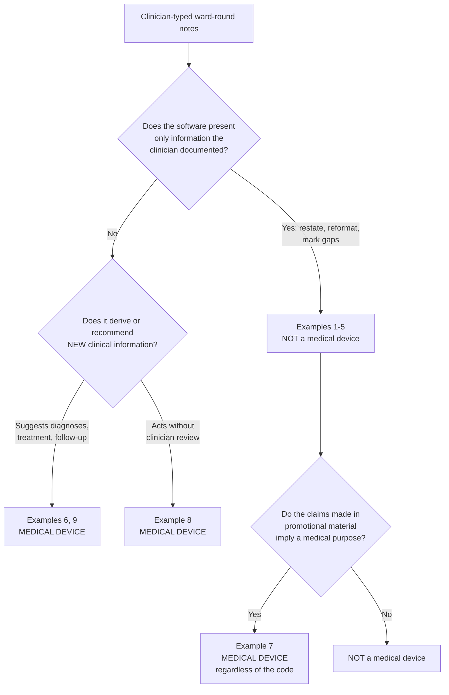

# WS2a — Intended Purpose and Medical Device Determination

**AI Discharge Summary Assistant**
Document version 1.5 · Written 11 September 2026, verified 15–16 September 2026 · Author: Shina Oguntoye

| Field | Value |
|---|---|
| Subject of determination | AI Discharge Summary Assistant, system prompt **v0.7**, deployed configuration as at 11 Sep 2026 |
| Jurisdiction | Great Britain (England, Scotland, Wales). Northern Ireland not assessed — EU MDR applies there under the Windsor Framework |
| Governing law | Medical Devices Regulations 2002 (SI 2002/618), as amended |
| Regulatory position verified | **10–11 September 2026** against primary sources (§10) |
| Standards baseline | DCB0129 **v4.2** / DCB0160 **v3.2** (2018 versions). Both under NHS England national review; consultation closed 11 Sep 2026, no revised version or publication date announced. **Re-check before relying on this document after any revision is published.** |
| Determination | **Not a medical device** under UK MDR 2002, on the intended purpose stated in §1 |
| Confidence | High on the drafting function. Medium-high overall: one named residual (§5.3) and two open implementation gaps on the same boundary (§5.2), which affect conformance rather than qualification (§5.4) |

> **Read this first.** This memo is an assessment of a portfolio demonstration running on
> fully synthetic data. It is not a regulatory submission, it has not been reviewed by MHRA
> or by a regulatory consultant, and no legal manufacturer entity exists. Its value is the
> reasoning, not the verdict.

---

## 1. Intended purpose statement

Structured to the four elements MHRA sets out in *Crafting an intended purpose in the context
of SaMD* (updated 31 Jul 2026): structure and function, intended population, intended user,
intended use environment.

### 1.1 Structure and function

The AI Discharge Summary Assistant is software that takes **free-text ward-round notes
authored by a clinician** and returns **three draft documents** for that clinician to review,
edit and sign:

1. a structured clinical discharge summary,
2. a GP handover letter,
3. a patient-facing version of the same content in plain English.

Its function is **reformatting and restatement**. It reorganises information the clinician has
already recorded into the conventional structure of each document type, adapts register for the
reading audience, and marks where the source notes are silent. It does not consult external
clinical knowledge bases, guidelines, or any data source other than the notes supplied in the
request.

**Inputs:** clinician-typed free text, submitted through an authenticated web interface.
**Outputs:** three text drafts, returned with the model version, a draft flag and a completion
timestamp on the generation record. (The SPA surfaces the model version and per-output SHA-256
hashes; a per-output draft marker is emitted by the model at its discretion and is not enforced
by the software — see §9.)
**Action required of the user:** read, correct and sign every output before any clinical use.
The clinician remains the author of record. Nothing is written to any clinical record system by
the software.

### 1.2 What the software is explicitly **not** intended to do

This list is part of the intended purpose, not a disclaimer appended to it.

- It is **not intended to derive or recommend any new clinical information** that would
  influence the clinician's decision-making.
- It does not diagnose, suggest diagnoses, or rank differentials.
- It does not recommend treatment, investigations, drugs or doses.
- It does not detect, infer or flag drug interactions, contraindications, or prescribing errors.
- It does not generate clinical advice, follow-up plans or safety-netting the clinician has not
  documented. *(Intent. The implementation does not currently hold this line in full — see §5.2
  and §5.4.)*
- It does not act on its output, order anything, or write to a record without human action.
- It is not a system of record. The EPR remains authoritative.

### 1.3 Intended population

Adult and paediatric inpatients being discharged from a UK secondary-care setting, in the
sense that the notes describe such a patient. The software never interacts with a patient and
has no patient-facing mode; the patient-facing *document* is produced for the clinician to
review and hand over.

**Out of scope / contraindicated:** use with real patient-identifiable data in the current
demonstration deployment; use as the sole source for any document not read by a clinician; use
for any purpose other than drafting the three named document types.

### 1.4 Intended user

A **registered clinician who already holds responsibility for authoring the discharge summary** —
in practice a foundation doctor, SHO or registrar. The user must be capable of recognising a
clinical error in a discharge summary. The software is not for administrative staff, students,
patients or carers.

### 1.5 Intended use environment

A UK secondary-care ward or doctors' office, on a hospital or personal device with browser
access, at the point of discharge. Authenticated access only; per-user attribution recorded.
Not designed for emergency or time-critical use — there is no service-level guarantee, and the
clinician can always write the document themselves.

---

## 2. The legal test

Qualification in GB is governed by the **Medical Devices Regulations 2002**, not EU MDR.
There is **no Rule 11** in GB, so the EU's aggressive software classification does not apply
here and should not be imported by analogy.

A product is a medical device if the manufacturer intends it for one or more of:

- diagnosis, prevention, monitoring, treatment or alleviation of **disease**;
- diagnosis, monitoring, treatment, alleviation of or compensation for an **injury or handicap**;
- investigation, replacement or modification of the **anatomy or of a physiological process**.

Two features of the test matter more than the list itself:

- **Intended purpose is set by the manufacturer**, and MHRA reads it from "the labelling, the
  instructions for use and/or the promotional materials". It is not set by the technology used.
  Generative AI is not a qualifying criterion; neither is clinical subject matter.
- **A disclaimer does not rescue a product whose claims imply a medical purpose.** MHRA is
  explicit: "general disclaimers (for example 'this product is not for diagnosis') are not
  acceptable to demonstrate a product is not a medical device if medical claims are made or
  implied elsewhere." See §7.

---

## 3. Which guidance applies, and the honest caveat

The closest MHRA guidance on point is **Ambient voice technology-enabled products (29 Jul 2026)**,
which contains nine worked examples applying the definition above to scribe-class products.

**That guidance is titled for ambient voice technology. This tool takes clinician-typed text.**
The analogy must be argued, not assumed. Three things make it strong:

1. **Example 5 already covers non-ambient input.** It applies to a product drafting a discharge
   summary "based on patient information from sources such as the electronic patient record or
   transcripts/summaries of conversations" — i.e. the example is not confined to what a
   microphone heard.
2. **Example 9 covers dictation explicitly** — "a report from a clinician's dictation or a
   clinical conversation". Dictation is not ambient listening. The guidance therefore already
   reasons across input modalities.
3. **No conclusion in any of the nine examples turns on the input modality.** In every case the
   deciding factor is what the product does with the information after it has it. Examples 1–5
   restate; Examples 6–9 derive, recommend or act. Input method is never the discriminator.

**The caveat, stated plainly:** MHRA has not published guidance addressed to text-input drafting
tools, and this memo therefore reasons by analogy from guidance written for an adjacent product
class. The analogy is well supported by the structure of the examples, but it is an analogy.
A regulator could take a different view, and this document does not claim otherwise.

The general SaMD framework (*Medical devices: software applications*, upd. 1 Jul 2023) reaches
the same conclusion by the same route and does not depend on the AVT analogy at all.

---

## 4. Determination against MHRA's worked examples

| MHRA example | What it covers | This tool | Why |
|---|---|---|---|
| **Example 5** — not a device | Drafts a discharge summary or letter for clinician review and edit, from EPR data and/or encounter records; "not intended to derive or recommend any new information to impact the clinician's clinical decision making" | **Matches** | Same output type, same review-and-edit posture, same negative intent — stated at §1.2 and enforced in prompt v0.6 |
| **Example 6** — device | Summary with an optional "generated insights" feature offering suggested diagnoses or follow-up/treatment options; sold on that feature despite a UI disclaimer | **Does not match** | There is no insights feature, no optional mode that adds clinical content, and nothing in the interface offers one. The absence is architectural, not a setting |
| **Example 8** — device | Agent that saves to the EPR without clinician review and autonomously orders follow-up tests | **Does not match** | The software writes to no clinical system, orders nothing, and has no action surface at all. Output is returned to the requesting clinician and to no one else |
| **Example 9** — device | Drafts a report from dictation plus EPR test results, then analyses those data to suggest diagnoses the clinician is expected to rely on without reviewing the reasoning | **Does not match — and this is the nearest miss** | The formatting-from-dictation half of Example 9 is treated as unobjectionable; the device trigger is the added diagnostic layer. This tool has the first half and not the second |

**Determination: not a medical device**, on the intended purpose at §1.

---

## 5. The features that sit near the line

Three functions in the deployed system do more than copy text across. Each is assessed against
the Example 5 test — *does it derive or recommend new information that impacts clinical
decision-making?*

### 5.1 Drug reconciliation — outside, with a named condition

The prompt tags every discharge medication against the documented pre-admission history
(`NEW` / `INCREASED` / `DECREASED` / `continued` / `STOPPED`) and forbids silently dropping a
pre-admission drug.

**Assessment: outside the definition.** Comparing two lists the clinician wrote and labelling
the differences is a completeness check on the clinician's own documentation, not new clinical
information. The prompt forbids reconstructing a list, inventing a dose, or filling a gap
(`"never reconstruct them from the pre-admission list"`), and the observed behaviour is to
**flag the gap rather than close it** — verified in the Run 3 cold evaluation of scenario S12
(Care of the Elderly), where the discharge medication list was absent despite a documented
pre-admission DAPT history post-NSTEMI. The model wrote "Not documented" and raised a
reconciliation flag rather than reconstructing the list from the pre-admission drugs
(`evals/EVAL_RESULTS.md`, S12).

**What would move it inside:** inferring *why* a drug was stopped; identifying a drug
interaction or contraindication; suggesting a drug that "should" be on the list; or scoring the
list against a formulary or guideline. Any of those derives new clinical information.

### 5.2 Safety-netting advice — outside by intent, and the build was not holding it

Prompt v0.6 restricted the patient version to advice **the clinician documented**: "You may
rephrase, simplify, or reorganise advice and safety-netting that IS present in the source
notes… You may NOT add new clinical advice."

That rule exists because it failed once. Run 4's single substantive clinician response
(general surgery, scenario S16) found the patient version had added standard stoma red-flag
advice that was not in the notes. The advice was clinically correct; it was still the model
supplying clinical information the responsible clinician had not given. That is precisely the
Example 5 boundary, found empirically before it was found legally.

**Assessment: the intended purpose is clean. The build was not enforcing it, for a reason
nobody had looked at.** The v0.6 fix was applied one layer too high.

**The root cause.** v0.6 scoped its rule to PART C and defined the boundary as *"do not
introduce any fact, clinical advice, or safety-net trigger **not in Part A**"* — which blesses
whatever PART A contains. And PART A's own field template read:

> `PATIENT ADVICE` — *[Wound care, safety-net advice, what to expect, when to seek help.]*

That is an instruction to **author** advice, with no documented-only qualifier anywhere near it.
So the model invented the safety-netting into PART A, and PART C carried it faithfully — exactly
as instructed. The output looked like a PART C failure and was in fact a PART A failure.

Verified against the source notes, not inferred:

- **S15 (COPD).** The notes contain no safety-netting of any kind — they end "Resp clinic 6/52,
  community resp team referral. GP: review after exacerbation." PART A nonetheless produced
  *"If breathlessness worsens, sputum changes, or you feel unwell, contact your GP or call NHS
  111."* PART C then reproduced it correctly.
- **S18 (first seizure).** The notes document activity restrictions — *"Safety advice (no
  swimming alone, heights, baths)"* — and no re-presentation trigger at all. PART A produced
  *"If you become unwell **or have another seizure**, contact your GP or call NHS 111."*
- **PART B had the same hole.** Its template asked the model to write *"No specific actions;
  please review if [trigger]"* — the model supplies `[trigger]`, which is a re-presentation
  criterion it invents.
- **The paediatric clause contradicted the rule outright**, instructing the model to "give
  parents concrete red flags and realistic expectations". It was acted on in the 2026-05-21
  bronchiolitis run, which produced a full invented red-flag set from notes saying only
  "Parental safety-net advice given". No paediatric or neonatal scenario had been run under
  v0.6, so nothing caught it.

**Patient v2 was never a control against this — and it made the failure mode worse.** Its only
input is the curated PART A, so it propagates whatever PART A invented and has no way to know.
The design document's claim that it is "architectural belt-and-braces over the v0.6 prompt rule"
holds only for inventions originating in PART C — which, as it turns out, is not where they
originate. Worse than neutral: with the second pass **on**, PART A is the *sole* input to the
patient leaflet, so an invented trigger in PART A is laundered into the patient version with
nothing left to contradict it. The v1 combined pass at least had the raw notes in context. The
structural guarantee was real; it was guaranteeing the wrong boundary.

**And it is on.** `PatientV2SecondPass` defaults to `off` in `infra/template.yaml`, but the CI
pipeline pins it `PatientV2SecondPass=on` on every deploy to `main`, and the deployed stack was
confirmed `on` on 15 Sep 2026. Versions 1.0–1.3 of this memo stated it was off in the deployed
stack, reasoning from the template default and `samconfig.toml` without checking the live
parameter. That was wrong, and it is the kind of error this memo warns about elsewhere: the
deployed configuration is a fact to be queried, not inferred from source.

> **Fixed 11 Sep 2026 — prompt v0.7.** The no-added-advice rule is promoted out of PART C into
> the CORE PRINCIPLE and now covers PARTS A, B and C, with inventing a safety-net trigger named
> as a critical failure alongside inventing a drug or a resus status. PART A's advice template is
> documented-only and defaults to "Not documented". PART B no longer asks for a `[trigger]`. The
> paediatric clause is scoped to audience and register. The generic fall-back line is pinned as
> verbatim text.
>
> **And a gate behind the rule, because a rule alone had already failed once.**
> `evals/safety_net_gate.py` anchors to the **source notes** — not to PART A, which is model
> output and was the mistake the first version of this gate made. If the notes record no
> seek-help trigger, neither PART A's advice field nor PART C may contain one, and PART C's only
> signposting is the canonical line verbatim. If the notes do record one, the gate reports and
> does not fail: judging a rephrasing is a rubric job, not a regex one.
>
> Against the ten saved generations it returns **5 clean, 2 inventions in PART A (S15, S18) and
> 3 wording deviations in PART C** (S16 adding an A&E route, S18 rewording the fixed line, S17
> adding "anything else") — while passing routine follow-up, markdown emphasis, soft line
> wrapping, colon-terminated headings, quoted text and a repeated fall-back line. **Half the
> saved corpus deviated. The v0.6 prompt rule held about half the time.** 24 unit tests
> (`tests/test_safety_net_gate.py`) pin the real strings and the real PART A field shape.
>
> **What the gate does not catch**, stated because a gate trusted beyond its reach is worse than
> none: it keys on urgency tokens (111 / 999 / A&E), so invented advice phrased without them is
> invisible to it — "go back to the hospital if your breathing gets worse", a bulleted red-flag
> list, or a prognostic claim like "the cough can last 2–3 weeks". Those stay with the eval
> rubric (D2, hallucination). It is a floor, not a proof.
>
> **Verified in behaviour 15 Sep 2026.** Cold eval of S8, S9, S15 and S18 under v0.7: all four
> pass the gate, and the two scenarios that were failing — S15 and S18 — return `clean` rather
> than `advisory`, meaning the gate actively inspected PART A's advice field and found no
> invented trigger. The breathlessness/sputum and "another seizure" lines are gone.
>
> **S8 is the case that matters**, because it is the shape that produced a wholly invented
> paediatric red-flag set under v0.6. Its notes record only *"Safety-net advice to parents re
> fever/feeding/breathing"* — that advice was given, but not what it was. Under v0.7, PART A
> reads: *"The notes record that safety-net advice was given to parents regarding fever,
> feeding, and breathing. The specific content, thresholds, and triggers were not documented.
> The reviewing clinician should confirm and document the advice given before this summary is
> finalised."* It surfaces the gap instead of filling it, which is the behaviour §1.2 claims and
> now the behaviour on record.
>
> **One residual found by that run, and not a blocker.** S8's patient version rendered the
> fall-back as "If you become **worried about your baby**, contact your GP or call NHS 111" — a
> sensible audience adaptation, since "if you become unwell" is wrong when the reader is the
> parent and the patient is the neonate. But it is an unprompted rewrite of text v0.7 pins as
> verbatim, and the gate cannot see it: S8's notes do record a trigger, so the gate goes
> advisory and stops checking. The prompt should *specify* a paediatric variant of the fixed line
> rather than leave the model to improvise one. Logged for WS4; the hazard is the same one.

A secondary code defect on the same path, **fixed 11 Sep 2026**: `_maybe_second_pass` guarded
only on the summary being non-empty, but `_split_outputs` fails *safe* by returning the whole
A+B+C blob under `summary`. That blob is non-empty, so the guard never fired and the second pass
anchored to unparsed output rather than to PART A — defeating the one property that makes v2 a
control at all. The function now takes a required `parse_ok` and skips when the split failed; two
unit tests pin both halves of the guard.

### 5.3 The resuscitation carve-out — the closest to the line, and the residual

Prompt §2a permits one inference. Where the notes record that a resuscitation form or discussion
**took place** but do not transcribe its content, the model may state the *most likely*
recommendation — e.g. "in this context the recommendation is most likely DNACPR with a
ward-based ceiling of care" — flagged as inferred, with a mandatory instruction to confirm
against the completed form.

This is the only place in the system that supplies clinical content the clinician did not
document, and the subject matter is a treatment-limitation decision. It deserves to be argued,
not waved past.

**Assessment: outside the definition, on four conditions that all currently hold.**

1. **The trigger requires the decision to already exist.** The model fills in a value for an
   event the notes record; it does not conjure the event. Where no form or discussion is
   documented, rule 2 stands absolutely; the prompt calls inventing a status a critical failure and the
   evaluation rubric scores it as an **auto-fail** (`evals/EVAL_RESULTS.md`, dimension D3).
2. **It is flagged as inference, never asserted as fact.** Example 9's device trigger turns on
   the clinician being "intended to rely on the output of the software without review of the
   reasoning". Here the reasoning is on the page and the output is marked as unconfirmed.
3. **It directs the clinician to the primary source.** The output instructs confirmation against
   the form before reliance. It routes the clinician *to* the record rather than substituting
   for it.
4. **It is a documentation-retrieval prompt, not a clinical recommendation.** The output's
   function is "go and read the form", not "this is what the ceiling of care should be".

**This is the feature to watch.** Removing any one of those four conditions moves the tool
across the line — see §6, items 5–8. It is recorded here as a residual, not resolved away, and
it is the correct subject of a DCB0129 hazard entry in WS4.

*Decision recorded 11 Sep 2026: retain the carve-out and argue the position above. The
alternative considered — narrowing the prompt so the model states only that a form exists and
its content is not transcribed — would give a cleaner determination at the cost of reversing the
v0.5 change that the Care-of-the-Elderly scenario drove, and would require a prompt version bump
and cold-eval re-run. Reconsider if this tool ever moves toward real deployment.*

---

### 5.4 Qualification versus conformance — why §5.2 does not change the determination

The distinction matters and is worth stating rather than assuming.

**Qualification** — whether this is a medical device — is decided by the manufacturer's intended
purpose, read from the labelling, instructions for use and promotional materials. The intended
purpose at §1 excludes model-added clinical advice, and the determination at §4 stands on it.

**Conformance** — whether the build does what the intended purpose says — is a separate question,
and §5.2 shows two places where it currently does not. That is a clinical-safety and claims
problem, not a qualification problem: a product does not become a medical device because it has a
bug. But it does become one if the gap is left open and the behaviour is allowed to settle into
the intended purpose by practice, or if the published material starts describing it.

The correct response is therefore a build fix and an eval gate (§9), not a change to §1.

## 6. Boundary conditions — what would flip this determination

Stated as concrete changes, not principles. Any one of these converts the tool into a medical
device and the assessment must be redone before it ships.

**Function changes**

1. Flagging a drug interaction, contraindication, allergy conflict or dosing error.
2. Suggesting, ranking or hinting at a diagnosis, including "possible causes" phrasing.
3. Generating condition-specific safety-netting, follow-up intervals or red flags not documented
   by the clinician — in **any** part of the output, including a "helpful" conditional fallback,
   and including writing one into the clinician summary where the patient version will then copy
   it faithfully. §5.2 is what this looks like in practice.
4. Comparing the clinical picture against a guideline, pathway, risk score or formulary.

**Changes to the resuscitation carve-out**

5. Presenting the inferred recommendation without the inference flag.
6. Dropping the "confirm against the form" instruction.
7. Extending the carve-out to cases where no form or discussion is documented.
8. Extending inference-from-context to any other safety-critical field (drugs, diagnoses,
   allergies, investigations).

**Architectural changes**

9. Writing any output to an EPR or clinical system without a clinician action in between.
10. Removing meaningful clinician review from the workflow — including making review
    skippable, defaulted-through, or reduced to a click with nothing to read.
11. Adding any autonomous action: ordering, referring, booking, notifying.
12. Adding an "insights", "suggestions" or "AI review" mode, however disclaimed. Example 6 is
    decided on exactly this, disclaimer included.

**Claims changes** — see §7. These flip the determination with no code change at all.

---

## 7. The claims test

Intended purpose is read from labelling, instructions for use **and promotional materials**.
For this project the promotional materials are the README, the portfolio site, the case study,
the LinkedIn posts and the newsletter. A claim made there converts the product regardless of
what the code does — Example 7 turns on nothing else.

**Do not write, in any channel:**

- "catches missed diagnoses" / "spots what you missed"
- "improves patient outcomes" / "reduces readmissions"
- "safer discharges" (as a property of the tool rather than a design intent)
- "clinical decision support"
- "flags drug interactions" / "checks your prescribing"
- "reduces errors" without naming *documentation* errors specifically

**Safe formulations, because they describe the administrative function:**

- "drafts a discharge summary, GP letter and patient version from ward-round notes"
- "engineered for restraint — it reports only what the notes support"
- "flags gaps and contradictions rather than resolving them"
- "every output is a draft for clinician review and sign-off"
- "not a medical device; not for use in clinical care"

**Audit performed 11 September 2026.** No forbidden phrasing found in the README, the case
study or the portfolio site. Three items to decide on:

1. `README.md` — "poor summaries delay GP follow-up and **contribute to readmissions**. This tool
   drafts a structured summary…". The outcome was attributed to the *problem*, not the tool, so it
   was not a claim — but the adjacency of the two sentences invited the inference.
   **Fixed 11 Sep 2026:** the sentences are separated and the paragraph now says in terms that
   this describes the problem and not the tool, pointing at `MODEL_CARD.md` §7.
2. `docs/CASE_STUDY.md` — the same sentence shape. **Fixed the same way.**
3. **The portfolio site carried no "not a medical device / not for use in clinical care" line**,
   though the README did. It is the most public of the promotional materials and the one most
   likely to be read without context. **Fixed 11 Sep 2026** — the line is now on the project card.

Re-run this audit before WS2b: the DTAC form asks for the intended purpose and will be read
against whatever is published.

---

## 8. If it were a device — classification

Recorded so the fallback position is on file, not because it is the conclusion.

**Class I** under UK MDR 2002. Rule 10 places active diagnostic devices in Class IIa where they
allow "direct diagnosis or monitoring of vital physiological processes", and MHRA reads "direct
diagnosis" as providing **decisive** information for making a diagnosis, or claiming to perform
as a clinician would in a diagnostic task. A drafting tool whose output is reviewed and rewritten
by the responsible clinician before use supplies nothing decisive.

Class I under the current GB regime would require a UKCA route with self-certification against
the essential requirements, a quality management system, a technical file, MHRA registration and
a UK Responsible Person — none of which exist for a portfolio project with no legal entity.

**Reform status:** the draft Medical Devices (Amendment) Regulations 2026 were consulted on
11 May – 19 Jun 2026 and are **not enacted**. Post-market surveillance requirements
(SI 2024/1368) **are** in force since 16 Jun 2025. Re-check both before reusing this section.

---

## 9. Consequences carried forward

1. **The clinician review gate is load-bearing and is not built.** It is designed but not wired
   into the deployed SPA (`MODEL_CARD.md` §8). It now carries three jobs simultaneously: the
   primary clinical-safety mitigation, the "meaningful human involvement" that keeps the tool
   outside UK GDPR Articles 22A–22D, and one of the conditions this determination rests on
   (§6 item 10). It is a prerequisite, not a backlog item. **→ W1, 5 Oct.**
2. **§1.2 is a build constraint, not documentation.** Every item in it must stay enforced. Any
   future feature request should be tested against §6 before it is estimated.
3. **The resus carve-out needs a hazard entry** in the WS4 DCB0129 hazard log, with §5.3's four
   conditions as its controls.
3a. **~~Fix the safety-netting holes at §5.2~~ — done 11 Sep 2026** (prompt v0.7 across PARTS A,
   B and C + `evals/safety_net_gate.py` + 24 tests). They still belong in the WS4 hazard log:
   the same hazard as §5.3 on a different field, with the gate as their control. Note for the
   hazard log that the control sits at PART A, not PART C — the patient version was the symptom.
3b. **~~Fix the `_maybe_second_pass` parse guard~~ — done 11 Sep 2026.**
3c. **~~Cold-eval S8 + S9 under v0.7~~ — done 15 Sep 2026.** Ran S8, S9, S15 and S18; 4/4 pass
   the gate. Outputs at `evals/runs/run-2026-09-15-discharge-summary-system-prompt/`. See §5.2.
3d. **~~Run the unit suite~~ — done 15 Sep 2026.** 65 passed, plus the canary scenario-bundle
   check and cfn-lint (five W3005 and five W3002, both deliberate, no errors).
3e. **Outstanding: specify a paediatric variant of the fall-back line** (§5.2 residual). The
   model currently improvises one, correctly but unprompted, and the gate cannot see it because
   paediatric scenarios tend to document a trigger and so route to the advisory path.
4. **The claims audit (§7) gates WS2b** — the DTAC form asks for the intended purpose and will
   be read against the published material.
5. **`PatientV2SecondPass` is ON in the deployed stack** (confirmed 15 Sep 2026; CI pins it on
   every deploy). It does not change the determination — the restatement-only rule governs both
   paths. **Both paths are now verified under v0.7:** S8, S9, S15 and S18 pass the gate on the v1
   combined path (`evals/runs/run-2026-09-15-discharge-summary-system-prompt/`) and again on the
   deployed v2 path (`…-patient-v2/`). The v2 result is the one that counts for deployed
   behaviour, because with the second pass on PART A is the leaflet's only input (§5.2) — the v2
   path is where a PART A invention would reach the patient unopposed.

   *Harness defect found in the process, now fixed:* the cold-eval runner auto-named its output
   folder from the date and prompt stem only, so the v2 run silently overwrote the v1 run of the
   same day. The v1 evidence survived only because it had already been committed. The patient-pass
   mode is now part of the folder name, and both runs are retained side by side.

---

## 10. Sources

All accessed and verified 10–11 September 2026. Dates are the publisher's own.

| Source | Date | Used for |
|---|---|---|
| [MHRA — Ambient voice technology-enabled products](https://www.gov.uk/government/publications/ambient-voice-technology-enabled-products/ambient-voice-technology-enabled-products) | 29 Jul 2026 | Examples 1–9, the derive-or-recommend test, the disclaimer rule |
| [MHRA — MHRA clarifies regulatory status of AVT used in the NHS](https://www.gov.uk/government/news/mhra-clarifies-regulatory-status-of-ambient-voice-technologies-used-in-the-nhs) | 29 Jul 2026 | Confirms the position supersedes earlier 2025 guidance |
| [MHRA — Crafting an intended purpose in the context of SaMD](https://www.gov.uk/government/publications/crafting-an-intended-purpose-in-the-context-of-software-as-a-medical-device-samd) | upd. 31 Jul 2026 | The four-element structure at §1 |
| [MHRA — Medical devices: software applications](https://www.gov.uk/government/publications/medical-devices-software-applications-apps) | upd. 1 Jul 2023 | General qualification route, independent of the AVT analogy |
| [NHS England — AI-enabled ambient scribing products, v3](https://www.england.nhs.uk/long-read/guidance-on-the-use-of-ai-enabled-ambient-scribing-products-in-health-and-care-settings/) | upd. 29 Jul 2026 | NHS-side position; supersedes the Apr 2025 "beyond transcription" line |
| Medical Devices Regulations 2002 (SI 2002/618, as amended) | in force | The definition and Class I/IIa rules |
| SI 2024/1368 — post-market surveillance | in force 16 Jun 2025 | §8 reform status |

> **Currency warning.** Anything written on this subject **before 29 July 2026** overstates the
> burden. The widely repeated 2025 line that scribe products going "beyond transcription" are
> likely medical devices comes from the April 2025 NHS England guidance and has been superseded.
> Check the date on every source before citing it.

---

## 11. Limitations of this memo

- Written by the developer, who is also the clinician. No independent regulatory review.
- Reasons by analogy from AVT guidance to a text-input product (§3).
- Assesses a demonstration on synthetic data. A real-data deployment changes the IG analysis
  (WS3) and, in a trust context, brings DCB0160 obligations onto the deploying organisation.
- Assessed against a moving baseline: DCB0129/0160 are under national review and the 2026 device
  reform is unenacted.
- GB only. Northern Ireland and the EU are not assessed and would be decided under EU MDR,
  where **Rule 11** exists and the answer may well differ.

---

## Change control

| Version | Date | Change |
|---|---|---|
| 1.5 | 16 Sep 2026 | Deployed path verified: the cold eval re-run with `--patient-second-pass` passes the gate on all four scenarios, so v0.7 holds on both the v1 combined path and the v2 path the stack actually runs. Cold-eval harness fixed — it was auto-naming output folders without the patient-pass mode, so the v2 run overwrote the v1 run; the v1 evidence survived only because it had been committed first. Both runs now retained side by side. |
| 1.4 | 15 Sep 2026 | Corrected a factual error the memo had carried since v1.0: `PatientV2SecondPass` is **on** in the deployed stack — CI pins it on every deploy — where versions 1.0–1.3 said it was off, reasoning from the template default instead of querying the live parameter. The correction sharpens §5.2 rather than softening it: with the second pass on, PART A is the patient leaflet's *only* input, so an invention in PART A reaches the patient unopposed. Patient v2 was not merely a non-control against this class; it removed the one remaining contradicting input. Scope corrections applied in place to `PATIENT_V2_DESIGN.md`, `ADR-phase1.md` and the patient-pass prompt header. New outstanding item: re-run the cold eval with `--patient-second-pass`, since the 15 Sep run exercised the v1 path. |
| 1.3 | 15 Sep 2026 | Behaviour verified, not just asserted: cold eval S8/S9/S15/S18 under v0.7 all pass the gate, unit suite green at 65, both commits pushed. §5.2's outstanding note replaced with the S8 result. One residual logged — the paediatric fall-back line is adapted by the model rather than specified by the prompt. |
| 1.2 | 11 Sep 2026 | §5.2 rewritten after a second verification pass. The first fix was aimed at PART C; the invention actually happens in PART A, whose field template instructed the model to author advice, and v0.6's "not in Part A" boundary then blessed it. Prompt v0.7 now covers PARTS A, B and C; the gate re-anchored from PART A to the source notes; Patient v2 recorded as never having been a control against this class. 24 tests. |
| 1.1 | 11 Sep 2026 | Both §5.2 holes fixed and the `_maybe_second_pass` parse guard corrected. Claims fixes applied to README, case study and portfolio site. Outstanding: cold-eval S8/S9 under v0.7, and a `pytest` run on the dev machine. |
| 1.0 | 11 Sep 2026 | Initial determination. Intended purpose stated; tested against MHRA Examples 5, 6, 8, 9; resuscitation carve-out identified as the residual and retained with four stated conditions. Verification pass against the repo found two previously unrecorded safety-netting gaps (§5.2) and one code defect; all carried forward to §9 rather than written out. |
