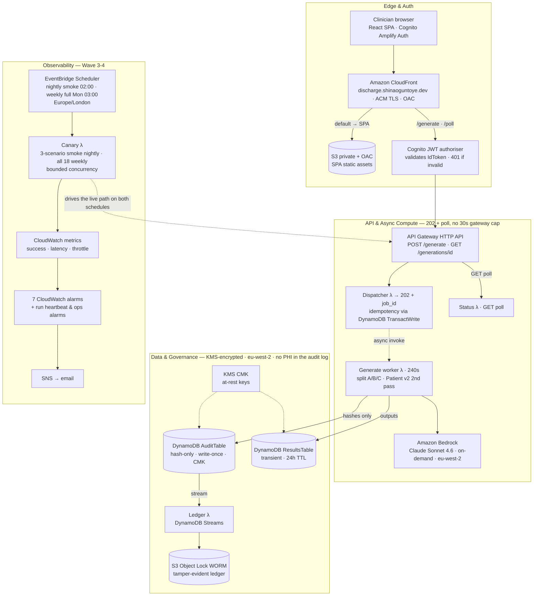

# WS3 — Data Protection Impact Assessment

**AI Discharge Summary Assistant**
Document version **2.4** · Written 16 September 2026 · Transposed onto the NHS England template and verified 17 September 2026 · Action-plan dates re-aligned 18 September 2026 · Annex B published 20 September 2026
Author: Shina Oguntoye · IG sources verified from primary sources **16 September 2026** (§12)

| Field | Value |
|---|---|
| Subject of assessment | AI Discharge Summary Assistant — system prompt **v0.7**, infrastructure as deployed 16 Sep 2026, stack `discharge-audit` (eu-west-2) |
| Assessment type | **Manufacturer's DPIA.** Written by the supplier for a deploying organisation to adopt, extend and complete as controller |
| Template | **NHS England, *Health and care: Template data protection impact assessment (DPIA)*, March 2026 master.** Local copy: `docs/NHSE_Template_DPIA_March_2026.docx`. Sections 1–11 below are the template's own sections, in its own order and wording |
| Data status | **Fully synthetic patient data.** No real patient personal data has ever been processed. Clinician (worker) personal data *is* real and *is* being processed now — §1.3 |
| Device status | **Not a medical device** under UK MDR 2002, on the intended purpose at `WS2a-DEVICE-DETERMINATION.md` §1 (memo v1.5). Settled; not re-derived here |
| Legal framework | UK GDPR as amended by the Data (Use and Access) Act 2025; Data Protection Act 2018; common-law duty of confidentiality; NHS Records Management Code of Practice 2023 (v5) |
| ADM framework | UK GDPR **Articles 22A–22D**, inserted by DUAA 2025 s.80, in force **5 February 2026** (SI 2026/82) — §8 |
| Standards baseline | DCB0129 **v4.2** / DCB0160 **v3.2** (2018). Under NHS England national review; consultation closed 11 Sep 2026, no revised version or date announced |
| DTAC | Written to close **C2.2.2** (and, if published, **C2.2.3**) of DTAC form 2.0, February 2026. All twelve must-cover items mapped at §0.3 |
| Risk scoring | **The template's own 5×5 scale** — Likelihood (Rare 1 … Almost certain 5) × Impact (Negligible 1 … Catastrophic 5). §10 |
| Status | **Draft for review.** No legal manufacturer entity exists; no DPO has been appointed; the ICO has not been consulted |

> ### Read this first
>
> This is a DPIA for a portfolio demonstration running on synthetic data. Its value is the
> reasoning and the honesty of its gaps, not a compliance verdict. Four things a reviewer should
> know before reading further:
>
> 1. **The central safeguard this assessment relies on — the clinician review gate — is designed
>    but not built** (§8.6, §10 R-08). Every argument about meaningful human involvement is an
>    argument about a control that does not yet exist in the deployed SPA.
> 2. **Patient data is synthetic; clinician data is not.** The worker-monitoring half of this
>    assessment describes live processing of real personal data (§1.3).
> 3. **Where a source says nothing, this document says so** rather than filling the gap. The
>    8-year default at §7.2 is an analogy, not a citation, and is presented as one.
> 4. **Where the answer belongs to the deploying organisation, it is marked
>    [Controller to complete]** rather than guessed. The template's own guidance anticipates this:
>    *"In some cases, manufacturers will not have the responses to all of the questions within a
>    DPIA as it may need the context of the health and care organisations."*

> ### How to read this against the template
>
> The template is a Word form with guidance boxes and answer fields. This document answers its
> questions **in its section order and by its question text** — not by question number, because
> the numbers in the `.docx` are auto-generated fields and do not appear in the extracted text.
> When filling the actual form, match by wording and confirm the numbering there.
>
> Questions the form's routing lets us skip are still answered where a reviewer would ask anyway,
> and are marked **[skipped by routing — answered voluntarily]**. This follows the practice set at
> WS2b: a reviewer who finds a skipped question unaddressed reopens the one that skipped it.

---

## 0. Corrections and mapping

### 0.1 The DTAC form asks for twelve items, not eleven

`WS2b-DTAC-EVIDENCE-MAP.md` v1.0 and the Notion working page both stated that DTAC C2.2.2 lists
**eleven** must-cover items. Read verbatim from `docs/DTAC_Form_2.0_February_2026.docx`, the list
has **twelve** bullets.

**The error was a miscount, not an omission.** WS2b's own enumeration was complete — all twelve
were listed, including the end-user security-control item — and merely labelled "eleven", in four
places. Corrected in WS2b (now v1.1) and on the Notion page.

*(This correction was itself wrong in v1.0 of this document, which asserted that the end-user
security-control item had been dropped from WS2b's enumeration. It had not. The adversarial
verification pass caught it — recorded rather than quietly amended, because a DPIA whose headline
correction is itself a misdiagnosis is the exact failure mode this project keeps finding.)*

### 0.2 What changed in the transposition to the real template

v1.1 was written to the **content** DTAC requires, using the ICO's seven-step process as a spine,
because the template `.docx` could not be fetched — both shells get HTTP 403 from the egress proxy
on `digital.nhs.uk` binaries. Shina supplied the file on 17 September. Laying the document against
it changed four things, and the pattern is the same one Step 3 found: **the questions were
predictable; the scale, the routing and the checklists were not.**

1. **The scoring scale is 5×5, not 3×3.** The template's own risk-scoring table runs Likelihood
   Rare(1) → Almost certain(5) against Impact Negligible(1) → Catastrophic(5). **Every row of the
   register has been re-scored on the template's scale** (§10). This is not cosmetic: a 3×3 scale
   has no way to distinguish "Significant" from "Catastrophic" impact, and it was flattening the
   difference between a clinician's activity log and a patient's clinical record.
2. **The template carries its own AI-risk checklist**, and it named **three risks this register
   did not have**: *"Unfairness or bias in AI training data impacting certain groups of people in
   particular"*; *"Users intentionally or unintentionally using the AI for purposes outside of the
   defined and acceptable use"*; and *"Accurate transparency not possible due to an inability to
   understand how data is used in complex 'black box' systems"*. Added as **R-19, R-20 and R-21**.
   Coverage against the full checklist is at §10.4.
3. **ADM has its own question set in Section 8**, with explicit routing and a lawful-basis
   sub-question — not the free-form section v1.1 assumed. The analysis survives intact and is
   answered at §8.6 against the template's questions, **grouping the three Article 22C safeguard
   questions under one heading and the two lawful-basis questions under another** rather than
   answering all seven separately; the "No" at the head of the set skips all of them, and all are
   answered anyway.
4. **Section 6 states that *"multi factor authentication must be used for any systems with patient
   data"***. `MfaConfiguration` is `OPTIONAL`. That moves R-11 from "good practice not yet
   enforced" to a stated prerequisite for any real-data deployment.

Also new from the form: **Section 4 requires confirmation that the organisation's Information
Asset Register / ROPA has been updated** with the flows described. No ROPA exists — added as
**R-22**, an Article 30 gap that no prior document had named.

### 0.3 DTAC C2.2.2's twelve items → template section

The form's requirement, verbatim: *"To pass, the manufacturer must provide a DPIA that provides
sufficient detail for the assessing organisation to understand how the technology will use
personal data… It must cover:"*

| # | DTAC C2.2.2 must-cover item (verbatim) | Answered at |
|---|---|---|
| 1 | A summary of the product, including how it processes data | §1.2, §2.1 |
| 2 | A list of the data fields required | §3.2, §3.3 |
| 3 | How data flows into, within and out of the product | §4.1, **Annex A** |
| 4 | What security controls are in place in relation to end users (on/off boarding users; what limits their access within the product) | §6.4 |
| 5 | the technical and organisational measures in place, which must cover data in transit and at rest, and be proportionate to the risk of the processing | §6.1–§6.3, §6.5 |
| 6 | details of which countries the data will be stored in or flow through | §4.3, **Annex C.1** |
| 7 | whether the manufacturer's staff will be able to access any personal data, which must be proportionate and have an identified legal basis for doing so | §6.6 |
| 8 | who will be the controller for all elements of the processing | §9.1–§9.5 |
| 9 | arrangements for retention and disposal of data | §7.1–§7.4 |
| 10 | details of any processors or sub processors used for any part of the technology, and confirmation that there is a legally binding agreement to cover this processing | §9.2–§9.3, §9.6, **§9.7** (the agreement), **Annex C.2** |
| 11 | the confidentiality, availability and integrity risks associated with processing the personal data within its product, and how it mitigates these | §10 |
| 12 | how the product supports data subject rights | §8.1–§8.5 |

---

# SECTION 1 — Screening questions

## 1.1 Do you need to do a DPIA?

**☒ Yes**

**Two** of the template's four stated reasons apply. A third reason, not on the template's list,
applies independently. The template says only that reasons "may include", so none is presented
here as a statutory trigger in itself:

- **Sensitive (special category) data.** In deployment the product processes identifiable health
  and care data — the clinical content of ward-round notes.
- **New technology.** A generative AI model applied to clinical documentation. The template's
  guidance singles AI out repeatedly.
- **Worker monitoring — not one of the template's four, and the reason this DPIA would be needed
  even with no patient data at all.** The product records every generation against a named
  clinician. That is monitoring of workers under the ICO's guidance, and it engages Article 35
  independently of anything above.

NHS England's IG guidance for ambient scribing states that *"A DPIA is highly likely to be a legal
requirement for the use of an ambient scribe in a health or care setting"*. **That is an analogy
and is flagged as one:** this product is not an ambient scribe — it takes clinician-typed text —
and `WS2a` §3 is explicit that the AVT analogy *"must be argued, not assumed"*, because MHRA and
NHS England have published nothing addressed to text-input drafting tools.

> **On synthetic data and whether the obligation arises at all.**
> UK GDPR applies to personal data, and data about a person who does not exist is not personal
> data. It does not follow that no DPIA is required: (a) the **clinician** data at §1.3 is real
> personal data being processed now; (b) Article 35(1) requires the assessment *before* processing
> begins, so a system designed for real patient data needs it written before the first real
> record — writing it against the synthetic build is the correct sequence, not an optional one.
>
> **The ICO has not published a position on whether synthetic-only processing removes the DPIA
> obligation, and this document does not claim it has, either way.** The argument above reasons
> from the framework; it is not a citation.

## 1.2 Summary of how data will be used and shared

The AI Discharge Summary Assistant takes **free-text ward-round notes typed by a clinician** and
returns **three draft documents** for that clinician to review, edit and sign: a structured
clinical discharge summary, a GP handover letter, and a patient-facing version in plain English.

Its function is **reformatting and restatement**. It reorganises information the clinician has
already recorded, adapts register for the reading audience, and marks where the source notes are
silent. It consults no external clinical knowledge base, guideline or data source other than the
notes supplied in the request. It is not intended to derive or recommend any new clinical
information. *(Intended purpose is settled at `WS2a-DEVICE-DETERMINATION.md` §1; §1.2 of that memo
is the authoritative negative scope.)*

**How the data is handled, in one paragraph.** Clinical notes enter over TLS, are held **in memory
only** for the duration of one generation, and are sent to a large language model for inference
within the UK. The notes are **never written to durable storage**: no database row, no object, no
log line contains them. What *is* stored is (a) the three generated outputs, in a transient table
where they expire after 24 hours, and (b) an audit row containing **SHA-256 hashes** of the input
and outputs — never the text itself — attributed to the clinician who made the request. The
hash-only design is documented at **ADR-002**: the log proves *who generated what, when, with
which model, and whether it was reviewed* without ever holding the clinical content.

**Data is shared with no one.** There is no integration surface, no export, no reporting feed, no
third-party analytics and no onward disclosure. The only other organisation in the chain is AWS,
as sub-processor (§9.3). The clinician copies the reviewed output into the EPR by hand; the EPR
remains the system of record.

## 1.3 Is any of the data identifiable, pseudonymised or anonymised?

**☒ Directly identifiable data** · **☒ Pseudonymised data**

This system processes personal data about **two unrelated populations under two different
regimes**, and they share no lawful basis, retention period or rights process. The distinction is
carried from **ADR-007**, where it was first identified, and it drives the whole document.

| | Patients (clinical content) | Clinicians (usage record) |
|---|---|---|
| Data | Clinical free text, in-flight only | `user_sub`, email, timestamps, hashes, token counts |
| Identifiability | **Directly identifiable** in deployment (names, NHS number, DOB inside the notes) | **Directly identifiable** — the Cognito username *is* the email. `user_sub` in the audit table is pseudonymised and resolves to that email in one query |
| Category | Special category (Art. 9) in deployment | Ordinary personal data — an access-and-activity record, not health data about the clinician |
| **Currently real?** | **No — fully synthetic** | **Yes** |
| Stored at rest? | Outputs only, 24 h; input never | Indefinitely today (§7.2) |
| Regime | Health/care processing + common-law confidentiality | Worker monitoring |
| Controller in deployment | The deploying trust | Split — §9 |

> **A correction to how this has been described elsewhere.** ADR-007 describes `user_sub` as
> *"pseudonymous id, not name/email"*. That is true **of the audit table**, and it is the right
> design. It is not true of the system: the Cognito pool uses **email as the username**, so the
> controller holds directly identifying data. The ICO's position applies squarely —
> *"pseudonymised data is personal data in the hands of someone who holds the additional
> information"*. This DPIA treats the audit row as personal data about an identifiable clinician
> throughout, which is what makes §7.2's retention argument necessary rather than optional.

---

# SECTION 2 — Why do you need the data?

## 2.1 What are the purposes for using or sharing the data?

| # | Purpose | Population | Why the data is necessary |
|---|---|---|---|
| P1 | Draft the three discharge documents | Patients | The product's function. A clinician cannot be given a draft of a document without the document's content |
| P2 | Authenticate the user and control access | Clinicians | Clinical content must not be readable by an unauthenticated party, and outputs must not be readable across users |
| P3 | Maintain a non-repudiation and clinical-safety audit trail | Clinicians | DCB0129 clinical risk management; the ability to investigate a safety incident and establish which draft was generated and whether it was reviewed |
| P4 | Prove integrity of the audit trail (WORM ledger) | Clinicians | An audit log a privileged principal can silently alter does not support P3 |
| P5 | Operational monitoring, alerting and the synthetic canary | — (no personal data) | Availability, and detection of model or platform degradation |

**P3 is the purpose that constitutes worker monitoring**, and its limitation is recorded at §7.5
and in Annex B: it may not be repurposed for performance management or appraisal without a
compatibility assessment.

**The processing is coextensive with the task.** The discharge summary is a mandatory clinical
document that must be written by someone. The product does not create a new processing purpose; it
changes the means by which an existing, necessary document is produced, using **exactly the data
the clinician has already recorded and nothing else** — no EPR integration, no external lookup, no
enrichment. That is the strongest necessity argument available to a product of this kind.

## 2.2 What are the benefits of using or sharing the data?

- **Reduced administrative burden on clinicians.** Discharge documentation is a substantial,
  low-discretion drafting task performed under time pressure, typically by the most junior member
  of the team.
- **More complete and better-structured documents**, because the product marks where the source
  notes are silent rather than papering over the gap. The worked example at `WS2a` §5.2 (scenario
  S8) shows it surfacing an undocumented safety-netting gap for the clinician to close, which is
  the behaviour a discharge summary most needs and least often gets.
- **A patient-facing version produced as a by-product**, in plain English, which would not
  otherwise be written at all.
- **An auditable record** that a draft was produced and by whom — evidence that does not exist at
  all when the document is typed by hand.

**Stated as a limit, not a benefit:** the product does not claim to improve clinical outcomes,
catch missed diagnoses, or reduce readmissions. Such a claim would convert a non-device into a
medical device regardless of what the code does (`WS2a` §7), and the claims audit exists to keep
every published channel clear of it.

---

# SECTION 3 — What data do you want to use or share?

## 3.1 Can you use anonymous data for your purposes? If not, explain why.

**☒ No**

A discharge summary is a document about one identified patient, written to be filed in their
record and sent to their GP. Anonymising the input would destroy the output: the document must
carry the patient's identifiers to be the document at all.

**Two qualifications matter, and pull in opposite directions:**

- **The product does not *use* the identifiers.** It carries the NHS number through verbatim under
  a prompt rule and never validates it (no Modulus 11 check), scores it, indexes it or uses it as a
  key. The audit trail holds hashes, not identifiers. So identifiable data passes through the
  product without the product ever processing it *as* identity.
- **The clinician-side data cannot be anonymised either, and that is the point.** An anonymous
  audit log answers "a generation happened" and not "whose it was", which is the only question a
  non-repudiation record exists to answer. Attribution is the purpose, not an incidental
  by-product (see the legitimate-interests assessment at §5.5).

**What is actually done instead of anonymisation** is the stronger control: the identifiable data
is **never retained**. See §7.

## 3.2 Which types of personal data do you need to use and why?

Against the template's checklist — these are present **inside the free-text notes**, not as
structured fields the product parses:

**☒ Forename · ☒ Surname · ☒ Date of birth · ☒ Age · ☒ Gender · ☒ NHS number · ☒ Other numerical identifier** (hospital/MRN) · **☒ GP details** · **☒ Email address** (the clinician's — see below) · **☒ Other** (Cognito `sub`; SHA-256 hashes; token counts)

**☐ Address · ☐ Postcode full · ☐ Postcode partial · ☐ Physical description, for example height · ☐ Phone number · ☐ Legal representative name (personal representative) · ☐ National insurance number · ☐ Photograph / picture of people · ☐ IP address · ☐ Other location data · ☐ Audio recordings · ☐ Video recordings · ☐ None** — none of these is collected. **No IP address or user agent is captured anywhere**, which is a consequence of the absent access logging (R-09): a security gap that happens also to minimise personal data.

**Why it is needed:** patient identifiers are needed because the output document must carry them;
they are transcribed, never interpreted. The clinician's email is the Cognito username and is
needed to operate an authenticated, attributable account.

### Special category data

**☒ Information relating to an individual's physical or mental health or condition, for example
information from health and care records.**

Specifically: presenting complaint, diagnoses, past medical history, examination and investigation
findings, medications and changes to them, procedures, and follow-up arrangements — i.e. the
substance of the notes. It is needed because the discharge summary *is* a restatement of it.

**☐ Biometric · ☐ Genetic · ☐ Sexual life or orientation · ☐ Racial or ethnic origin · ☐ Political opinions · ☐ Religious or philosophical beliefs · ☐ Trade union membership · ☐ Criminal offences** — none is sought. Any could appear incidentally in free text where clinically relevant; the product neither extracts nor indexes it, and the notes are not retained.

> **In the current demonstration all of the above is synthetic.** The eighteen evaluation scenarios
> and all traffic use invented patients. `README.md` states *"All data synthetic"*, and the
> disclaimer states the product *"must not be used in clinical care or with real patient data"*.

## 3.3 Data fields, in full

### Patient data (synthetic today)

| Field | Where it exists | Persisted? |
|---|---|---|
| Free-text ward-round notes | `POST /generate` body; worker Lambda memory; Bedrock inference request | **No** — never written to DynamoDB, S3 or CloudWatch; log statements sanitised |
| Patient identifiers (name, DOB, NHS number, hospital number) | Only as they appear inside those notes | **No** — not parsed into fields, not indexed, not validated |
| Generated discharge summary, GP letter, patient version | DynamoDB `ResultsTable` | **Yes — 24 hours** (`RESULTS_TTL_HOURS` default 24), KMS CMK-encrypted |
| `input_sha256`, `output_sha256` | DynamoDB `AuditTable` (`GEN#` rows) | **Yes** — one-way; not reversible to the note, cannot identify a patient |

### Clinician (worker) data — real

| Field | Where | Persisted? |
|---|---|---|
| **Email address** | Cognito (`UsernameAttributes: email`) | **Yes — life of the account.** Directly identifying |
| `sub` → `user_sub`, `PK = USER#<sub>` | Cognito; `AuditTable` | **Yes — indefinitely today** |
| Password hash, TOTP secret | Cognito | Yes — credential material |
| `started_at`, `completed_at`, `generation_id` (ULID) | `AuditTable` | Yes |
| `model_version`, `output_type`, `request_region`, `inference_profile`, `schema_version`, `status` | `AuditTable` | Yes — personal in combination with `user_sub` |
| `draft`, `reviewed_at` | `AuditTable` | Yes — whether and when the clinician signed off |
| `input_tokens`, `output_tokens`, `patient_output_tokens` | `AuditTable` | Yes — **a proxy for the length of the notes a named clinician entered.** The closest thing in the log to a measure of an individual's work, which is why §7.5's purpose limitation matters |
| `idempotency_key`, `parse_ok`, `patient_version`, `patient_model_version`, `patient_parse_ok` | `AuditTable` | Yes — operational and provenance |
| `error_code`, `error_message`, `failed_at` | `AuditTable` | Yes — `error_message` carries the AWS error code only; verified that no input text reaches it (`_mark_failed`) |
| Ledger copy of every audit change event | S3 WORM (Object Lock) | **Yes — `LedgerRetentionDays`, default 1 in demo** |

> **Schema drift, declared:** ADR-002 specifies a single `timestamp` attribute and a sort key of
> `GEN#<ISO8601>#<ulid>`. The deployed schema (`schema_version` 2) writes `started_at`/
> `completed_at` and uses `GEN#<ulid>`, and writes nine attributes ADR-002 does not mention.
> **ADR-002 should be updated to match the build.**

## 3.4 Who are the individuals that can be identified from the data?

**☒ Patients or service users** (from the clinical content, in deployment) · **☒ Staff** (the
clinician using the tool) · **☒ Wider workforce** — named explicitly because the ICO's
monitoring-workers guidance applies *"regardless of the nature of the contract"*, so **locum, bank
and agency clinicians are in scope** and are the likeliest users of a tool like this.

**☐ Carers · ☐ Visitors · ☐ Members of the public · ☐ Other – please state.**

## 3.5 Where will your data come from?

**Directly from the individual using the system.** Clinical notes are typed by the clinician into
the web interface. There is no ingest from an EPR, a third party, a data feed or an existing
holding. Clinician account data comes from the administrator who creates the account.

## 3.6 Will you be linking any data together?

**☒ No**

Nothing is linked. The only inbound data is the clinician's own typed notes, and the product
consults no other source — no EPR lookup, no demographics service, no reference dataset, no prior
generation. Each request is evaluated against its own content alone.

**Sub-question — will linking make individuals identifiable who were not identifiable before?**
Does not arise, there being no linkage. Recorded because the underlying concern is real and worth
answering directly: the audit trail holds `input_sha256` and `user_sub`, and joining them could in
principle group generations by clinician — which it is designed to do, and which is the processing
described at §2.1 P3, not a re-identification side-effect. **The hashes cannot be joined to any
patient**, because nothing anywhere holds the pre-image.

---

# SECTION 4 — Where will data flow?

## 4.1 Describe the flows of data

The full diagram is at **Annex A**, reproduced from `docs/architecture.mmd` — the same file the
repository maintains, not a copy. The narrative below is written against it.

| Data flow name | Going from (source) | Going to (destination) | Data description |
|---|---|---|---|
| F1 Sign-in | Clinician browser | Amazon Cognito (eu-west-2) | Email, password, TOTP code. SRP exchange |
| F2 Generate request | Clinician browser | CloudFront edge PoP → API Gateway HTTP API → dispatcher Lambda | **Free-text clinical notes**, IdToken as bearer. TLS throughout. **The edge hop is the "transfer through" point — §4.3** |
| F3 Job acceptance | Dispatcher Lambda | DynamoDB `AuditTable` | Idempotency receipt + pending `GEN#` row (no clinical content) |
| F4 Async invoke | Dispatcher Lambda | Generate worker Lambda | Notes, in the invoke payload. `MaximumRetryAttempts: 0`, no DLQ or failure destination, so the payload is never captured |
| F5 Inference | Generate worker Lambda | Amazon Bedrock, `anthropic.claude-sonnet-4-6`, on-demand, eu-west-2 | Notes as prompt; generated text returned. With `PatientV2SecondPass=on` (pinned by CI), a second call generates the patient version from PART A |
| F6 Outputs | Generate worker Lambda | DynamoDB `ResultsTable` | Three generated documents. 24 h TTL |
| F7 Audit | Generate worker Lambda | DynamoDB `AuditTable` | **Hashes only**, plus `user_sub`, timestamps, model version, token counts |
| F8 Integrity ledger | `AuditTable` DynamoDB stream | Ledger Lambda → S3 Object Lock bucket | Audit change events — the tamper-evidence control |
| F9 Retrieval | Status Lambda | Clinician browser | The three outputs, **to the requesting user only**; a cross-user request returns 404 |
| F10 Manual transfer | Clinician | The EPR | The reviewed, corrected, signed document. **Human action, outside the product** |
| F11 Execution logs | All five Lambdas | CloudWatch Logs (30-day retention) | Operational logs, **sanitised of clinical content** |
| F12 Alerting | CloudWatch alarms | SNS → operator email | Metrics only. No personal data |
| F13 Canary | EventBridge Scheduler → canary Lambda | The live API path | Synthetic scenarios. Signs in as a dedicated synthetic Cognito user, so it writes real `USER#<sub>` audit rows |

**Flows that do not exist:** no data flows to any party other than AWS. No export, no reporting
feed, no third-party analytics, no email of content, no backup outside the account, no
support-tooling integration, no third-party JavaScript on the SPA.

## 4.2 Confirm that your organisation's information asset register (IAR), record of processing activities (ROPA) or your combined information assets and flows register (IAFR) has been updated with the flows described above

**☒ No. No IAR, ROPA or IAFR exists.**

*(The template also offers "Unsure — add as a risk in section 10 with an action to find out". "No"
is the accurate answer, and the action that option would have prompted is taken anyway.)*

No prior document in this project had identified this. Article 30 requires a processor to maintain
a record of processing activities carried out on behalf of each controller; with no legal entity
and no controller relationship, none has been created. The flows table at §4.1 is the raw material
for one and should be the basis of it.

**Logged as R-22.** **[Controller to complete]** — the deploying organisation must also add these
flows to its own register.

## 4.3 Will any data be shared outside of the UK? If yes, give details, including any safeguards

**☒ Yes — and the honest answer is more nuanced than the DTAC C2.2.5 "UK only" toggle suggests.**

**Storage and processing of personal data is UK only.** All stateful resources and all model
inference are in **eu-west-2 (London)**: DynamoDB, S3, Cognito, KMS, CloudWatch, Lambda, and
Bedrock on-demand invocation. Residency is **evidence, not a claim** — every audit row records
`request_region` and `inference_profile` (ADR-002, ADR-003). ADR-003's decision rule forbids a US
or global inference profile by design; the EU geographic profile is retained as a documented
fallback only and has never been used.

Three items are disclosed against the "flow through" wording. **None is storage of personal data
outside the UK.**

1. **The ACM certificate in us-east-1 (United States).** CloudFront reads viewer certificates only
   from there (ADR-006). A certificate contains a domain name and a public key — **no personal
   data**. Disclosed for completeness, not because it engages Chapter V.
2. **CloudFront edge termination — the substantive one.** Viewer TLS terminates at the point of
   presence nearest the viewer, so a `POST /generate` body containing clinical notes is
   **processed in memory at an edge location**. `PriceClass_100` spans North America and Europe,
   and edge selection is by **viewer location, not by any residency control the product sets**.
   **Full reasoning at Annex C.1.** Safeguard in place: transient processing only, no edge access
   logging, and a UK-only intended use environment. **Safeguard not in place: a CloudFront
   geo-restriction allow-list**, which would make "UK only" provable rather than argued — one
   property on `infra/web-template.yaml`. Logged as **R-05**.
3. **Cognito hosted endpoints** used for the SRP exchange are eu-west-2. No authentication data is
   stored outside the UK.

---

# SECTION 5 — Is the intended use of the data lawful?

## 5.1 Article 6 lawful basis — patient data (deployment)

**☒ (e) We need it to perform a public task**

Processing is necessary for the performance of a task carried out in the public interest — the
provision of NHS healthcare — and the deploying trust's statutory functions supply the task.

**Consent is deliberately not used.** The imbalance of power between clinician and patient, and
the fact that the discharge summary must be written regardless, make consent neither freely given
nor meaningful. Offering it would misrepresent a choice the patient does not have.

**[Controller to complete]** — the trust confirms the basis in its own DPIA.

## 5.2 Article 9 condition — patient data (deployment)

**☒ (h) We need it to provide or manage health or social care services**

Necessary for the provision of health care and the management of health care systems, by or under
the responsibility of a professional subject to the obligation of professional secrecy. **The
clinician is that professional**, and the fact that the product only ever restates what that
clinician recorded is what keeps the processing inside the condition.

An appropriate policy document under DPA 2018 Sch. 1 is a **[Controller to complete]** item.

## 5.3 Common-law duty of confidentiality

**☒ Implied consent**

Producing a patient's own discharge summary is **direct care**. Implied consent is available
precisely because the processing is for the care of that patient by the team providing it, and the
patient would expect their discharge summary to be written.

**The national data opt-out does not apply** — see §8.5.

## 5.4 Article 6 lawful basis — clinician (worker) data

**☒ (f) We have another legitimate interest** — in the current demonstration.
**In an NHS deployment: ☒ (e) public task**, the interest belonging to the trust as employer and
as the organisation carrying the DCB0129 duty.

**Article 9: ☒ Not applicable.** The audit row is an access-and-activity record, not health data
about the clinician.

> **Note on (ea).** The template offers *"(ea) We have a recognised legitimate interest"*, new
> under the DUAA. It is **not** used here, and that is deliberate: **Article 22B expressly
> prohibits a significant decision being taken solely by automated means where the processing is
> *"carried out entirely or partly in reliance on Article 6(1)(ea)"***. Relying on (ea) would
> narrow the ground the ADM analysis at §8.6 stands on, for no gain.

## 5.5 Legitimate interests assessment — clinician monitoring data
*(Not a template question — added to support the Article 6(1)(f) basis claimed at §5.4.)*

| Test | Assessment |
|---|---|
| **Purpose** | Clinical safety and non-repudiation: establishing which draft was generated, by whom, with which model, and whether it was reviewed |
| **Necessity** | An audit trail cannot serve non-repudiation without attribution. An anonymous log answers "a generation happened", not "whose it was" — which is the question a safety investigation asks. The attribution *is* the purpose |
| **Balancing — in favour** | The interest is patient safety. The data is minimal: no clinical content, no productivity metric, no comparison between individuals. The purpose limitation at §7.5 forecloses the use clinicians would most reasonably object to |
| **Balancing — against** | It is monitoring of workers. The audit trail has **no end date in implementation** (R-03). **Clinicians are not told it exists** (R-06). Token counts are a length proxy that could be misread as a productivity measure (R-19/R-07) |
| **Conclusion** | The interest is legitimate and the processing necessary, **but the balance currently tips on two unbuilt controls** — the transparency notice (Annex B) and the retention lifecycle. Until both exist, the honest statement is that the assessment is **satisfiable, not satisfied** |

## 5.6 Further information or evidence

Intended purpose and the medical-device determination: `docs/WS2a-DEVICE-DETERMINATION.md` v1.5
(**not a medical device** under UK MDR 2002). DTAC 2.0 evidence map: `docs/WS2b-DTAC-EVIDENCE-MAP.md`
v1.1. Retention reasoning: `docs/ADR-phase1.md` ADR-007. Threat model: `docs/THREAT_MODEL.md`.
Model card: `docs/MODEL_CARD.md`. Evaluation evidence: `evals/EVAL_RESULTS.md`.

---

# SECTION 6 — How are you keeping the data secure?

## 6.1 How will information be stored?

**☒ Third party storage** — Amazon Web Services, eu-west-2 (London). No physical storage, no local
organisation servers.

The template's guidance is pointed here: *"If you are proposing to use AI, ensure that you clearly
state if any data will be stored in a different location as a result."* **It is not.** Model
inference runs on Bedrock on-demand in the same region as every stateful resource; cross-region
inference is not enabled (ADR-003 rule 1). The one location difference that exists anywhere in the
system is the ACM certificate in us-east-1, which holds no personal data (§4.3).

| Store | What it holds | Encryption |
|---|---|---|
| DynamoDB `AuditTable` | Audit rows (hashes + `user_sub`), idempotency receipts | **Customer-managed KMS CMK**, tight key policy; PITR 35 days |
| DynamoDB `ResultsTable` | The three generated outputs, 24 h TTL | Customer-managed KMS CMK; no PITR, deliberately — it is a buffer, not storage |
| S3 WORM ledger | Audit change events | KMS CMK with Bucket Key; **Object Lock** — Governance in demo, **Compliance in prod**; versioning; `DeletionPolicy: Retain` |
| S3 SPA origin | Static assets, **no personal data** | Default encryption; OAC-only access |
| Amazon Cognito | Clinician email, password hash, TOTP secret | AWS-managed |
| CloudWatch Logs | Execution logs, **sanitised**, 30-day retention on all five log groups | AWS-managed |

**Nothing stores the clinical notes.** That is the single most important line in this section.

## 6.2 Are you transferring information?

**☒ Yes** — the data moves between components and between the browser and the platform. The flows
are at §4.1.

## 6.3 How will information be transferred?

Encrypted in transit at every hop.

| Hop | Protection |
|---|---|
| Browser → CloudFront | TLS, ACM certificate; **HSTS** response header |
| CloudFront → S3 (SPA) | **Origin Access Control**; bucket private, not directly reachable |
| CloudFront → API Gateway | TLS; `AllViewerExceptHostHeader` origin request policy |
| API Gateway → Lambda; Lambda → DynamoDB / S3 / KMS / Bedrock | TLS, AWS internal, regional endpoints |
| DynamoDB stream → ledger Lambda → S3 | TLS, AWS internal |
| Clinician → EPR (F10) | **Manual copy-and-paste by the clinician.** Outside the product; governed by the trust's own controls |

Browser-side hardening: **CSP**, `X-Content-Type-Options: nosniff`, `X-Frame-Options: DENY`, HSTS
(`infra/web-template.yaml` response-headers policy). No third-party script origins.

## 6.4 How will you ensure that information is safe and secure?

**☒ Encryption** — AES-256 at rest via KMS customer-managed keys on both DynamoDB tables and the
S3 ledger (AWS-managed keys for Cognito and CloudWatch); TLS 1.2+ in transit on every hop.

**☒ User identity verification and authentication** — and this is where the template states a
requirement the build does not yet meet.

> The template's guidance: *"**multi factor authentication must be used for any systems with
> patient data**, and is strongly recommended for any digital system."*
>
> **`MfaConfiguration` is `OPTIONAL`.** TOTP (`SOFTWARE_TOKEN_MFA`) is supported and not enforced.
> On the template's own wording this is **a prerequisite for any real-patient-data deployment, not
> a nice-to-have** — a firmer position than DTAC C3.5, which asks only for *a plan*. `ON` is a
> one-property change. **Logged as R-11, and its priority is raised by this finding.**

In place: admin-only account creation (`AllowAdminCreateUserOnly: true`, no self-signup); password
policy of 12 characters with upper, lower, number and symbol, temporary passwords valid 7 days;
SRP authentication; `PreventUserExistenceErrors` to block account enumeration; Cognito IdToken
validated by the HTTP API's **native JWT authoriser**, with identity asserted by the authoriser and
never by the client (ADR-004), verified by
`tests/test_dispatcher.py::test_anti_spoof_ignores_body_user_sub`.

*Disclosed: the app client also enables `ALLOW_USER_PASSWORD_AUTH` alongside `ALLOW_USER_SRP_AUTH`
and `ALLOW_REFRESH_TOKEN_AUTH`, for a curl smoke test. The non-SRP flow should be disabled for any
deployment.*

**☒ Role based access controls (RBAC)** — with a caveat. There is **a single user role**. No
administrator role exists within the product, no supervisor view, and no way for any user to see
another user's content: the DynamoDB partition key is `USER#<sub>`, and a cross-user `GET` returns
**404 rather than 403**, so the existence of another user's generation is not disclosed
(`tests/test_status.py::test_cross_user_get_returns_404_does_not_leak_existence`). The flat model
is appropriate at this scale and is why the access-control surface is small; **it would need
revisiting before any feature requiring oversight of another clinician's drafts.**

**☐ Physical controls** — not applicable; no physical estate. AWS data-centre controls apply.

**☐ Security policies** — **none exist.** No system-level security policy, no organisational
security policy, no secure-development policy. A stated gap (§6.5).

**☐ Business continuity plans** — none. The compensating fact is that the product is **not
time-critical by design** (`WS2a` §1.5): there is no service-level guarantee and the clinician can
always write the document themselves. R-14.

**☒ Other** — infrastructure as code with a region-bounded deploy role; CI gate on every push and
PR (65 unit tests, a canary scenario-bundle check and `cfn-lint`); deployment only from `main` via
**OIDC short-lived credentials** with no stored keys; fork PRs cannot deploy; a documented STRIDE
threat model with an AI-specific section (`docs/THREAT_MODEL.md`); a model card; architecture
decision records; evaluation results with worked failure → fix → verify loops.

### End-user security controls — onboarding and offboarding
*(DTAC C2.2.2 item 4)*

**Onboarding.** An account exists only because an administrator created it. **[Controller to
complete]** — in a real deployment the control that matters is the link between an account and a
person with a current clinical role. The correct design is **federation to NHS Care Identity
Service 2 (CIS2)** by OIDC, which makes account lifecycle a property of the national identity
service rather than of this product's user pool. **Not designed, not built** (R-10).

**Offboarding.** Today: an administrator disables or deletes the Cognito user. **There is no
documented offboarding procedure, no periodic access review and no automated de-provisioning**
(R-10). Note the interaction with §7.2: **deleting the account does not delete the audit rows, and
must not** — the non-repudiation record has to outlive the account. Offboarding is therefore two
operations with two different authorities, and writing it as one would destroy the audit trail.

## 6.5 Organisational measures not in place
*(Not a template question — the template's Section 6 asks what is in place; this records what is not, because a reviewer will otherwise ask.)*

Declared rather than omitted, because the asymmetry is the honest finding: **the technical measures
are strong and the organisational ones are largely absent.** Technical measures are properties of a
system one person can build; organisational measures are properties of an organisation that does
not exist.

No written information-security policy · **no incident-response or breach procedure, and no
documented route to notify a controller "without undue delay" under Article 33(2)** (R-17) · no
vulnerability-disclosure route or security contact · no dependency or vulnerability scanning in CI,
no SBOM · no penetration test (deferred on cost, ~£5–15k CREST) · no Cyber Essentials · no DSPT
submission · **no ICO registration** (a firm requirement under DTAC 2.0, not a self-assessment) ·
no DPO · no ROPA (R-22) · no staff training records — there are no staff.

**Everything in that list becomes a prerequisite the moment real patient data is in scope**, and
most of it becomes possible only once a legal entity exists (DTAC A1).

## 6.6 Will the manufacturer's staff be able to access any personal data?
*(Not a template question — required by DTAC C2.2.2 item 7: "which must be proportionate and have
an identified legal basis for doing so".)*

**Yes, and "not applicable" is not available.**

The sole developer holds AWS console and CLI access to account `061051247394`, which runs the
product. That access reaches the Cognito user pool (clinician emails), the `AuditTable` and the
`ResultsTable` (hashes, and outputs within their 24-hour window).

- It **cannot** reach clinical notes at rest, because there are none.
- It **can** reach generated outputs during the 24-hour window. In deployment this is the most
  sensitive access in the system, and it is unconstrained.
- It **can** reach clinician email addresses and the full activity record.

**Proportionality and basis.** For a single-developer demonstration on synthetic data, access to
the account that runs the system is necessary to operate it at all; the basis is legitimate
interests (Art. 6(1)(f)) in operating and maintaining the service, with no special category data
reached in fact. **That argument does not survive contact with a real deployment.** The controls
below are then prerequisites, and none is built:

| # | Required control | Status |
|---|---|---|
| 1 | Named support roles with least-privilege IAM, separate from the deploy role | Not built — the deploy role is acknowledged as deliberately broad (`CICD.md`) |
| 2 | **CloudTrail** on the account, with data events on the tables | **Not configured in either template** — it appears only in a KMS comment |
| 3 | Break-glass procedure: support access to `ResultsTable` contents time-boxed, justified and logged | Not built |
| 4 | Contractual confirmation to the controller of who may access what, with a named legal basis | Not written — no entity |
| 5 | MFA enforced on all privileged access | **Verified for console access**: root MFA enabled, the single IAM user MFA-enabled (queried live 16 Sep 2026). Does **not** extend to the CLI access key — below |

**One residual declared rather than hidden:** the single human IAM user holds a **long-lived access
key** for CLI use.

> **A correction to WS2b.** `WS2b-DTAC-EVIDENCE-MAP.md` recorded this as not failing DTAC C3.5.1.
> On the form's own pass criteria that is too generous: C3.5.1 requires MFA *"enforced on all
> privileged access connections to the product"*, and a long-lived key with deploy-level rights
> **is** such a connection — console MFA does not cover it. Re-stated in both documents as an
> arguable-to-probable failure, not a clean pass. Route to closure: IAM Identity Center short-lived
> credentials (R-12).

**Evidence gap, declared:** the live-account MFA query above is the only claim in this document
with no committed artefact behind it. Against the project's own "evidence, not a claim" standard,
the `iam get-credential-report` output should be committed to `docs/`.

## 6.7 How will you ensure the information will not be used for any other purposes beyond those set out in question 2?

**☐ Contract · ☐ Data processing agreement · ☐ Data sharing agreement · ☐ Data sharing and
processing agreement (DSPA) · ☐ Audit · ☐ Staff training · ☐ Other**

**Nothing is ticked, and that is the honest answer.** None of these is in place, because there is
no legal entity to be party to them and **no staff to train** (§6.5). This is the
honest answer and it is a material gap: **DTAC C2.2.4 asks for exactly these terms and they do not
exist** (R-18).

What exists instead is a documented purpose limitation with no binding force — §7.5, ADR-007, and
Annex B. **[Controller to complete]** — an Article 28 DPA, and an Article 26 arrangement where the
manufacturer retains account administration (§9.5).

---

# SECTION 7 — How long are you keeping the data and what will happen to it after that time?

## 7.1 How long are you planning to use the data for?

Two different answers, because there are two kinds of data.

- **Clinical notes: for the duration of one request.** Seconds. Held in Lambda memory and in the
  Bedrock inference call, then gone. **This is the strongest data-minimisation control in the
  system and it is architectural, not procedural.**
- **The clinician audit record: for as long as the system runs**, in two phases — §7.2.

## 7.2 How long do you intend to keep the data?

Carried from **ADR-007** (Accepted 11 Sep 2026), whose central finding is reproduced because it is
load-bearing and is routinely got wrong:

> **The NHS Records Management Code of Practice 2023 (v5) sets no retention period for audit
> trails, system logs or access logs.** Every Appendix II sub-schedule was checked. The nearest
> entries are "Clinical audit — 5 years" (audit *projects*, not system trails) and "Telephony
> systems record — 1 year".

| Class | Store | Period | Basis |
|---|---|---|---|
| Clinical notes (input) | — | **Not retained at all** | Never written to durable storage |
| Generated outputs | `ResultsTable` | **24 hours**, per-item TTL | A delivery buffer between the async worker and the clinician's poll. The clinician's copy of record is what they put in the EPR |
| Idempotency receipts (`IDEM#`) | `AuditTable` | TTL'd | Operational only |
| Audit rows (`GEN#`) — **attribution phase** | `AuditTable` | **Set by the deploying organisation. Default 8 years** | See the caveat below |
| Audit rows — **integrity phase** | `AuditTable` | **Life of the Health IT System**, `user_sub` removed or salted-forward-hashed | DCB0129 v4.2 §3.1.2: *"The Clinical Risk Management File MUST be maintained for the life of the Health IT System."* No destruction date appears anywhere in the standard |
| WORM ledger | S3 Object Lock | **`LedgerRetentionDays` — default 1 in demo**; must be ≥ the attribution period, in Compliance mode, for any real deployment | R-04 |
| Lambda execution logs | CloudWatch | 30 days, all five log groups | Contains no clinical content |

> **The 8-year default is an analogy, not a citation.** It matches the adult health-record period
> in the Records Management Code, on the argument that a record of what was generated for an
> episode should not outlive the episode's own record. **The Code has no audit-trail entry.** Any
> claim that "the NHS Code requires 8 years for audit logs" is extrapolation, and this document
> does not make it. A deploying organisation should set its own period and record its own
> reasoning; the default exists so that the absence of an instruction does not silently become
> indefinite retention.

**Why the split exists.** One number cannot serve both halves. A single bounded period is either
too short for the DCB0129 "life of the system" duty or too long to hold a named clinician's
activity record. The split lets the integrity chain survive while the attribution to an individual
does not. Six months — the DSPT/NCSC floor for security logs — is calibrated to attacker dwell
time, not to clinical incident investigation, which runs for years: a floor to justify departing
from, not a target.

**Why indefinite retention is not available.** The ICO's monitoring-workers guidance is mandatory
in form: *"You must ensure you have a retention schedule and delete any information you collect
from monitoring workers in line with your schedule."* **Indefinite-with-no-schedule fails that
before the period is even argued.** That is why ADR-007 exists.

## 7.3 What will happen to the data at the end of this period?

*Template options, "next to all that apply":* **☒ Secure destruction** · ☐ Long term preservation by
transferring the data to a National Archives' approved Place of Deposit · ☐ Transfer to another
organisation · ☐ Extension to retention period · **☒ It will be anonymised and kept** · ☐ The
controller(s) will manage as it is held by them · ☐ Other

**Two options are ticked because the answer is a two-stage lifecycle, not a single disposal.**

1. **Generated outputs** expire by DynamoDB TTL and are deleted by the platform. *(TTL deletion is
   best-effort — AWS documents it as typically within 48 hours of expiry, and the repo records the
   same at `src/dispatcher/app.py`. Stated precisely because a retention answer should not promise
   a guarantee the platform does not give.)*
2. **Audit rows** are **not deleted**. At the end of the attribution phase, `user_sub` is removed
   or replaced with a salted forward-hash, and the de-identified row is retained for the life of
   the system. What survives is that a generation occurred, its input and output hashes, model
   version, region and timestamp — enough to prove the integrity chain and investigate a safety
   incident, **without continuing to hold a record of which clinician did it**.

**How, and who is accountable.** Retention is deliberately **not** implemented by adding a `ttl`
attribute to the `GEN#` rows: that would hand the expiry mechanism to the same code that creates
the record, destroying the non-repudiation property ADR-002 exists to provide. The
de-identification transition is a **separate, authorised lifecycle operation** requiring its own
IAM principal, and each transition is itself logged.

**This job is designed and not built (R-03).** Declaring the period is what September requires;
implementing it is v2.1+. **[Controller to complete]** — the controller sets the attribution
period and is accountable for it; the manufacturer executes it as processor.

## 7.4 Where the data is retained and who is accountable
*(Not a template question. The template asks this only under the "Long term preservation" option,
which is not ticked; it is answered here because a controller will ask it of the anonymised
retention at §7.3(2).)*

All within the AWS account running the product, eu-west-2. Accountable today: the author, as the
only person with access. **[Controller to complete]** in deployment — the controller is accountable
for the retention decision, the processor for its execution, and the arrangement belongs in the
Article 28 DPA that does not yet exist (§6.7).

## 7.5 Purpose limitation on the monitoring record
*(Not a template question — required by the ICO's monitoring-workers guidance and by DTAC C2.2.4.)*

Recorded here because it is cheap to write down now and expensive to discover later:

> **The audit trail is collected for clinical safety and non-repudiation. It may not be used for
> performance management, appraisal, productivity measurement or any comparison between clinicians,
> without a documented compatibility assessment under Article 6(4).**

The ICO's constraint: *"You can only change your purpose for monitoring if: your new purpose is
compatible with your original purpose; you get consent; or you have a clear obligation or function
set out in law."* The realistic trigger is somebody asking for "a report on who's using the tool" —
and the token-count fields at §3.3 are what would make such a report easy to produce and easy to
misread. This limitation is stated to the clinician in Annex B and belongs in the terms DTAC
C2.2.4 asks for (R-18).

---

# SECTION 8 — How are people's rights and choices being met?

## 8.1 The right to be informed

*Template options, "next to all that apply":* ☐ Privacy notice(s) for all relevant organisations ·
☐ Information leaflets · ☐ Posters · ☐ Letters · ☐ Emails · ☐ Texts · ☐ Social media campaign ·
**☒ DPIA published (best practice rather than requirement)** · **☒ Other** (the worker-facing notice
at Annex B, shown in the product) · ☐ Not applicable

**Both ticked options are prospective, not current** — this document is not yet published and Annex
B is not yet deployed. Neither should be read as a control already in place.

**Patients — [Controller to complete].** The deploying organisation's patient-facing privacy notice
covers the processing as controller. The manufacturer's position is that the product *supports*
transparency about AI use: `model_version` is recorded on every generation, so the fact that a
draft was AI-assisted, and which model produced it, is provable **per document** rather than
asserted at system level.

**Clinicians — currently not met. This is R-06, and it is the cheapest thing in this document to
fix.** Nothing in the product or its documentation tells a clinician that their generations are
attributed to them and retained. Under the ICO's monitoring-workers guidance transparency is
mandatory — *"you must make sure workers are aware of how and what personal information you are
collecting during any monitoring"* — and it cannot be satisfied by a line in a threat model they
will never read.

**Annex B is the drafted notice that closes it.** It should be shown at first sign-in, be reachable
from the application at all times, and be included in the transparency materials offered at DTAC
C2.2.3. *(A published DPIA also satisfies C2.2.3 on the form's own wording — so publishing this
document closes C2.2.2 and C2.2.3 together.)*

## 8.2 The right of access

**Patients:** within 24 hours, outputs are retrievable by `generation_id`. After that **nothing
about the patient exists in the product** — the input was never stored and the hashes are not
reversible. The disclosure obligation sits with the EPR as system of record.

**Clinicians: well supported.** All `GEN#` rows for a `user_sub` are retrievable by a single
partition-key query. The schema was designed for per-clinician history, and that is exactly a
subject-access query.

**Not built (R-16):** no self-service rights interface, no DSAR export tool, no documented
request-handling procedure with timescales. Proportionate for the demonstration; an Article 28(3)(e)
processor obligation in deployment.

## 8.3 The right to rectification

**Patients:** the product holds no patient record to correct. The clinician corrects the draft
before signing; the EPR holds the record.

**Clinicians:** the audit row records what happened. A factual record of an event is not
rectifiable in the Article 16 sense; a dispute about its accuracy is handled by the controller's
process. Note the interaction with **R-04**: a record that *could* be altered would not be a
reliable record of what happened either.

## 8.4 The right to erasure, restriction, portability and objection

| Right | Position |
|---|---|
| **Erasure** — patients | Automatic and unconditional via TTL: outputs expire at 24 h and are deleted shortly afterwards. No manual erasure path is needed, and none exists |
| **Erasure** — clinicians | **Constrained, and the constraint is declared.** `GEN#` rows are deliberately not deletable by the write path. The manufacturer's position is that erasure is restricted under **Art. 17(3)(b) and (e)** — compliance with a legal obligation (DCB0129 §3.1.2) and the establishment or defence of legal claims. **ADR-007's de-identification transition is the answer to a clinician who leaves and wants their attribution removed, and it is not built (R-03)** |
| **Restriction** | Patients: not applicable in practice within the 24-hour window. Clinicians: achievable operationally by account disablement; there is no per-row restriction flag |
| **Portability** | **Not engaged** for either population — the basis is 6(1)(e)/9(2)(h) and 6(1)(f), not consent or contract |
| **Objection** | Patients: direct-care processing under 6(1)(e); handled by the controller. Clinicians: a controller matter; the substantive answer is the purpose limitation at §7.5 — the log is not used for anything beyond safety and non-repudiation |

> **What supports rights best here is not a feature, it is the architecture.** A right of erasure
> over data that was never written is discharged by design rather than by process, and a subject
> access request over a store holding no clinical content returns a short, honest answer. The
> hash-only schema (ADR-002) and the never-store-the-notes decision do more for data-subject rights
> than any subject-access tooling could.

## 8.5 Will the national data opt-out need to be applied?

**☒ No**

The national data opt-out applies to the use of confidential patient information **for purposes
beyond individual care** — planning and research. Producing a patient's own discharge summary is
direct individual care, so the opt-out does not apply. **[Controller to complete]** — the trust
confirms this in its own DPIA.

## 8.6 Automated decision-making

### Will any decisions be made in a purely automated way without any meaningful human involvement?

**☒ No** — the template's option is *"No - go to question 26"*, which is the
**stakeholder-consultation question at §8.7**, skipping the ADM sub-questions entirely. *(It does
not route to Section 9, as the first draft of this section stated.) Every skipped sub-question is
answered below anyway, because the reasoning rests on a control that is not built, and a reviewer
who disagrees with the "No" must be able to see what would be owed.*

UK GDPR Article 22 was **replaced** by Articles 22A–22D, inserted by **DUAA 2025 s.80**, in force
**5 February 2026** (SI 2026/82). The regime was liberalised generally — but **the strict
restriction is retained for special category data**, which is exactly the class a real deployment
would process. This analysis is therefore not academic.

**The test, in the Act's own words.** Article 22A: *"a decision is based solely on automated
processing if there is no meaningful human involvement in the taking of the decision"*, and *"a
decision is a significant decision, in relation to a data subject, if — (i) it produces a legal
effect for the data subject, or (ii) it has a similarly significant effect"*.

**Two independent reasons the answer is No:**

1. **No decision is taken by the product.** The system produces **text**. It does not decide to
   discharge, prescribe, refer or restrict. The discharge decision is taken by the clinician before
   the tool is opened; the tool documents it. The intended purpose forbids deriving or recommending
   new clinical information (`WS2a` §1.2), the prompt enforces restatement only (v0.7, CORE
   PRINCIPLE across PARTS A/B/C), and an offline gate anchored to the source notes tests it on
   every cold eval (`evals/safety_net_gate.py`, 24 unit tests). A product with no decision to take
   cannot take one solely by automated means.
2. **Even treating the draft as a decision, there is human involvement by design.** Every output is
   a draft. The clinician reads, corrects and signs it, then **manually copies** it into the EPR.
   Nothing the software produces reaches a patient or a record without a clinician's deliberate
   act, and the software writes to no clinical system.

### Please provide an explanation of how the decisions are made and who it impacts
**[Skipped by routing — answered voluntarily]**

The tool sends the clinician's notes to `anthropic.claude-sonnet-4-6` on Amazon Bedrock with a
system prompt (v0.7) that constrains it to restating what the notes contain, marking gaps as "Not
documented", and never adding clinical advice, drugs, diagnoses or safety-netting triggers the
clinician did not record. It returns three drafts. **The people affected are the patient the notes
describe (indirectly, through the document) and the clinician (directly, through the attribution
record).**

### How will the quality of the outputs and decisions be monitored and recorded?
**[Skipped by routing — answered voluntarily. This is the question the unbuilt review gate fails
most directly, so it is answered at length.]**

- **Offline evaluation** with a documented rubric and auto-fail gates (`docs/MODEL_CARD.md` §6;
  `evals/EVAL_RESULTS.md`) across 18 scenarios, with worked failure → fix → verify loops.
- **A source-anchored gate** (`evals/safety_net_gate.py`) that fails the build if the model invents
  a seek-help trigger the notes do not contain. Its limits are documented: it keys on 111/999/A&E
  tokens, so advice phrased without them remains the rubric's job. **It is an offline gate, not a
  runtime control.**
- **A synthetic canary** replaying scenarios through the live path — a nightly three-scenario smoke
  run at 02:00 and a weekly full 18-scenario regression at 03:00 Mondays, Europe/London — with
  seven CloudWatch alarms, three of which watch real traffic.
- **Per-generation provenance** in the audit trail: model version, output hashes, region.

> **The template's guidance asks specifically: *"Confirm how records will be maintained to capture
> where a human has overridden an AI output."***
>
> **They are not.** The schema has carried `draft` and `reviewed_at` since ADR-002, but **the
> clinician review gate that would set them is designed and not wired into the deployed SPA**,
> which renders the three drafts without capturing a sign-off (`README.md`; `MODEL_CARD.md` §8).
> There is no record distinguishing a draft a clinician read and corrected from one they used
> unread, and no record of what they changed.
>
> **This is the single most consequential gap in this DPIA (R-08).** The argument at (1) and (2)
> above holds today — no automated path to the record exists at all — but **the evidence for it
> does not**. "Meaningful human involvement" is currently an architectural claim with no audit
> artefact behind it, and Article 22D reserves a power for the Secretary of State to define
> meaningful human involvement by regulation. A system whose human involvement is unrecorded is
> poorly placed for a definition it has not seen. **No such regulations have been made as at
> 16 September 2026**, and the ICO's draft ADM and profiling guidance is pending.
>
> **Requirement, not recommendation: the review gate must be built before any deployment
> processing real patient data.** Scheduled **W10, 7 December 2026** — after the agentic rebuild, so the gate attaches to its steps (The Window re-plan, 18 Sep 2026; previously W1, 5 October).

### Will the effect of the decisions on the individual be significant? · How will you provide information about, contest, and obtain human intervention in the decision?

**[Skipped by routing — answered voluntarily]**, so that a reviewer who disagrees with the "No"
above finds the question addressed rather than absent.

If a regulator took the view that generating a discharge document is a significant decision taken
solely by automated means, the deployment would owe the Article 22C safeguards: information to the
patient that the draft was AI-generated; a route to make representations; human intervention on
request; and a right to contest. **Of these, only human intervention is architecturally present
today** — and only as an argument, per the box above. The other three are controller obligations
discharged through the patient-facing privacy notice and the trust's complaints route.
**[Controller to complete]**

### Confirm whether the decision is: · Are you using special category data as part of ADM?

**[Skipped by routing]** — no ADM occurs, so no lawful-basis-for-ADM question arises. Recorded for
completeness: were it engaged, the available route would be *"Required or authorised by law (public
task, legal obligation)"*, and because the data is special category, Article 22B would additionally
require explicit consent or substantial public interest. **Neither is currently in place, which is
a further reason the "No" answer above must remain true in fact — it is not merely the convenient
answer, it is the only one the current lawful-basis position can support.**

## 8.7 Detail any stakeholder consultation that has taken place

| Consultee | Status |
|---|---|
| **Clinicians (data subjects)** | **Not consulted.** For a single-user demonstration there is no population to consult. In deployment this should happen via the relevant staff-side route, and **Annex B is the artefact that makes it possible** |
| **Patients (data subjects)** | Not applicable — synthetic data. In deployment, the controller's existing patient and public engagement route |
| **DPO** | **None appointed** — no entity |
| **Information security** | Not consulted; the threat model is the author's own work |
| **Clinical Safety Officer** | The author is a GMC-registered clinician and performed the clinical-safety reasoning. A formal CSO appointment record is owed under DTAC C1.2.5 and is not yet written |
| **ICO** | **Not consulted.** Prior consultation under Article 36 is required only where a high risk cannot be mitigated. On this assessment the highest residuals all have known, scheduled mitigations, so the Article 36 threshold is not reached — **but that conclusion depends on those mitigations actually being built** |
| **Processor (AWS)** | Not consulted directly; the position at Annex C.2 is taken from published documentation |
| **Independent clinical review** | One substantive response from an independent clinician on the evaluation set (`evals/EVAL_RESULTS.md`). One response is not a consultation and is not presented as one |

---

# SECTION 9 — Which organisations are involved?

## 9.1 Organisations that will decide why and how the data is used (controllers)

**In deployment: the deploying NHS organisation**, for the clinical content and for the monitoring
of its own workers. It determines the purpose (producing its patients' discharge summaries) and the
means at the level that matters, and it holds the direct relationship with both patients and
clinicians.

**Today: the author, as an individual**, for the clinician account data and the audit record. No
patient controllership arises in fact, because the patient data is synthetic.

## 9.2 Organisations instructed to use or share the data (processors)

**The manufacturer**, in deployment — processing on the controller's documented instructions, with
no independent purpose for the clinical content.

**Today there is no legal manufacturer entity**, so no processor relationship can actually be
entered into. That is a DTAC A1 gap rather than a data-protection design gap, but it is why several
rows below read "in deployment".

## 9.3 Organisations subcontracted by the processor (sub-processors)

**Amazon Web Services EMEA SARL.** All storage, transit and inference happen on AWS services in
eu-west-2. The service inventory is at §9.6.

**No other sub-processor exists.** No analytics provider, no error-tracking SaaS, no email provider
beyond Cognito's default sender (deliberately kept as `COGNITO_DEFAULT` so no custom mail path can
carry content), no CDN other than CloudFront, no third-party JavaScript.

**On the model provider.** The question a reviewer will ask is whether **Anthropic** is a
sub-processor of the clinical notes. **Annex C.2 answers it from AWS's published documentation —
cited, not asserted** — and states three limits on that position, including that the
zero-data-retention default carries enumerated, model-specific exceptions that must be re-checked
on every model change.

## 9.4 Any organisation involved but not covered above

None today. **[Controller to complete]** — a commissioner, an ICB, or a hosting trust in a shared
deployment.

## 9.5 Explain the relationship between the organisations

**In deployment:** Controller (the trust) instructs Processor (the manufacturer) to provide the
drafting service. The manufacturer sub-contracts all hosting, storage and model inference to
sub-processor AWS under the AWS GDPR Data Processing Addendum. The trust's clinicians are the end
users; the trust's patients are the subjects of the clinical content.

**The allocation is not uniform, and a single blanket answer would be wrong:**

| Element | Controller | Processor |
|---|---|---|
| Clinical notes and generated outputs (deployment) | Deploying NHS organisation | Manufacturer, with AWS as sub-processor |
| Clinical notes and outputs (today) | The author — but synthetic, so no personal data arises | AWS |
| Clinician account data (Cognito) | Manufacturer today. In deployment **the trust**, where accounts map to its staff — or **joint controllers** if the manufacturer retains account administration | AWS |
| Audit / monitoring record of clinicians | Manufacturer today. In deployment **the deploying organisation**, as the worker's employer or engager | AWS |
| Security and platform logs | Manufacturer | AWS |
| Anything the clinician does with the reviewed output | Deploying organisation | — |

**[Controller to complete]** — the allocation must be confirmed in the deployment contract. Where
the manufacturer retains account administration, the arrangement is likely **joint controllership**
for that element and needs an **Article 26 arrangement**, not a bare Article 28 DPA. The cleanest
way to avoid the question entirely is **CIS2 federation**, which moves account lifecycle to the
national identity service (R-10).

## 9.6 AWS services in the processing chain
*(Not a template question — the detail behind §9.3, for DTAC C2.2.2 item 10.)*

All eu-west-2 unless stated.

| Service | Personal data processed |
|---|---|
| Amazon CloudFront | Request bodies in transit at the edge — **global PoPs, `PriceClass_100`** (Annex C.1) |
| AWS Certificate Manager | None (certificate only) — **us-east-1** |
| Amazon S3 | SPA assets (no personal data); WORM ledger (audit events) |
| Amazon API Gateway (HTTP API) | Request bodies in transit |
| AWS Lambda ×5 (dispatcher, worker, status, ledger, canary) | Notes in memory; outputs; audit rows |
| **Amazon Bedrock** | Clinical notes as inference input; generated text as output — Annex C.2 |
| Amazon DynamoDB | `AuditTable`, `ResultsTable` |
| Amazon Cognito | Clinician email, password hash, MFA secret, `sub` |
| AWS KMS | Customer-managed encryption keys |
| Amazon CloudWatch | Sanitised execution logs, metrics, 7 alarms |
| Amazon SNS | Alarm notifications to an operator email |
| Amazon EventBridge Scheduler | Two canary schedules — no personal data |

## 9.7 Due diligence measures and checks carried out on processors

**On AWS (sub-processor):**

**☒ Stated accreditations** — AWS holds ISO 27001, ISO 27017, ISO 27018 and SOC 1/2/3, and
publishes its UK/EU compliance position. **☒ Other checks** — the AWS Customer Agreement
incorporating the **AWS GDPR Data Processing Addendum** is AWS's standard Article 28 terms and
applies without separate signature; the Bedrock data-handling position was verified from AWS's own
documentation on 16 September 2026 (Annex C.2).

**☐ DSPT compliance · ☐ Registered with the ICO · ☐ DTAC assessment · ☐ Cyber Essentials** — not
asserted for AWS by this document.

**On the manufacturer — the checks a controller would run, answered honestly in advance:**

| Check | Status |
|---|---|
| DSPT compliance | **None.** DSPT v9 (2026-27) released 1 Sep 2026; any submission would be against v9, "supplier" category |
| ICO registration | **None.** DTAC 2.0 makes this a firm requirement, not a self-assessment |
| DTAC assessment | **Completed as-if-submitting and would not pass** — `WS2b-DTAC-EVIDENCE-MAP.md` v1.3: 8 evidenced, 5 partial, **18 gaps**, 13 N/A-with-rationale. Published as evidence of the gaps, not of compliance |
| Cyber Essentials | **None** — requires a legal entity |
| Accreditations | **None** |
| **Legally binding agreement for the processing** *(DTAC C2.2.2 item 10)* | **Does not exist between controller and manufacturer.** It exists between manufacturer and AWS (the AWS DPA). **[Controller to complete]** — an Article 28 DPA must be executed before any real deployment |

**An honest register of absent assurances is worth more than a clean-looking one.** A reviewer who
finds one invented "yes" discards the whole document.

---

# SECTION 10 — What data protections are there and what mitigations will you put in place?

## 10.1 Risk assessment table

Scored on **the template's own 5×5 scale**: Likelihood — Rare(1), Unlikely(2), Possible(3),
Likely(4), Almost certain(5); Impact — Negligible(1), Low(2), Moderate(3), Significant(4),
Catastrophic(5). Impact is assessed on **risks to the rights and freedoms of individuals**, not
risk to the project.

> **Relationship to the clinical hazard log.** These are data-protection risks. Clinical-safety
> hazards (invented safety-netting, the resuscitation carve-out) belong to **WS4's** DCB0129 hazard
> log. Where one item is both — R-08 is the clearest — it appears in both and says so.
>
> **Where a residual equals its inherent score, that is not an error:** it means no effective
> control is in place, and the row says so.

| Ref | Description | C/I/A | L | I | **L×I** | Mitigations | **Residual** | Owner |
|---|---|---|---|---|---|---|---|---|
| **R-01** | Clinical notes disclosed from storage | C | 3 | 4 | **12** | **The notes are never stored.** No database row, object or log line holds them; log statements sanitised; no DLQ or failure destination captures the invoke payload | **1×4 = 4** | Manufacturer |
| **R-02** | One clinician reads another's generated outputs | C | 3 | 4 | **12** | Partition key `USER#<sub>`; cross-user `GET` returns 404 not 403; identity from the authoriser only; anti-spoof and cross-user tests in CI | **1×4 = 4** | Manufacturer |
| **R-03** | Clinician activity record retained beyond any defined period | C | 4 | 3 | **12** | ADR-007 schedule **declared** (§7.2); split attribution/integrity phases | **4×3 = 12 — unchanged. The de-identification lifecycle is NOT BUILT; the schedule exists on paper only** | Manufacturer |
| **R-04** | Audit trail altered, defeating non-repudiation | I | 3 | 4 | **12** | No `DeleteItem`/`BatchWriteItem` in either role's policy, so rows cannot be destroyed; DynamoDB stream → S3 Object Lock WORM; PITR as recovery | **3×4 = 12 — unchanged in the demo.** Two compounding defects (Annex C.3): write-once is **not IAM-enforced**, and the WORM copy expires after 1 day. Closing both → 1×4 = 4 | Manufacturer |
| **R-05** | Clinical notes processed at a non-UK CloudFront edge PoP | C | 2 | 3 | **6** | UK intended use environment; `PriceClass_100`; transient only; no edge access logging | **2×3 = 6 — geo-restriction not deployed** (Annex C.1) | Manufacturer |
| **R-06** | Clinicians unaware their generations are attributed and retained | C | 5 | 2 | **10** | **None today.** Nothing in the product or its documentation tells them | **5×2 = 10 → 1×2 = 2 on publishing Annex B.** ICO transparency here is a *must*; a line in a threat model does not satisfy it | Manufacturer |
| **R-07** | Monitoring record repurposed for performance management | C | 3 | 3 | **9** | Purpose limitation at §7.5 and Annex B; flat access model — no supervisor view exists to make it easy | **2×3 = 6** until it is in binding terms | Controller + manufacturer |
| **R-08** | An unreviewed or inaccurate draft reaches the patient record; no record of human override | I | 4 | 4 | **16** | Draft flag on every generation; prompt v0.7 restatement-only rule; manual copy-across as a natural review point; offline eval gate and rubric *(`safety_net_gate.py` runs in CI and cold evals — **not** in any Lambda)* | **3×4 = 12 — the review-gate UI is NOT BUILT.** Tied for the highest residual in this document with R-03, R-04, R-09, R-17 and R-19 — and the only one of the six that is *also* WS4's principal clinical hazard. Also WS4's principal clinical hazard, and one of the conditions the non-device determination rests on (`WS2a` §6 item 10) | Manufacturer |
| **R-09** | Unauthorised access to the account goes undetected | C, I | 3 | 4 | **12** | Cognito authoriser; OAC-only S3; hardened headers; 7 CloudWatch alarms of which 3 watch real traffic | **3×4 = 12 — unchanged. No CloudTrail, no API Gateway or CloudFront access logs, Cognito sign-ins not exported.** Generations are audited; *access* is not — which is DTAC C3.6's own floor | Manufacturer |
| **R-10** | Account persists after the clinician leaves the role | C | 3 | 3 | **9** | Admin-only account creation | **3×3 = 9** — no offboarding procedure, no access review, no CIS2 federation | Controller |
| **R-11** | Clinician credential compromise | C | 3 | 4 | **12** | 12-character policy with complexity; `PreventUserExistenceErrors`; SRP; TOTP available | **2×4 = 8** — **`MfaConfiguration: OPTIONAL`.** The template states MFA *must* be used for any system with patient data, so this is a prerequisite, not an improvement. `ON` is one property; `ALLOW_USER_PASSWORD_AUTH` should also be disabled | Manufacturer |
| **R-12** | Developer static credential compromised | C, I | 2 | 4 | **8** | Console MFA enforced; CI uses OIDC with no stored keys; deploy only from `main` | **2×4 = 8** — one long-lived access key remains; swap to IAM Identity Center | Manufacturer |
| **R-13** | Prompt injection in the notes causes disclosure or unsafe output | C, I | 3 | 3 | **9** | Notes treated as an untrusted boundary (`THREAT_MODEL.md`); no tool use; no retrieval; no outbound action surface; output returned only to the requesting user | **1×2 = 2** — the absence of an action surface is what makes this small. **Any future EPR write-back re-opens it at a much higher inherent score** | Manufacturer |
| **R-14** | Service unavailable at the point of discharge | A | 3 | 1 | **3** | Serverless managed services; async 202+poll; 7 alarms; canary; **the clinician can always write the document themselves** | **2×1 = 2** — not time-critical by design. No multi-region DR, no business continuity plan, no availability SLI | Manufacturer |
| **R-15** | Outputs lost before the clinician retrieves them | A, I | 2 | 2 | **4** | 24 h window; idempotency lets a request be safely retried | **1×1 = 1** — `ResultsTable` has no PITR, deliberately; it is a buffer | Manufacturer |
| **R-16** | A data-subject request cannot be answered within the statutory period | C | 3 | 2 | **6** | The schema makes retrieval trivial: one partition-key query returns everything held about a clinician; nothing is held about a patient after 24 h | **3×2 = 6** — no documented procedure, no timescales, no export tooling, no named contact | Manufacturer |
| **R-17** | A personal-data breach is not notified to the controller in time | C, I | 3 | 4 | **12** | Detection would rely on alarms that watch availability and errors, not disclosure. Compounded by R-09 | **3×4 = 12** — **no incident-response or breach procedure, and no Article 33(2) notification route.** The most conspicuous organisational gap | Manufacturer |
| **R-18** | The audit trail is used for a purpose the clinician did not expect, because nothing binds its use | C | 3 | 3 | **9** | Purpose limitation stated at §7.5 and Annex B — in a DPIA and an ADR, not in terms | **3×3 = 9** — **DTAC C2.2.4 asks for exactly those terms and they do not exist.** Distinct from R-07: R-07 is the repurposing event, R-18 is the absence of the instrument that would prevent it | Controller + manufacturer |
| **R-19** | **Unfairness or bias in model outputs affecting particular groups** *(from the template's checklist — not previously in this register)* | C, I | 3 | 4 | **12** | Thin, and stated as such. `THREAT_MODEL.md` carries **one** "Accessibility / equity" bullet among eight AI-specific threats, and its content is *readability and language*, not group bias; reading age is a scored eval dimension (D5, Flesch–Kincaid ≤ 8), which is an accessibility measure and **not** an equity assessment; the restatement-only rule limits how far the model can editorialise | **3×4 = 12 — unchanged. No bias evaluation has been performed.** The eval set is not stratified by age, sex, ethnicity, first language or condition, and reading-age measurement is not the same as an equity assessment. **Named as a WS4 and evaluation-backlog item** | Manufacturer |
| **R-20** | **Users employ the tool outside its defined acceptable use** *(from the template's checklist)* | C, I | 3 | 3 | **9** | README disclaimer; intended purpose at `WS2a` §1; no self-signup; the product refuses nothing technically | **3×3 = 9** — nothing enforces scope at run time, and **there is no EULA or acceptable-use term** (R-18). The realistic case is pasting content the tool was never intended for, or using it for a document type outside the three | Controller + manufacturer |
| **R-21** | **Transparency limited by the model's opacity** *(from the template's checklist)* | C | 3 | 2 | **6** | Model card; per-generation provenance (model version, region, output hashes); the restatement-only design means outputs are traceable to the source notes in a way a predictive model's would not be | **2×2 = 4** — the product can say *what* was produced, by which model, from which input, but not *why* a particular phrasing was chosen. Mitigated more by architecture than by explanation | Manufacturer |
| **R-22** | **No record of processing activities (ROPA / IAR) exists** *(surfaced by the template's Section 4)* | C | 5 | 2 | **10** | **None.** No Article 30 record has been created | **5×2 = 10** — the §4.1 flows table is the raw material for one. **[Controller to complete]** for its own register | Manufacturer |

## 10.2 The residuals that matter
*(Not a template question — a reading aid for the table above.)*

An twenty-two-row table lets a reviewer's eye slide past the important rows, so they are named:

1. **R-08 (12) — the clinician review gate is not built.** Simultaneously the primary clinical
   safety mitigation, the "meaningful human involvement" behind the Article 22B answer, the
   template's explicit "record where a human has overridden an AI output" requirement, and one of
   the conditions the non-device determination rests on. **Prerequisite for any real-data
   deployment.** W10, 7 December 2026 (The Window re-plan, 18 Sep 2026; previously W1, 5 October).
2. **R-09 (12) and R-17 (12) — nobody is watching, and there is no procedure for when something is
   found.** No CloudTrail is configured in either template; no breach-notification route exists.
   These compound: undetected plus unreportable.
3. **R-03 (12) and R-04 (12) — the record's lifetime and its integrity both rest on things that
   are declared rather than built.** See Annex C.3 for the write-once finding.
4. **R-19 (12) — no bias evaluation has been done.** This risk was not in the register until the
   template's checklist named it. That is worth recording as a finding about the process, not only
   about the product.
5. **R-06 (10) — clinicians are not told.** The cheapest item in this document: publish Annex B.

## 10.3 Action plan

| Risk ref | Action needed | Action approver | Action owner | Due date | Status |
|---|---|---|---|---|---|
| R-06 | Publish the worker-facing privacy notice (Annex B) in the product and the repo | Author | Author | Repo: **done 20 Sep 2026** (`PRIVACY-NOTICE.md` v1.3) · Product: **W10, 7 Dec 2026** | **Partly closed** |
| R-08 | Build the clinician review-gate UI; capture `draft → reviewed`, `reviewed_at`, and what was changed | Author (CSO role) | Author | **W10, 7 Dec 2026** *(was W1)* | Outstanding — **blocking for real-data deployment** |
| R-09 | Add CloudTrail to the template with data events on both tables; enable API Gateway and CloudFront access logs (`WAVE4_DESIGN.md` §6) | Author | Author | W11, 14 Dec 2026, with WS6 *(was W1–W2)* | Outstanding |
| R-04 | Set `LedgerRetentionDays` and Compliance mode for non-demo; constrain the `UpdateItem` grant to the review transition; correct the template comment and ADR-002 | Author | Author | W1, 5 Oct 2026 — IAM `dynamodb:Attributes` whitelist on both roles (IAM cannot express a value transition; that stays in code, and the comment and ADR-002 must say so); choose a demo retention period (the demo already runs GOVERNANCE via `IsProd`) | Outstanding |
| R-11 | `MfaConfiguration: ON`; disable `ALLOW_USER_PASSWORD_AUTH` | Author | Author | Jan 2027 *(was W1; WS6 trimmed 18 Sep 2026)* | Outstanding — **not one property each** (corrected 18 Sep 2026): the synthetic canary signs in with `USER_PASSWORD_AUTH` (`src/canary/app.py`), so both changes break it without a canary auth redesign; and CloudFormation has historically refused `MfaConfiguration: ON` on an existing pool (`SetUserPoolMfaConfig` route — test on a scratch stack first). ~4h |
| R-05 | CloudFront geo-restriction allow-list (GB, + EU as needed) | Author | Author | W11, 14 Dec 2026, with the WAF *(was W1 — geo-restriction lives in `web-template.yaml`, which CI does not deploy)* | Outstanding — one property, manual web-stack deploy |
| R-19 | Stratify the evaluation set and run a documented bias/equity assessment; record it in the model card and the WS4 hazard log | Author | Author | Jan 2027 *(was Nov)* | Outstanding — **newly identified** |
| R-22 | Create an Article 30 record of processing from the §4.1 flows table | Author | Author | Jan 2027 *(was Oct)* | Outstanding — **newly identified** |
| R-03 | Implement the de-identification lifecycle job and its authorisation path | Author | Author | v2.1+ | Deferred, declared |
| R-16, R-17, R-18, R-20 | Write the rights-request procedure, the breach procedure with Article 33(2) timescales, and the product terms / acceptable-use policy | Author | Author | **Pending a legal entity** | Blocked |
| R-12 | Replace the developer access key with IAM Identity Center short-lived credentials; commit the credential-report evidence | Author | Author | Jan 2027 *(was Oct)* | Outstanding |
| R-10 | Design CIS2 federation; write an offboarding and access-review procedure | Controller + author | Author | Pre-deployment | Not started |

## 10.4 Coverage against the template's own risk checklist
*(Not a template question — an audit of §10.1 against the suggested risks the template lists.)*

The template lists suggested risks to consider. Every one is addressed, and **three of them were
not in this register until the template named them** — recorded because that is the point of using
the real form rather than a reconstruction of it.

| Template's suggested risk | Where addressed |
|---|---|
| Confidentiality / integrity / availability risks generally | §10.1, C/I/A column |
| System unavailability | R-14 |
| Data is not up to date | Not applicable — no patient record is held; the EPR is the system of record (§1.2) |
| Data is inaccurate | R-08; prompt v0.7 restatement-only rule; the "Not documented" behaviour |
| Accidental alteration or deletion of data | R-04, Annex C.3 |
| Data held beyond required retention period | R-03, §7.2 |
| Insufficient organisational security controls | §6.5, R-17 |
| Insufficient technical security controls | R-09, R-11, R-12 |
| Re-identification of pseudonymised or anonymised data | §1.3, §3.3 — `user_sub` resolves to an email by design; the hashes are not reversible |
| Inappropriate use by third parties, including for developing own products | **Annex C.2** — AWS states content is not used to train models and is not shared with model providers |
| Inadequate transparency measures | R-06, §8.1, Annex B |
| Loss of control of data as it flows into a publicly accessible AI tool | **Not applicable, and worth stating why:** the model is invoked through the account's own Bedrock endpoint in eu-west-2. No data reaches a consumer chat product, and the architecture makes that a property rather than a policy |
| Accurate transparency not possible due to 'black box' systems | **R-21 — added from this checklist** |
| AI tool hallucinations, inaccurate or unsatisfactory outputs | R-08; `evals/safety_net_gate.py`; the eval rubric's auto-fail gates |
| Unfairness or bias in AI training data impacting certain groups | **R-19 — added from this checklist. No bias evaluation has been performed** |
| Overreliance on AI reducing effective human output checking | R-08 — automation bias is exactly this, and the review gate is exactly the missing control |
| AI use considered intrusive by data subjects | R-06, R-07 — and it is why Annex B says plainly what the log is *not* for |
| Re-use of data for a non-compatible purpose, such as training AI models on data collected for direct care | §7.5 purpose limitation; ADR-001 (no fine-tuning); Annex C.2 (AWS's position) |
| Users intentionally or unintentionally using the AI outside defined and acceptable use | **R-20 — added from this checklist** |

---

# SECTION 11 — Review and sign-off

## 11.1 Sign-off

| Role | Name | Job title | Date | Status |
|---|---|---|---|---|
| **Author / manufacturer** | Shina Oguntoye | Author; GMC-registered clinician | 17 Sep 2026 | Drafted |
| **Reviewer** | — | — | — | **Adversarial verification performed by a separate agent against the repository and primary sources, 16 Sep 2026. That is a verification pass, not an independent DPO review, and is not presented as one** |
| **DPO** | — | — | — | **None appointed — no entity** |
| **Approver — controller** | — | — | — | **[Controller to complete]** |
| **Clinical Safety Officer** | — | — | — | Appointment record owed (DTAC C1.2.5) |
| **ICO prior consultation** | — | — | — | Not required on this assessment (§8.7) |

**This DPIA is not approved and cannot be: there is no controller to approve it and no DPO to
advise on it.** It is published as the manufacturer's assessment for a deploying organisation to
adopt, challenge and complete.

## 11.2 Overall conclusion

The residual risk **splits by population, and a single verdict would be misleading**:

- **To patients: low — and low *because the data is synthetic today*, not because the design has
  made it low for real data.** That distinction was blurred in the first draft of this section and
  is corrected here: R-08 (residual 12, an unreviewed or inaccurate draft reaching the record) and
  R-19 (residual 12, bias affecting particular groups) are both risks **to patients**, both
  unreduced, and both named below as pre-deployment blockers. What the design *does* achieve is
  narrower and still substantial: because **the clinical notes are never stored** and **the audit
  trail holds hashes rather than content**, the two rows about the clinical content itself — R-01
  and R-02 — drop from 12 to 4. Those are not mitigations bolted on afterwards; they are
  architecture. They do not reach the accuracy and fairness risks, which is precisely the point.
- **To clinicians: moderate, and not yet acceptable even at demonstration scale.** Their data is
  real and is being processed now, and **nine residuals sit unreduced against them** — R-03 (12),
  R-04 (12), R-06 (10), R-22 (10), R-10 (9), R-18 (9), R-20 (9), R-12 (8) and R-16 (6). The three
  that matter most: they are **not told the processing happens** (R-06), the retention schedule
  **exists on paper only** (R-03), and the record's integrity rests on application code plus a
  ledger copy that expires after a day (R-04).

**For any deployment processing real patient data the residual risk is not acceptable**, and the
blocking items are specific:

1. Build the clinician review gate (R-08).
2. Audit access — CloudTrail at minimum (R-09).
3. Publish the worker-facing privacy notice (R-06).
4. Enforce MFA — the template makes this a *must* for systems with patient data (R-11).
5. Implement the retention lifecycle and set `LedgerRetentionDays` in Compliance mode (R-03, R-04).
6. Run a bias and equity evaluation (R-19).
7. Establish a legal entity, an Article 28 DPA, ICO registration, a ROPA and a breach procedure
   (R-17, R-18, R-22).

## 11.3 Date for next review, and review triggers

**Scheduled review: March 2027**, or immediately on any of the following. This DPIA **must not be
relied on after one has occurred** without re-verification:

- **Any processing of real patient data** — the assessment changes character, not just degree.
- A change of Bedrock model, or enabling cross-region inference (Annex C.2).
- Any EPR write-back or integration surface — R-13 re-opens at a much higher score, and it would
  reopen the device determination at `WS2a` §6.
- Any feature that derives or recommends clinical information.
- Publication of the revised DCB0129 / DCB0160 following the national review.
- Publication of **Article 22D regulations** or the ICO's draft ADM and profiling guidance.
- Any update to the ICO guidance currently marked as under review post-DUAA (§5, §7).
- Any request to use the audit trail for a new purpose (§7.5).
- Any update to the NHS England DPIA template itself — this document is written to the March 2026
  master.

---

## 12. Sources

All accessed and verified **16 September 2026** unless stated. Dates are the publisher's own.

| Source | Date | Used for |
|---|---|---|
| **NHS England — *Health and care: Template data protection impact assessment (DPIA)*** — local copy `docs/NHSE_Template_DPIA_March_2026.docx` | March 2026 master | **Primary.** Sections 1–11 structure, question wording, the 5×5 risk-scoring table, the AI-risk checklist at §10.4, and the MFA requirement at §6.4 |
| [NHS England Digital — DPIA (universal IG templates)](https://digital.nhs.uk/data-and-information/information-governance/templates/universal-ig-templates/data-protection-impact-assessment) | — | Template provenance and guidance on use |
| [DTAC form 2.0, February 2026 (.docx)](https://digital.nhs.uk/binaries/content/assets/website-assets/services/dtac/dtac_form_2.0_february_2026.docx) — local copy `docs/DTAC_Form_2.0_February_2026.docx` | "last updated on 24 February 2026" | **Primary.** C2.2.2's twelve must-cover items (§0.3), C2.2.5/6 "transfer through", C3.5.1 and C3.6 pass criteria |
| [ICO — How do we do a DPIA?](https://ico.org.uk/for-organisations/uk-gdpr-guidance-and-resources/accountability-and-governance/data-protection-impact-assessments-dpias/how-do-we-do-a-dpia/) | upd. **18 Feb 2026**; **under review post-DUAA** | DPIA process and content requirements |
| [DUAA 2025 s.80 — Articles 22A–22D](https://www.legislation.gov.uk/ukpga/2025/18/section/80) | in force 5 Feb 2026 | §8.6 — all Article 22A–22C wording quoted verbatim; the Article 6(1)(ea) bar at §5.4 |
| [SI 2026/82 — DUAA Commencement No. 6](https://www.legislation.gov.uk/uksi/2026/82/made) | in force 5 Feb 2026 | Commencement date |
| [ICO — Monitoring workers](https://ico.org.uk/for-organisations/uk-gdpr-guidance-and-resources/employment/monitoring-workers/) and [Data protection and monitoring workers](https://ico.org.uk/for-organisations/uk-gdpr-guidance-and-resources/employment/monitoring-workers/data-protection-and-monitoring-workers/) | upd. **16 Jun 2026**; **under review post-DUAA** | §1.3, §7.2, §7.5, §8.1, Annex B — the mandatory transparency and retention-schedule quotes and the purpose-change test, verbatim |
| [ICO — Methods of monitoring workers](https://ico.org.uk/for-organisations/uk-gdpr-guidance-and-resources/employment/monitoring-workers/specific-data-protection-considerations-for-different-ways-or-methods-of-monitoring-workers/) | **under review post-DUAA** | *"controlling access to IT and other systems"*, under *"Can we monitor time and restrict access?"* |
| [ICO — Storage limitation](https://ico.org.uk/for-organisations/uk-gdpr-guidance-and-resources/data-protection-principles/a-guide-to-the-data-protection-principles/storage-limitation/) · [Pseudonymisation](https://ico.org.uk/for-organisations/uk-gdpr-guidance-and-resources/data-sharing/anonymisation/pseudonymisation/) | — | §7.2; §1.3 |
| [NHS Records Management Code of Practice 2023 (v5)](https://digital.nhs.uk/data-and-information/information-governance/guidance/records-management-code-of-practice) · [Appendix II](https://digital.nhs.uk/data-and-information/information-governance/guidance/records-management-code-of-practice/appendix-ii) | 2023 | §7.2 — **no retention entry for audit trails**; the 8-year period used as an acknowledged analogy |
| [DCB0129 v4.2](https://digital.nhs.uk/data-and-information/information-standards/governance/latest-activity/standards-and-collections/dcb0129-clinical-risk-management-its-application-in-the-manufacture-of-health-it-systems/) | 2018 | §7.2 — §3.1.2 "life of the Health IT System" |
| [DSPT CAF Objective C](https://digital.nhs.uk/cyber-and-data-security/guidance-and-resources/caf-aligned-dspt-guidance/objective-c/security-monitoring) · [NCSC — logging](https://www.ncsc.gov.uk/guidance/introduction-logging-security-purposes) | — | §7.2 — the six-month floor and why it is the wrong calibration here |
| [NHS England Digital — IG guidance for ambient scribing](https://digital.nhs.uk/data-and-information/information-governance/guidance/using-ai-enabled-ambient-scribing-products-in-health-and-care-settings/guidance-for-ig-professionals) | upd. 4 Jun 2026 | §1.1 — the "highly likely to be a legal requirement" quote, with the analogy caveat attached |
| [AWS — Bedrock data protection](https://docs.aws.amazon.com/bedrock/latest/userguide/data-protection.html) · [data retention](https://docs.aws.amazon.com/bedrock/latest/userguide/data-retention.html) · [abuse detection](https://docs.aws.amazon.com/bedrock/latest/userguide/abuse-detection.html) · [FAQs](https://aws.amazon.com/bedrock/faqs/) | accessed 16 Sep 2026 | **Annex C.2** — five verbatim statements; the model-specific retention exceptions; cross-region storage of retained traffic |
| `docs/WS2a-DEVICE-DETERMINATION.md` v1.5 · `docs/WS2b-DTAC-EVIDENCE-MAP.md` v1.3 · `docs/ADR-phase1.md` ADR-001/-002/-003/-006/-007 · `docs/THREAT_MODEL.md` · `docs/MODEL_CARD.md` · `evals/EVAL_RESULTS.md` · `docs/architecture.mmd` | 2026 | Intended purpose; DTAC position; audit schema, residency, edge, retention; risks; evaluation evidence; Annex A |

> **Currency warning.** Four of the ICO pages cited are expressly under review following the Data
> (Use and Access) Act. The DCB0129/0160 national review closed 11 September 2026 with no outcome
> announced. **Article 22D regulations have not been made.** Anything written about device status
> before 29 July 2026 overstates the burden. **Re-verify before relying on this document.**

---

# Annex A — Data-flow diagram
### *DTAC C2.2.2 item 3 · NHS England template Section 4*

A **verbatim copy** of `docs/architecture.mmd` (rendered at `docs/architecture.svg`), which is the
repository's single source of truth for the system's data flows. Being a copy, it inherits that
file's errors — see the last two rows of the reading table — and **must be re-synced whenever
`architecture.mmd` changes.** The flow table at §4.1 is the authoritative narrative and is more
detailed than the diagram: F9 (status → browser), F11 (Lambda → CloudWatch) and the manual EPR
step F10 have no corresponding arrow here.



### Reading the diagram for data-protection purposes

| What to look for | Where |
|---|---|
| **Personal data entering** | `B → CF → JWT → API → DISP` — the only inbound path. Clinical notes are in the `POST /generate` body (flow F2) |
| **The "transfer through" point** | The `B → CF` edge. Viewer TLS terminates at the nearest PoP; `PriceClass_100` spans North America and Europe. **Annex C.1** |
| **Where the notes exist** | `WORK` (Lambda memory) and `BR` (Bedrock inference) **only**. No storage node receives them |
| **What is stored, and for how long** | `RESULTS` — outputs, 24 h TTL. `AUDIT` — hashes + `user_sub`, indefinite today (§7.2). `WORM` — ledger copy, `LedgerRetentionDays` (1 day in demo) |
| **The integrity chain** | `AUDIT → LEDGER → WORM`. The stream is what makes tamper-evidence a property rather than a claim (ADR-002) — subject to **Annex C.3** |
| **Where clinician identity enters** | `JWT` — asserted by the authoriser, never by the client (ADR-004) |
| **What leaves** | `STAT → B` (to that user only) and `SNS → email` (metrics, no personal data). **Nothing else** |
| **A gap the diagram cannot show** | The **clinician review gate** (R-08) would sit between `STAT` and the EPR, flipping `draft → reviewed` on `AUDIT`. It is designed, schema-ready and **not built** — correctly absent from a diagram of what exists |
| **A second gap** | There is no CloudTrail node and no access-log node (R-09). The diagram shows generations being audited and access not being audited |
| **A caption corrected at source, 17 Sep 2026** | The `CAN` and `EB` nodes previously read "replays 18 scenarios" and "nightly 02:00" — the nightly run is a **3-scenario smoke subset** and the full 18 runs weekly. Fixed in `architecture.mmd`, `architecture.svg` (hand-authored, not generated — it had to be edited separately) and `README.md`, and this annex re-synced from the corrected source |
# Annex B — Worker-facing privacy notice

> **Status: published 20 September 2026 as [`PRIVACY-NOTICE.md`](../PRIVACY-NOTICE.md) (notice v1.3), which is now canonical — the text below is the v1.2 draft as assessed, kept for the record.** Publishing it checked every statement against the code and changed four things: token counts and run status added to "what is recorded" (the v1.2 list omitted `input_tokens`/`output_tokens`, which this DPIA's own §3.3 flags as a proxy for note length); Amazon Bedrock named as where the notes are processed (Bedrock position re-verified 20 Sep 2026 — `anthropic.claude-sonnet-4-6` still not on AWS's retention list); and a *Where this demonstration differs* section stating that there is no sign-off step yet, no identifier removal after retention (`GEN#` rows carry no TTL — R-03), no deploying organisation, and no in-product display. R-06 is **partly closed**: published, not yet shown to the clinician in the product (W10). Original status line: *drafted, not yet published.* This closes **R-06** on adoption. It should be shown to
> the clinician at first sign-in and be reachable from the application at all times, and it should
> be included in the transparency materials offered at **DTAC C2.2.3**. It is written to be read
> by a busy clinician in under a minute — the ICO's requirement is that workers *are aware*, and a
> notice nobody reads does not achieve that.

---

## How your use of the Discharge Summary Assistant is recorded

**In short: every draft you generate is recorded against your account, and kept. Your notes are
not.**

### What is recorded

Each time you generate a set of drafts, the system records:

- **who** — your account identifier,
- **when** — the date and time,
- **what** — a one-way *fingerprint* (a SHA-256 hash) of the notes you entered and of each
  document produced,
- **how** — the AI model version used, the AWS region, and which documents you asked for,
- **whether you signed it off** — a draft/reviewed marker and the time you reviewed it.

### What is *not* recorded

**The clinical notes you type are never stored.** They are held in memory only while your drafts
are being produced, and are then gone. They are not written to any database, file or log.

The fingerprint is one-way: it can confirm that a particular set of notes produced a particular
draft, but **it cannot be turned back into the notes**, by us or by anyone else.

The drafts themselves are stored for **24 hours** so you can retrieve them, and are then deleted
automatically shortly afterwards.

### Why this is recorded

Two reasons, and only two:

1. **Clinical safety.** If a problem is ever found with a discharge summary, we need to be able to
   establish which draft was produced, when, and with which version of the system. This is
   required of clinical IT systems under the NHS clinical risk management standard DCB0129.
2. **Non-repudiation.** The record shows that a document was generated and whether a clinician
   reviewed it — which protects you as much as it protects the patient.

### What it will *not* be used for

**This record will not be used for performance management, appraisal, productivity monitoring, or
any comparison between clinicians.** It is not a measure of how much work you do or how fast you
do it, and it will not be presented as one.

If anyone ever proposes using it for a different purpose, that requires a documented assessment
that the new purpose is compatible with this one — it cannot simply be repurposed.

### How long it is kept

| What | How long |
|---|---|
| Your clinical notes | Not kept at all |
| The drafts produced | 24 hours, then deleted automatically (usually within a day of that; the platform does not guarantee the exact moment) |
| The record linked to **you** | A period set by your organisation — **8 years by default** |
| After that | Your identifier is removed, and only an anonymous record that a generation occurred is kept, for as long as the system runs |

The second stage exists so the safety record survives without continuing to hold a record of who
did what. *(The organisation-set period and its default are explained at §7.2 of the full DPIA,
including why the 8-year figure is an analogy rather than a legal requirement.)*

### Who can see it

Your own drafts are visible only to you — the system returns another user's generation as "not
found", not as "not allowed". The technical staff who operate the service can reach the stored
records in order to run and maintain it; that access is covered by the arrangements at §6.6 of the
full DPIA.

### Your rights

You can ask for a copy of everything recorded about you, and we can produce it.

Because this record exists for clinical-safety and non-repudiation reasons, **it cannot generally
be deleted on request** — a safety audit trail that can be erased by the person it attributes
would not be an audit trail. What happens instead is the second stage above: your identifier is
removed at the end of the retention period.

If you have a question or a concern about any of this, or want to object to the processing,
contact your organisation's Data Protection Officer.

### If you use this system as a locum, bank or agency clinician

This applies to you in exactly the same way. The Information Commissioner's Office is explicit
that monitoring rules apply *"regardless of the nature of the contract"*.

---

*Notice version 1.2 · 17 September 2026 · To be reviewed alongside the DPIA (§11.3)*

---


---

# Annex C — Supporting analyses

The template's answer boxes are not the right place for extended reasoning, so three analyses live
here and are cross-referenced from the sections that need them.

## C.1 CloudFront edge transit — the "transfer through" point
*Referenced from §4.3 and R-05*

**The mechanism.** CloudFront terminates viewer TLS at the **point of presence nearest the viewer**,
decrypts the request, and re-encrypts to the origin. A `POST /generate` request body containing
clinical notes is therefore **processed in memory at an edge location**. The distribution runs
`PriceClass_100`, which is **North America and Europe** (ADR-006, "Consequences"). Edge selection is
made by **viewer location, not by any residency control the product sets**.

**Why it is disclosed at all.** DTAC C2.2.5 offers a "UK only" toggle, and answering it cleanly
would be easy. But C2.2.6's supporting text reaches data *"processed (including storage or
**transfer through** of data) in any country outside of the UK"*.
The NHS England template's Section 4 asks a **narrower** question — *"Will any data be shared
outside of the UK?"*, with safeguards *"whilst outside of the UK"* — so a strict reading of the
template alone would not compel this disclosure. DTAC's wording does, and it is disclosed under
both. **Omitting it and answering a bare "UK only"
would be the kind of invented clean answer that costs credibility on the first page** — and a
reviewer who found it would reopen every other residency answer in the pack.

**What this is and is not:**

- It **is** processing, and it is in scope on the form's own wording.
- It is **transient**: the request is held for the duration of the proxy hop. CloudFront does not
  write the request body to durable storage, and standard access logging is **not enabled** on this
  distribution — itself a gap (R-09), but one that means no request metadata is retained at the
  edge either.
- For the intended use environment — a UK secondary-care ward (`WS2a` §1.5) — the selected PoP is a
  **UK PoP**. A European PoP would be in a jurisdiction covered by UK adequacy regulations. A North
  American PoP would only be selected for a viewer physically in North America, which is outside the
  intended use environment but **is not prevented by any control**.

**The honest statement of the residual: today the "UK only" answer is an argument from expected
viewer location, not a property of the system.**

> **Mitigation — one property, not deployed.** A **CloudFront geo-restriction allow-list** (GB, plus
> EU states if a deployment needs them) converts this from argued to provable: a viewer outside the
> allow-list is refused at the edge before a request body is accepted, so no non-UK PoP can process
> clinical content. One property on `infra/web-template.yaml`. It also shrinks the attack surface,
> which is evidence toward DTAC C3.4's "secure design and development" principle — **not** toward
> C3.3, which is a penetration-test criterion that geo-restriction does nothing to satisfy.

## C.2 The model provider position — cited, not asserted
*Referenced from §9.3 and §10.4*

The model is `anthropic.claude-sonnet-4-6`, invoked through Amazon Bedrock. The question a reviewer
will ask is whether **Anthropic is a sub-processor** of the clinical notes. **This document does not
assert an answer of its own.** It reports AWS's documented position and states the limits of that
position — which is the difference between a DPIA and a marketing page.

**What AWS's documentation says** (accessed and verified 16 September 2026):

| Statement | Source |
|---|---|
| *"Because the model providers don't have access to those accounts, they don't have access to Amazon Bedrock logs or to customer prompts and completions."* | Bedrock User Guide — Data protection |
| *"Your content is not shared with the model provider."* | Bedrock User Guide — Data retention |
| *"No, AWS and the third-party model providers will not use any inputs to or outputs from Amazon Bedrock to train Amazon Nova, Amazon Titan, or any third-party models."* | Amazon Bedrock FAQs |
| *"Any customer content processed by Amazon Bedrock is encrypted and stored at rest in the AWS Region where you are using Amazon Bedrock."* | Amazon Bedrock FAQs |
| *"Retained inputs and outputs are stored and processed by AWS and are not shared with third-party model providers."* | Bedrock User Guide — Abuse detection |

**The position that follows** — stated as a conclusion drawn from those citations, not as a fact
about Anthropic: on AWS's documented account of the service, the model provider is **not in the data
path and is not a sub-processor of this product's data**. The sub-processor is AWS, which operates
the model within the customer's chosen region under the AWS GDPR Data Processing Addendum.

**Three limits, which belong in the DPIA rather than a footnote:**

1. **It is a platform representation, not an independent verification.** The manufacturer has no
   means of verifying it. A controller requiring assurance beyond a supplier statement should seek
   it from AWS directly under the DPA's audit provisions.
2. **The zero-retention default carries enumerated, model-specific exceptions.** AWS's
   abuse-detection page documents that Bedrock's default is zero data retention, but names specific
   models for which traffic is retained — up to 30 days for automated offline abuse detection, and
   in some cases subject to potential human review **performed by AWS**. As at **16 September 2026**
   the pinned model is **not** among the models that page enumerates as carrying a retention
   exception. **That list is exactly the kind of thing that moves. It must be re-checked on every
   model change, and a model change must not be made without re-checking it.** ADR-001's
   pinned-model discipline is what makes that re-check tractable.
3. **Where cross-region inference is enabled, AWS states that retained inputs and outputs are stored
   in the destination region.** Cross-region inference is **not** enabled here (ADR-003, rule 1), and
   this is a further reason it must not be enabled without revisiting §4.3 and this annex together.

## C.3 Write-once is not enforced where it is documented to be
*Referenced from §10.1 R-04, §10.2 and §10.3*

ADR-002 specifies that the application role is granted `UpdateItem` *"only for the
`draft`/`reviewed_at` transition"*, and `infra/template.yaml` carries a comment asserting that the
write-once contract is *"enforced at the IAM layer, not just in code"*. **Checked against the
template, it is not.** Both the worker role and the dispatcher role hold:

```yaml
Action:
  - dynamodb:PutItem
  - dynamodb:UpdateItem
Resource: !GetAtt AuditTable.Arn
```

with no condition key restricting which attributes may be updated. Either role could rewrite
`input_sha256`, `output_sha256` or `model_version` on an existing row. Attribute-level immutability
is enforced only by a `ConditionExpression` in the Lambda handlers — that is, **by the same code
that creates the record**, which is precisely the property §7.3 says must not be handed to the write
path.

`DeleteItem` and `BatchWriteItem` genuinely are absent from both policies, so rows cannot be
destroyed by the application. **The gap is alteration, not deletion.**

**Why this belongs in a DPIA rather than a backlog.** The integrity of the audit trail is what makes
the clinician-monitoring processing proportionate. A record that can be silently altered is not a
non-repudiation record, and a clinician told that their generations are attributed to them is
entitled to a record that cannot be edited to say something else. With `LedgerRetentionDays: 1`, the
WORM ledger — the only remaining integrity control — expires after twenty-four hours, so **in the
demo configuration there is a window in which neither control holds.** That is why R-04 scores 12
inherent and 12 residual.

**Route to closure, in order of cost:**

1. Set `LedgerRetentionDays` and Compliance mode for any non-demo deployment — one parameter.
2. Split the IAM grant so that `UpdateItem` on a `GEN#` row is constrained to the review transition,
   using a condition on the attribute set.
3. Correct ADR-002, which describes the intended grant rather than the deployed one.

**And correct the template comment regardless of whether the policy is fixed first**, because an
inaccurate assurance in infrastructure-as-code is worse than none — it is what this DPIA nearly
inherited, and what every document downstream of it had already believed.

---

# Annex D — Change control

| Version | Date | Change |
|---|---|---|
| 1.0 | 16 Sep 2026 | First issue. Written to DTAC C2.2.2's twelve must-cover items, transcribed verbatim from `docs/DTAC_Form_2.0_February_2026.docx`. IG sources verified from primary sources the same day per the standing rule on the Notion working page. Carried the eleven→twelve correction and the `user_sub`/Cognito-email correction. **Blocked on the NHS England DPIA template `.docx` for section transposition** — structured on the ICO's seven-step process as an interim spine |
| 1.1 | 16 Sep 2026 | **Adversarial verification pass by a separate agent, 22 findings, all applied.** Four substantive: (a) the v1.0 §0 correction was itself wrong — WS2b enumerated all twelve items correctly and merely labelled the list "eleven"; (b) **Annex C.3 added** — write-once on the audit table is not IAM-enforced as ADR-002 and the template comment both assert; (c) risk-register integrity — R-16/R-17 were cited with no rows, R-13 was double-booked, and R-08/R-09 had residual scores *above* their inherent scores; (d) the overall "low" conclusion contradicted the register and was split by population. Also corrected: the canary schedule, the alarm list, the canary's synthetic Cognito identity, `safety_net_gate.py` as an offline rather than runtime control, best-effort TTL, nine unnamed audit attributes, `ALLOW_USER_PASSWORD_AUTH`, the C3.5.1 overclaim, the ambient-scribing analogy caveat, and three broken cross-references |
| **2.4** | **20 Sep 2026** | **Annex B published** as `PRIVACY-NOTICE.md` v1.3 at the repo root and linked from the README; §10.3 R-06 marked partly closed (repo done; in-product display W10). Publication checked each statement against `src/dispatcher/app.py`, `src/generate/app.py` and `infra/template.yaml` and found four inaccuracies in the v1.2 draft, corrected in the published version and recorded in Annex B's status line. No risk score changed: R-06's residual of 2 is reached only when the notice is shown in the product. |
| **2.3** | **18 Sep 2026** | **Header version corrected** — it read 2.1 while this Annex already carried the 2.2 row below (found on the Notion working page 17 Sep; fixed here). **§10.3 due dates and the two "W1, 5 October" statements (the Section 8 ADM requirement box and §10.2 item 1) re-aligned to The Window re-plan, 18 Sep 2026**: R-08 → W10; R-09 and R-05 → W11 (web stack, with the WAF); R-11, R-12, R-19, R-22 → Jan 2027; R-04 stays W1 as an IAM attribute whitelist plus a retention-period choice. WS2b cross-references → v1.3. *(Dates revised the same day after an independent verification pass.)* **R-11's "one property each" corrected** — the canary authenticates with `USER_PASSWORD_AUTH`, so enforcing MFA and removing that flow both break it. No risk score, section structure or conclusion changed. *(Note: rows 1.0–1.1 run oldest-first and 2.0 onward newest-first; left as issued.)* |
| **2.2** | **17 Sep 2026** | Annex A re-synced after the stale canary caption was fixed at source. `architecture.mmd`, `architecture.svg` and `README.md` had described the canary as replaying all 18 scenarios nightly — the pre-optimisation behaviour, superseded in June by Lever 1 of `COST_OPTIMISATION_GUIDE.md` (3-scenario smoke nightly, full 18 weekly). **Two things the fix turned up:** `architecture.svg` is **hand-authored, not generated from the `.mmd`**, so the two can drift silently and both had to be edited — worth knowing before anyone assumes a re-render keeps them in step; and `README.md`'s canary paragraph carried a second stale figure, "thresholds track the observed baseline (~15–16/18 nightly)", when the alarm is a **percentage** threshold (`CanarySuccessThresholdPct`) and so was never tied to the scenario count. No change to any section, risk score or conclusion. |
| **2.1** | **17 Sep 2026** | **Second adversarial verification pass on the transposition (separate agent, 26 findings, all applied).** Template fidelity was the weak point, as expected — the infrastructure facts had already been verified at v1.1 and were not re-checked. Substantive: (a) **a template question was missing entirely** — Section 3's *"Will you be linking any data together?"* and its re-identification sub-question, now answered at §3.6, and §3.4/§3.5 reordered into the template's own sequence; (b) **the ADM routing gloss was wrong** — "No" routes to the stakeholder-consultation question (§8.7), not to Section 9; (c) **§7.3 ticked "Other" when two template options fit exactly** — Secure destruction and "It will be anonymised and kept" — in a document whose thesis is template fidelity; (d) **§11.2's patient conclusion contradicted itself and the register**, claiming the risk "would still be low with real data" while naming R-08 and R-19 (both residual 12, both risks to patients) as deployment blockers three paragraphs later; (e) R-08 was called "the highest residual" when six rows tie at 12; (f) the clinician-residual count was four when it is nine; (g) **R-19's mitigation cell overclaimed** — `THREAT_MODEL.md` has one accessibility/equity bullet about readability and language, not an equity section, and reading age is an accessibility measure, not a bias assessment. Also fixed: §1.1 claimed three of the template's four screening reasons when two apply (worker monitoring is an ICO reason, not a template one); five quoted option lists were incomplete (§3.2, §3.5, §6.7, §7.3, §8.1) and §8.1's *"DPIA published"* option — which supports this document's own publication argument — was missing; §4.2 answered outside the template's three options; eight author-added subsections inside template sections are now marked as such; three stale v1.1 cross-references survived in Annex B, one in §3.1, and the Sources heading was still numbered §17; Annex A's "not a copy" claim contradicted the fact that it is one; and `WS2b`'s pointer to the C3.5.1 correction still cited the pre-restructure §9.4. |
| **2.0** | **17 Sep 2026** | **Transposed onto the real NHS England template** (*Health and care: Template DPIA*, March 2026 master), supplied by Shina and now at `docs/NHSE_Template_DPIA_March_2026.docx`. Restructured into the template's own eleven sections, in its order and wording, with routing-skipped questions answered voluntarily and marked. **Four changes the real file forced, none of which the reconstruction had predicted:** (1) **the scoring scale is 5×5, not 3×3** — the entire register re-scored on the template's Likelihood/Impact table, which materially changes the relative weighting of clinician-record risks against patient-record risks; (2) the template's **own AI-risk checklist named three risks the register did not have** — bias and unfairness (**R-19**, and no bias evaluation has ever been run), use outside acceptable use (**R-20**), and black-box transparency (**R-21**) — coverage mapped at §10.4; (3) **ADM has its own question set with explicit routing** in Section 8, including a "record where a human has overridden an AI output" requirement that the unbuilt review gate fails directly; (4) Section 6 states that **"multi factor authentication must be used for any systems with patient data"**, moving R-11 from good practice to prerequisite. Section 4's IAR/ROPA confirmation surfaced **R-22** — no Article 30 record exists. Section 10's action-plan table added with owners and due dates; Section 11 sign-off and review triggers rebuilt to the template's fields. Supporting analyses moved to Annex C so the template's answer boxes stay answerable. **Lesson, and it is the same one Step 3 recorded: the questions were predictable from secondary sources; the scale, the routing and the checklists were not.** |
